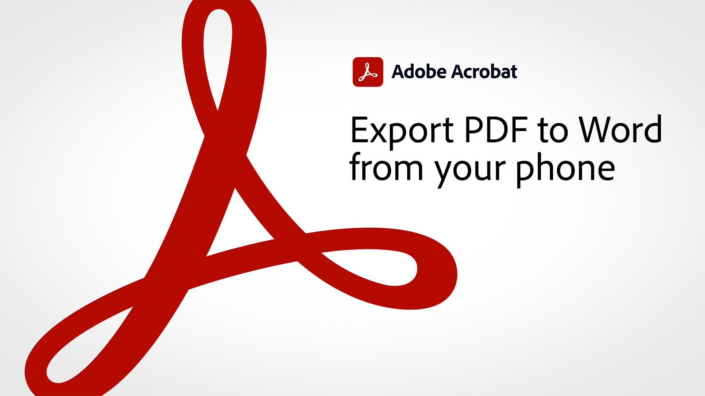
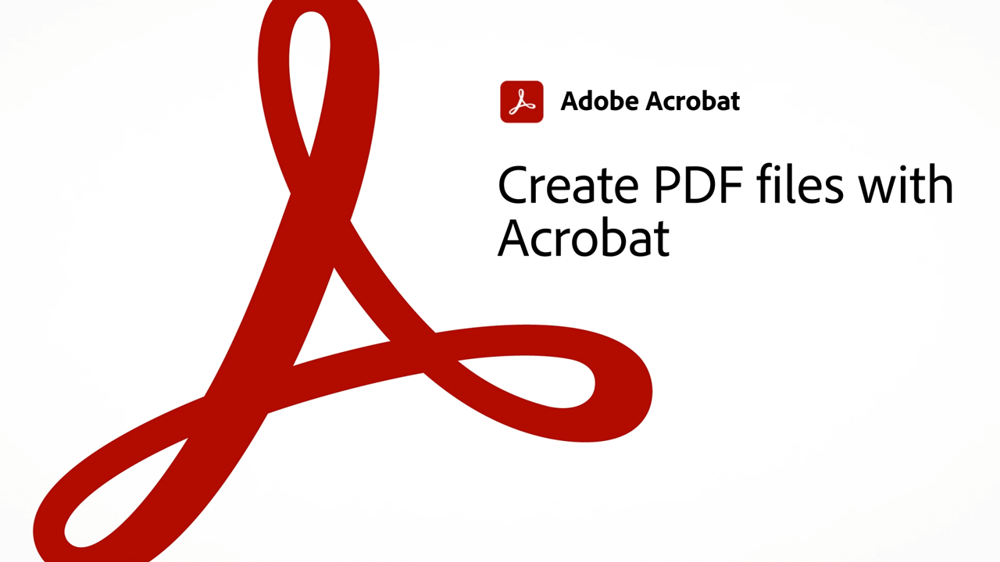

# 60-sekunders översikt över Acrobat

60-sekunders Acrobat ger dig självstudiekurser i bitstorlek som hjälper dig att lära dig ett nytt trick i Acrobat på en minut eller mindre. Dessa uppgiftsbaserade tips hjälper dig att plocka upp nya färdigheter för att arbeta med PDF filer genom att låsa upp några av Acrobat dolda pärlor. Du kan titta på en för att få ett snabbt svar, eller titta på fem för att öka dokumentproduktiviteten - och fortfarande ha tid att njuta av din kaffepaus.

## 60-sekunders självstudiekurser om Acrobat

## Redigera

<table style="table-layout:fixed">
<tr>
   <td>
    
    

    <a href="edit.md"><strong>Redigera PDF med Acrobat Web</strong></a>
    

    <em>Gör enkla redigeringar i text och bilder utan att ens hämta PDF</em>
     
  </td>
  <td>
    
    

     <a href="textrecognition.md"><strong>Identifiera PDF i en skannad fil</strong></a>
    

    <em>Konvertera en skannad PDF så att du kan söka efter text i PDF</em>
     
  </td>
  <td>
    
    

    <a href="combine-to-one-pdf.md"><strong>Kombinera filer till en PDF</strong></a>
    

    <em>Skapa snabbt ett nytt dokument genom att kombinera flera olika filtyper i ett enda PDF</em>
     
  </td>
   <td>
    
    

    <a href="organize.md"><strong>Ordna sidor på ett ögonblick</strong></a>
    

    <em>Lär dig att använda verktyget Ordna sidor för att få en fågelvy över din PDF</em>
     
  </td>
</tr>
<tr>
  <td>
    
    

    <a href="editphoto.md"><strong>Redigera ett foto i PDF</strong></a>
    

    <em>Lär dig hur du gör avancerade redigeringar av ett foto i PDF med Photoshop</em>
     
  </td>
  <td>
    
    

    <a href="editgraphic.md"><strong>Redigera en bild i din PDF</strong></a>
    

    <em>Lär dig hur du gör avancerade redigeringar av grafik i PDF med Illustrator</em>
     
  </td>
  <td>
      
        

         
  </td>
  <td>
      
        

         
  </td>
</tr>
</table>

## Konvertera

<table style="table-layout:fixed">
<tr>
  <td>
    
    

    <a href="convert-pdf-word.md"><strong>Konvertera en PDF till Word</strong></a>
    

    <em>Konvertera en PDF-fil till ett fullt redigerbart Microsoft Word-dokument</em>
     
  </td>
 <td>
    
    

    <a href="convert-pdf-excel.md"><strong>Konvertera en PDF till Excel</strong></a>
    

    <em>Konvertera en PDF-fil till ett fullt redigerbart Microsoft Excel-dokument</em>
     
  </td>
  <td>
    
    

    <a href="convert-pdf-powerpoint.md"><strong>Konvertera en PDF till PowerPoint</strong></a>
    

    <em>Konvertera en PDF-fil till ett fullt redigerbart Microsoft PowerPoint-dokument</em>
     
  </td>
  <td>
    
    

    <a href="exportwordphone.md"><strong>Export PDF till Word från din telefon</strong></a>
    

    <em>Konvertera en PDF-fil till ett fullt redigerbart Microsoft Word-dokument med mobilappen Acrobat</em>
     
  </td>
</tr>
</table>

## Skapa

<table style="table-layout:fixed">
<tr>
  <td>
    
    

     <a href="word-to-pdf.md"><strong>Skapa en PDF från Microsoft Word</strong></a>
    

    <em>Skapa en PDF från Microsoft Word</em>
     
  </td>
  <td>
    
    

     <a href="create-from-acrobat.md"><strong>Skapa PDF från Acrobat</strong></a>
    

    <em>Skapa PDF från Microsoft 365-filer direkt i Acrobat-datorprogrammet</em>
     
  </td>
  <td>
    
    

     <a href="wordform.md"><strong>Konvertera Word till PDF inklusive formulärfält</strong></a>
    

    <em>Konvertera Word-filer och -formulär till PDF och skapa formulärfält automatiskt</em>
     
  </td>
  <td>
      
      

      <a href="photo.md"><strong>Skapa en PDF med foton på ett ögonblick</strong></a>
      

      <em>Lär dig hur du bara drar och släpper ett gäng JPG på Acrobat-ikonen för att skapa en PDF</em>
       
  </td>
</tr>
<tr>
  <td>
    
    

    <a href="phone.md"><strong>Konvertera en PPT-fil till PDF på telefonen</strong></a>
    

    <em>Lär dig hur du konverterar en bifogad e-postbilaga till PDF på telefonen</em>
     
  </td>
  <td>
      
      

      <a href="optimize.md"><strong>Skapa effektivare PDF-filer på ett ögonblick</strong></a>
      

      <em>Använd verktyget Optimize PDF för att minska storleken på dina PDF-filer avsevärt</em>
       
  </td>
  <td>
      
        

         
  </td>
  <td>
      
        

         
  </td>
</tr>
</table>

## Signera

<table style="table-layout:fixed">
<tr>
  <td>
    
    

    <a href="sign.md"><strong>Signera ett pappersdokument elektroniskt</strong></a>
    

    <em>Lär dig använda Adobe Scan för att signera ett tryckt formulär</em>
     
  </td>
  <td>
      
        

         
  </td>
  <td>
      
        

         
  </td>
  <td>
      
        

         
  </td>
</tr>
</table>

## Skydda

<table style="table-layout:fixed">
<tr>
  <td>
    
    

    <a href="protect.md"><strong>Protect dina PDF-filer med ett lösenord</strong></a>
    

    <em>Protect ett PDF så att ett lösenord krävs för att öppna eller redigera PDF</em>
     
  </td>
  <td>
    
    

    <a href="redaction.md"><strong>Bortredigering: rätt sätt</strong></a>
    

    <em>Lär dig det rätta sättet att ta bort känslig information från en PDF</em>
     
  </td>
  <td>
      
        

         
  </td>
  <td>
      
        

         
  </td>
</tr>
</table>

## Dela och granska

<table style="table-layout:fixed">
<tr>
  <td>
    
    

    <a href="share-comment.md"><strong>Dela en PDF för att få kommentarer</strong></a>
    

    <em>Lär dig dela en PDF för att snabbt samla in feedback från flera personer i en enda fil</em>
     
  </td>
  <td>
    
    

    <a href="share-comment-teams.md"><strong>Dela och kommentera PDF-filer i Teams</strong></a>
    

    <em>Lär dig samarbeta i realtid med en PDF-fil i Microsoft Teams</em>
     
  </td>
  <td>
    
    

    <a href="summarize-comments.md"><strong>Wrangling PDF kommentarer med Sammanfatta</strong></a>
    

    <em>Lär dig hur du skapar en sammanfattning av alla kommentarer och markeringar i PDF-filen</em>
     
  </td>
   <td>
    
    

    <a href="indesign.md"><strong>Läs in PDF-kommentarer i InDesign</strong></a>
    

    <em>Lär dig hur du läser in PDF-kommentarer tillbaka i InDesignen efter en Acrobat-delad granskning</em>
     
  </td>
</tr>
</table>

## Förbered

<table style="table-layout:fixed">
<tr>
  <td>
    
    

    <a href="accessible.md"><strong>Låt Acrobat hjälpa dig att göra tillgängligt PDF</strong></a>
    

    <em>Kontrollera om en PDF är tillgänglig</em>
     
  </td>
 <td>
    
    

    <a href="conform.md"><strong>Anpassa en PDF till ett standardformat</strong></a>
    

    <em>Lär dig validera PDF-innehåll mot standardkriterier som PDF/X, PDF/A eller PDF/E från PDF</em>
     
  </td>
  <td>
      
        

         
  </td>
  <td>
      
        

         
  </td>
</tr>
</table>

## Ytterligare ämnen

<table style="table-layout:fixed">
<tr>
  <td>
    
    

     <a href="compare.md"><strong>Se skillnaderna med PDF Jämför</strong></a>
    

    <em>Lär dig hur du ser skillnaderna mellan två PDF-filer med verktyget Jämför filer i Acrobat</em>
     
  </td>
 <td>
    
    

     <a href="search.md"><strong>Söka efter flera PDF-filer samtidigt</strong></a>
    

    <em>Gör en sökning i en PDF-fil, öppna Avancerad sökning och sök i en hel mapp med PDF-filer</em>
     
  </td>
  <td>
      
        

         
  </td>
  <td>
      
        

         
  </td>
</tr>
</table>