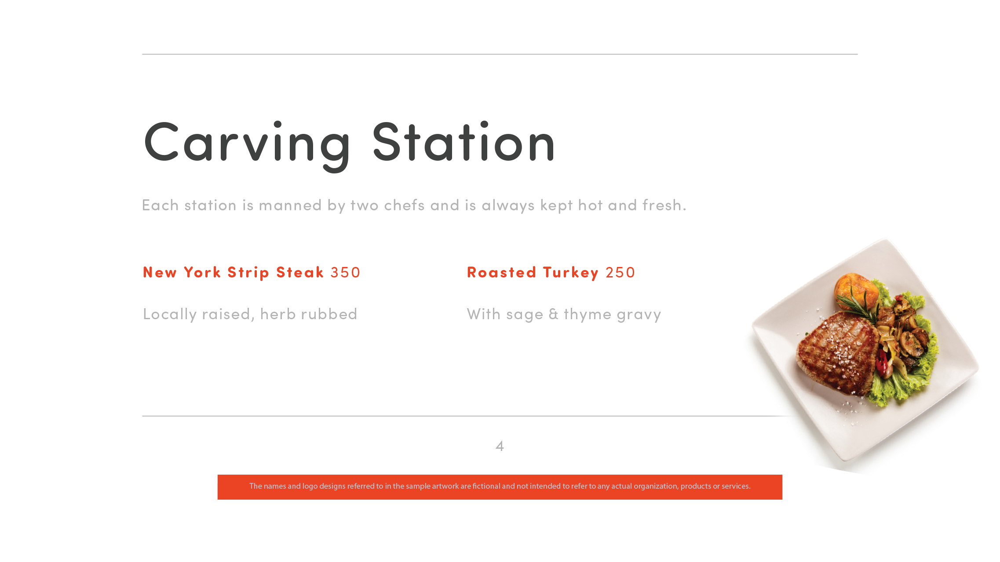

# 60-sekunders översikt över Acrobat

60-sekunders Acrobat ger dig självstudiekurser i bitstorlek som hjälper dig att lära dig ett nytt trick i Acrobat på en minut eller mindre. Dessa uppgiftsbaserade tips hjälper dig att plocka upp nya färdigheter för att arbeta med PDF filer genom att låsa upp några av Acrobat dolda pärlor. Du kan titta på en för att få ett snabbt svar, eller titta på fem för att öka dokumentproduktiviteten - och fortfarande ha tid att njuta av din kaffepaus.

## 60-sekunders självstudiekurser om Acrobat

## Redigera

<table style="table-layout:fixed">
<tr>
   <td>
    
    

    <a href="edit.md"><strong>Redigera PDF med Acrobat Web</strong></a>
    

    Lär dig redigera i Acrobat på webben
     
  </td>
  <td>
    
    

    <a href="textrecognition.md"><strong>Identifiera text i en skannad PDF-fil</strong></a>
    

    Lär dig hur du tolkar text från en skannad bild
     
  </td>
  <td>
    
    

    <a href="combine-to-one-pdf.md"><strong>Kombinera filer till en PDF</strong></a>
    

    Lär dig hur du snabbt kombinerar filer till en enda PDF
     
  </td>
   <td>
    
    

    <a href="organize.md"><strong>Ordna sidor på ett ögonblick</strong></a>
    

    Lär dig hur du snabbt ordnar sidor i en PDF
     
  </td>
</tr>
<tr>
  <td>
    
    

    <a href="editphoto.md"><strong>Redigera ett foto i PDF</strong></a>
    

    Lär dig hur du redigerar ett foto i en PDF
  </td>
  <td>
    
    

    <a href="editgraphic.md"><strong>Redigera grafik i PDF</strong></a>
    

    Lär dig hur du redigerar en bild i en PDF
  </td>
  <td>
      
        

         
  </td>
  <td>
      
        

         
  </td>
</tr>
</table>

## Konvertera

<table style="table-layout:fixed">
<tr>
  <td>
    
    

    <a href="convert-pdf-word.md"><strong>Konvertera en PDF till Word</strong></a>
    

    Lär dig hur du konverterar en PDF till Word-format
  </td>
 <td>
    
    

    <a href="convert-pdf-excel.md"><strong>Konvertera en PDF till Excel</strong></a>
    

    Lär dig konvertera en PDF till Excel-format
  </td>
  <td>
    
    

    <a href="convert-pdf-powerpoint.md"><strong>Konvertera en PDF till PowerPoint</strong></a>
    

    Lär dig hur du konverterar ett PDF- till PowerPoint-format
  </td>
  <td>
    
    

    <a href="exportwordphone.md"><strong>Export PDF till Word från din telefon</strong></a>
    

    Så här exporterar du en PDF till Word från telefonen
  </td>
</tr>
</table>

## Skapa

<table style="table-layout:fixed">
<tr>
  <td>
    
    

    <a href="word-to-pdf.md"><strong>Skapa en PDF från Microsoft Word</strong></a>
    

    Lär dig skapa en PDF direkt från Word
  </td>
  <td>
    
    

    <a href="create-from-acrobat.md"><strong>Skapa PDF från Acrobat</strong></a>
    

    Lär dig skapa PDF inifrån Acrobat
  <td>
    
    

    <a href="wordform.md"><strong>Konvertera Word till PDF, inklusive formulärfält</strong></a>
    

    Konvertera en Word-fil till PDF och generera formulärfält automatiskt
  </td>
  <td>
    
    

    <a href="photo.md"><strong>Skapa en PDF med foton på ett ögonblick</strong></a>
    

    Skapa en PDF med flera foton
  </td>
</tr>
<tr>
  <td>
    
    

    <a href="phone.md"><strong>Konvertera en PPT-fil till PDF på telefonen</strong></a>
    

    Konvertera en PowerPoint-fil till PDF på telefonen
  </td>
  <td>
    
    

    <a href="optimize.md"><strong>Skapa effektivare PDF-filer på ett ögonblick</strong></a>
    

    Optimera dina PDF-filer på ett ögonblick
  </td>
  <td>
      
        

         
  </td>
  <td>
      
        

         
  </td>
</tr>
</table>

## Signera

<table style="table-layout:fixed">
<tr>
  <td>
    
    

    <a href="sign.md"><strong>Signera ett pappersdokument elektroniskt</strong></a>
    

    Lär dig hur du signerar ett pappersdokument elektroniskt
  </td>
  <td>
      
        

         
  </td>
  <td>
      
        

         
  </td>
  <td>
      
        

         
  </td>
</tr>
</table>

## Skydda

<table style="table-layout:fixed">
<tr>
  <td>
    
    

    <a href="protect.md"><strong>Protect dina PDF-filer med ett lösenord</strong></a>
    

    Lär dig hur du skyddar PDF med ett lösenord
  </td>
  <td>
    
    

    <a href="redaction.md"><strong>Bortredigering: rätt sätt</strong></a>
    

    Lär dig hur du redigerar känslig information i PDF på rätt sätt
  </td>
  <td>
      
        

         
  </td>
  <td>
      
        

         
  </td>
</tr>
</table>

## Dela och granska

<table style="table-layout:fixed">
<tr>
  <td>
    
    

    <a href="share-comment.md"><strong>Dela en PDF för kommentarer</strong></a>
    

    Lär dig hur du delar en PDF som andra kan kommentera på
  </td>
  <td>
    
    

    <a href="share-comment-teams.md"><strong>Dela och kommentera PDF-filer i Teams</strong></a>
    

    Dela och kommentera en PDF-fil i Microsoft Teams
  </td>
  <td>
    
    

    <a href="summarize-comments.md"><strong>Krångliga PDF-kommentarer med sammanfattning</strong></a>
    

    Sammanfatta alla dina kommentarer i en enda PDF
  </td>
   <td>
    
    

    <a href="indesign.md"><strong>Läs in PDF-kommentarer i InDesignen</strong></a>
    

    Lär dig hur du överför alla dina PDF-kommentarer till InDesign
  </td>
</tr>
</table>

## Förbered

<table style="table-layout:fixed">
<tr>
  <td>
    
    

    <a href="accessible.md"><strong>Låt Acrobat hjälpa dig att göra tillgängligt PDF</strong></a>
    

    Lär dig hur du gör ditt PDF tillgängligt för alla
  </td>
 <td>
    
    

    <a href="conform.md"><strong>Använd ett PDF i standardformatet</strong></a>
    

    Lär dig anpassa en PDF till en viss standard
  </td>
  <td>
      
        

         
  </td>
  <td>
      
        

         
  </td>
</tr>
</table>

## Ytterligare ämnen

<table style="table-layout:fixed">
<tr>
  <td>
    
    

    <a href="compare.md"><strong>Se skillnaderna i jämförelse med PDF</strong></a>
    

    Lär dig jämföra skillnaden mellan två PDF snabbt
  </td>
 <td>
    
    

    <a href="search.md"><strong>Sök i flera PDF-filer samtidigt</strong></a>
    

    Lär dig söka i flera PDF-filer
  </td>
  <td>
      
        

         
  </td>
  <td>
      
        

         
  </td>
</tr>
</table>