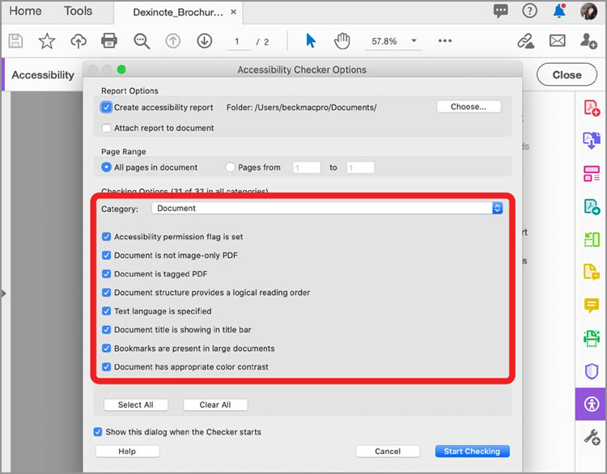
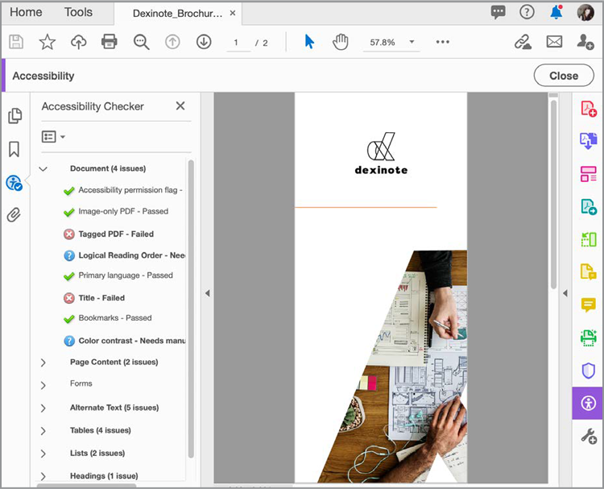

# Kontrollera tillgänglighet i PDF

Lär dig hur du kontrollerar om PDF är allmänt tillgängligt för rörelsehindrade, inklusive rörelsehindrade, blinda, synskadade, döva, hörselskadade eller personer med nedsatt kognitiv förmåga.

>[!NOTE]
>
>Finns endast i Acrobat Pro.

## Tillgänglighetskontroll

1. Välj **[!UICONTROL Tillgänglighet]** från Verktygscenter eller den högra rutan.

   

1. Välj **[!UICONTROL Tillgänglighetskontroll]** i den högra rutan.

   

1. Välj en kategori i listrutan och alternativ i checklistan.

   Lämna alla rutor markerade för en fullständig rapport.

1. Välj **[!UICONTROL Starta kontroll]** att påbörja rapporten.

   

   Det vänstra navigeringsfönstret öppnas och rapportresultaten visas. Expandera ett avsnitt för att se informationen.

   

Du kan också använda kommandot [!UICONTROL Gör tillgänglig] åtgärder i [Action Wizard](https://experienceleague.adobe.com/docs/document-cloud-learn/acrobat-learning/advanced-tasks/action.html) verktyg som går igenom en grundläggande uppsättning steg för att skapa ett tillgängligt PDF.

## Åtgärda tillgänglighetsproblem

Högerklicka på ett objekt i tillgänglighetsrapporten för att visa snabbmenyn. Snabbmenyn för alla objekt som misslyckades i tillgänglighetskontrollen ger dig möjlighet att åtgärda problemet.

>[!NOTE]
>
>Vissa problem kan inte åtgärdas automatiskt och du måste åtgärda problemet manuellt. Acrobat I så fall visas en dialogruta som talar om vad du ska korrigera.