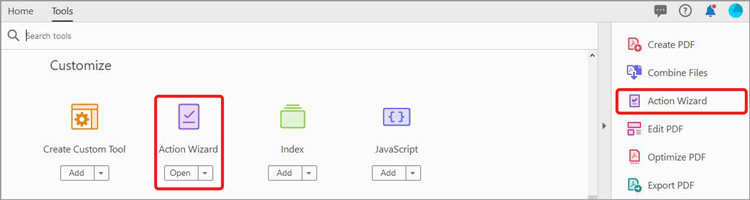

# Action Wizard

Spara tid och tangenttryckningar genom att använda ett funktionsmakro för att automatiskt tillämpa en uppsättning kommandon på en eller flera filer.

>[!NOTE]
>
>Finns endast i Acrobat Pro.

1. Välj **[!UICONTROL Action Wizard]** från [!UICONTROL Verktyg] mitten eller den högra rutan.

   

   Fördefinierade åtgärder visas i **Åtgärdslista**.

1. Välj **[!UICONTROL Ny åtgärd]** på den övre menyn för att skapa en anpassad åtgärd.

   

1. Välj en aktivitet i listan till vänster och välj sedan mittpilen för att lägga till den i den högra kolumnen i **[!UICONTROL Skapa ny åtgärd]** dialogrutan.

   *Inställningarna för varje uppgift är förinställda i den här dialogrutan, eller så kan du uppmana användaren att fatta nödvändiga beslut medan åtgärden körs.*

   

1. Välj **[!UICONTROL Spara]** och namnge åtgärden så att den visas på **[!UICONTROL Åtgärdslista]**.

Nu kan du köra den anpassade åtgärden när du vill utföra dessa specifika steg på en eller flera PDF-filer.

Klicka på ikonen PDF för att hämta *Action Wizard* självstudiekurs.

.

>[!TIP]
>
>Den här videon är en del av kursen [Arbeta smartare med Acrobat DC och Microsoft 365](https://experienceleague.adobe.com/?recommended=Acrobat-U-1-2021.microsoft365) som är tillgänglig gratis på Experience League!
