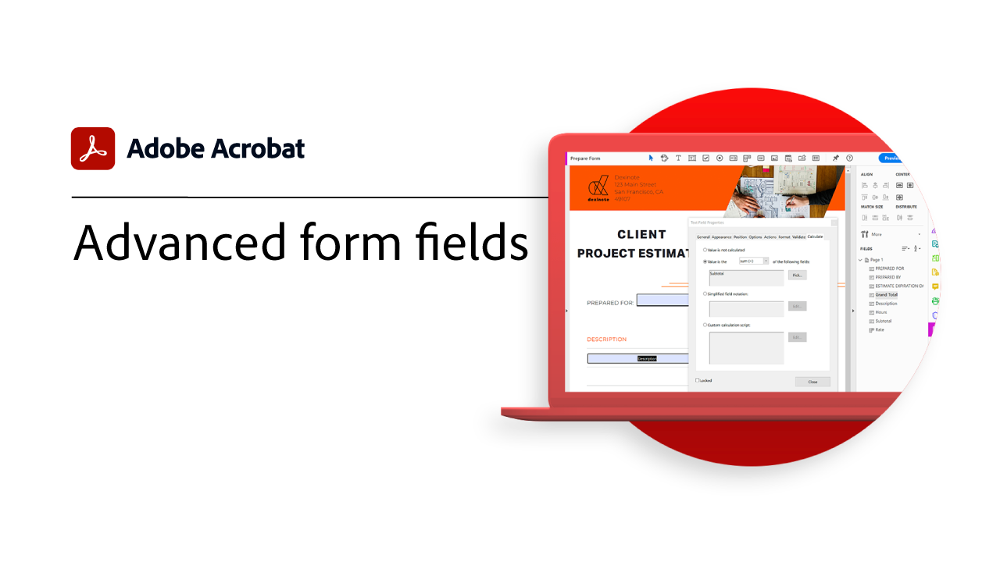
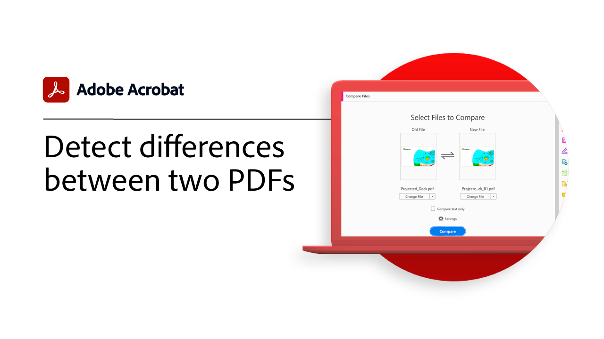
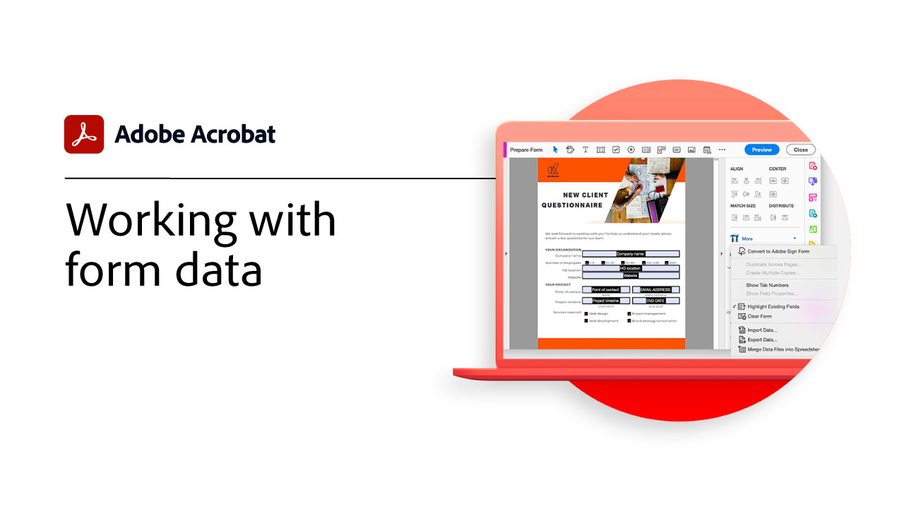

# Översikt över avancerade uppgifter

Gå steget längre med de här avancerade verktygen i Acrobat. Lär dig skapa funktionsmakron för att upprepa triviala moment, ta bort känslig information, minska och optimera stora filer, snabbt samla in formulärdata och skapa universellt tillgängliga PDF-filer.

## Självstudiekurser för Acrobat

<table style="table-layout:fixed">
<tr>
  <td>
    
    

    <a href="custom.md"><strong>Anpassade kommandon och verktyg</strong></a>
    

    <em>Förbättra dokumentarbetsflödet med anpassade kommandon och verktygsuppsättningar</em>
     
  </td>
  <td>
    
    

    <a href="advancedforms.md"><strong>Avancerade formulärfält</strong></a>
    

    <em>Lär dig avancerad teknik för att bygga professionella PDF forms</em>
     
  </td>
  <td>
    
    

    <a href="optimizeseo.md"><strong>Optimize PDF för SEO (sökmotoroptimering)</strong></a>
    

    <em>Optimera en PDF för förbättrad sökbarhet och rankning av sökmotorer på webben</em>
     
  </td>
</tr>
<tr>
  <td>
    
    

    <a href="workforms.md"><strong>Arbeta med formulärfält</strong></a>
    

    <em>Lägg till olika typer av formulärfält, ange formulärfältsegenskaper och lägg till säkerhet för att skapa professionella blanketter av hög kvalitet</em>
     
  </td>
  <td>
    
    

    <a href="enhance.md"><strong>Förbättra PDF</strong></a>
    

    <em>Omforma PDF genom att lägga till grafikförbättringar och automatisk numrering</em>
     
  </td>
  <td>
    
    

    <a href="compare.md"><strong>Identifiera skillnader mellan två PDF</strong></a>
    

    <em>Hitta snabbt och exakt skillnaderna mellan två PDF-filer</em>
     
  </td>   
</tr>
<tr>
  <td>
    
    

    <a href="action.md"><strong>Action Wizard</strong></a>
    

    <em>Spara tid och tangenttryckningar genom att använda ett funktionsmakro för att automatiskt tillämpa en uppsättning kommandon på en eller flera filer</em>
     
  </td>
  <td>
    
    

    <a href="redact.md"><strong>Redigera bort och sanera</strong></a>
    

    <em>Ta permanent bort privat eller känslig information från PDF</em>
     
  </td>
   <td>
    
    

    <a href="reduce.md"><strong>Minska filstorleken och optimera</strong></a>
    

    <em>Minska antalet stora filer och optimera PDF utan att kompromissa med kvaliteten för delning, publicering eller arkivering</em>
     
  </td>
</tr>
<tr>
  <td>
    
    

    <a href="formdata.md"><strong>Arbeta med formulärdata</strong></a>
    

    <em>Sammanställ formulärdata i ett kalkylblad</em>
     
  </td>
  <td>
    
    

    <a href="accessibility.md"><strong>Kontrollera tillgänglighet i PDF</strong></a>
    

    <em>Kontrollera om PDF är universellt tillgängligt för funktionshindrade</em>
     
  </td>
  <td>
    
    

    <a href="accessibility-series.md"><strong>Acrobat Accessibility series</strong></a>
    

    <em>I den här webbseminarieserien i sex delar går du från grunderna i tillgänglighet till en djupdykning i taggning av dina PDF-filer</em>
     
  </td>
</tr>
</table>
