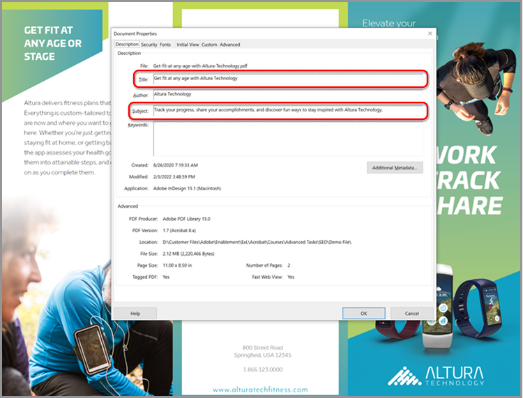

# Optimize PDF för SEO (Search Engine Optimization)

Läs om hur du optimerar en PDF för förbättrad upptäckbarhet och rankning av sökmotorer på webben.

## 1. Skapa unikt innehåll

Skapa PDF-innehåll som skiljer sig från informationen på dina webbsidor.

+++Visa information om hur du skapar unikt innehåll

Innehållet i PDF bör vara unikt och strukturerat enligt följande:

* Använda en enda huvudrubrik/titel som börjar med ett nyckelord
* Använda nyckelordsunderrubriker ordnade i en hierarkisk struktur
* Använda korta stycken som innehåller nyckelord och listor
* Lägg till interna och externa hyperlänkar (innehåll på din webbplats eller andra webbplatser)
* Lägga till en hyperlänkad innehållsförteckning för dokument som är längre än 25 sidor
* Kör [textigenkänning](https://experienceleague.adobe.com/docs/document-cloud-learn/acrobat-learning/getting-started/scan-and-ocr.html) på alla skannade dokument
* Bygg PDF som är mobilvänliga
Om du vill kontrollera mobilvisningsupplevelsen för PDF öppnar du filen i mobilappen [Acrobat Reader](https://www.adobe.com/acrobat/mobile/acrobat-reader.html) och aktiverar Liquid Mode. Om det behövs kan du lägga till fler underrubriker för att förbättra navigeringen.

  

+++

  

## 2. Lägg till dokumentegenskaper

PDF-filer har en rubrik och en metabeskrivning precis som en webbsida.

+++Visa information om hur du lägger till dokumentegenskaper

Lägg till nyckeln **[!UICONTROL Dokumentegenskaper]** enligt följande:

1. Markera **[!UICONTROL Arkiv > Egenskaper]** eller använd kortkommandot *Ctrl + D* i Windows eller *Cmd + D* i Mac och klicka på fliken **[!UICONTROL Beskrivning]**.
1. Ange en nyckelordsoptimerad titel i fältet **[!UICONTROL Titel:]**.
1. Se till att fältet **[!UICONTROL Författare:]** inte identifierar någon specifik person i organisationen.
1. Ange en nyckelordsoptimerad sammanfattning av dokumentet i fältet **[!UICONTROL Ämne:]**.
Prova att starta sammanfattningen med ett åtgärdsverb som Lär dig, Upptäck, Utforska osv.
1. Välj **[!UICONTROL Ytterligare metadata]** om du vill lägga till information om upphovsrätt eller offentlig domän.

   

+++

  

## 3. Tagga din PDF

Om du taggar innehåll i PDF blir filen [inte bara tillgänglig](https://experienceleague.adobe.com/docs/document-cloud-learn/acrobat-learning/advanced-tasks/accessibility.html) för personer med funktionshinder, utan det förbättrar även SEO.

+++Visa information om hur du taggar en PDF

Tagga en PDF på följande sätt:

1. Välj **[!UICONTROL Tillgänglighet]** i **[!UICONTROL Verktygscenter]**.
1. Välj **[!UICONTROL Märk dokument automatiskt]** i den högra rutan.
1. Följ tipsen för reparation i den vänstra rutan **[!UICONTROL Identifieringsrapport]**.
1. Kör **[!UICONTROL Ange alternativ text]** om det behövs.
1. Använd nyckelord för att beskriva bilden i den **[!UICONTROL alternativa texten]**.

   

+++

>[!NOTE]
>
>Endast tillgängligt i Acrobat Pro.

  

## 4. Förbered för webben

Optimera interaktionen med PDF genom att förbereda den för webbvisning och [minska PDF-filstorleken](https://www.adobe.com/se/acrobat/online/compress-pdf.html){target="_blank"}.

+++Visa information om hur du förbereder din PDF för webben

Förbered din PDF för webben enligt följande:

Om du vill förbereda PDF för webben väljer du **[!UICONTROL Arkiv > Spara som annan > PDF i reducerad storlek]**.

Det här steget minskar filstorleken och möjliggör **snabb webbvisning** i PDF. Med **snabb webbvisning** kan filen öppnas, visas och sökas direkt innan hela filen strömmas eller hämtas, vilket skapar en optimal slutanvändarupplevelse. Öppna **[!UICONTROL Dokumentegenskaper]** (*Ctrl + D* i Windows eller *Cmd + D* i Mac) för att avgöra om **Snabb webbvisning** har aktiverats.

>[!TIP]
>
>Om du har Acrobat Pro kör du Optimera för webben och mobiler i verktyget Action Wizard. Den här åtgärden konverterar färger till sRGB och bäddar in teckensnitt för konsekvent visning av PDF i webbläsare och på mobila enheter.

+++

  

## 5. Skapa ett nyckelordsfilnamn

+++Visa information om hur du skapar ett nyckelordsfilnamn

Skapa ett nyckelordsfilnamn på följande sätt:

Filnamnet blir en del av URL-adressen när en PDF läggs upp på webben. Ett tips är att matcha den nyckelordsoptimerade titeln med filnamnet. Om du vill vara sökvänlig använder du gemener, inget skiljetecken eller hash, och undviker stoppord (a, an, och, det, för, eller, men, i, min, din, vår, och deras, etc.). Om du använder separata ord lägger du till bindestreck eller understreck mellan orden.

+++

  

## 6. Säkra PDF

Sista steget är att [skydda din PDF](https://www.adobe.com/se/acrobat/online/password-protect-pdf.html){target="_blank"} för att förhindra obehöriga ändringar.

+++Visa information om hur du skyddar din PDF

Säkra PDF på följande sätt:

1. Öppna **[!UICONTROL Dokumentegenskaper]** (*Ctrl + D* i Windows eller *Cmd + D* i Mac) och välj fliken **[!UICONTROL Säkerhet]**.
1. Markera **[!UICONTROL Skriva ut redigering och utskrift av dokumentet. Ett lösenord krävs för att ändra dessa inställningar.]**
1. Under **[!UICONTROL Tillåtna ändringar:]** välj **[!UICONTROL Inga]**.
1. Markera **[!UICONTROL Aktivera textåtkomst för skärmläsarenheter för synskadade.]**
1. Ange och bekräfta ett starkt lösenord.
1. Välj **[!UICONTROL OK]** och spara filen.

   

+++

Nu är din PDF redo att publiceras på webben - med optimala sökord rankning potential och slutanvändare interaktion.
