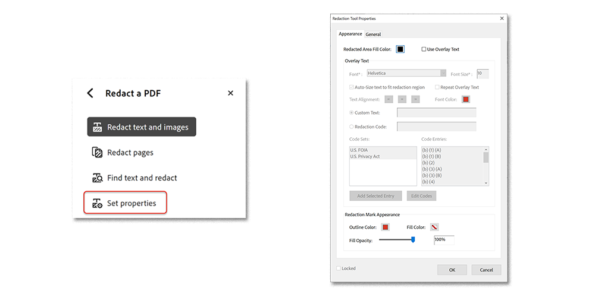

# Redigera och sanera

Lär dig använda verktyget Redigera bort för att permanent ta bort privat eller känslig information från PDF. Använd saneringsverktyget för att ta bort information som inte syns i filen, t.ex. kommentarer, metadata eller dolda lager.

>[!NOTE]
>
>Endast tillgängligt i Acrobat Pro.

[!BADGE ORGANISATORISK EFFEKT]
Kunddataskydd, riskhantering

## Redigera text och bilder

1. Välj **[!UICONTROL Redigera bort]** i mitten av [!UICONTROL Verktyg] eller i den högra rutan.

   

1. Välj **[!UICONTROL Redigera bort text och bilder]** **>** **[!UICONTROL Egenskaper]** för att anpassa utseendet på dina redigeringar, inklusive färgen på bortredigeringsrutor eller textövertäckning.

   

Redigera informationen genom att först markera objekten som ska tas bort och sedan tillämpa bortredigeringarna. Du kan redigera hela sidor eller markerat innehåll.

1. Välj **[!UICONTROL Redigera bort sidor]**, välj sedan sidan eller sidintervallet som ska redigeras bort och välj **[!UICONTROL OK]**.

   

Du kan också använda markören för att välja innehållet som ska redigeras bort. Du kan se en förhandsgranskning av redigeringen genom att hålla muspekaren över det valda innehållet.

   

1. Välj **[!UICONTROL Redigera bort text och bilder]** **>** **[!UICONTROL Sök efter text och redigera bort]** om du vill hitta specifikt innehåll som ska redigeras bort.

Använd sökrutan för att söka efter ett visst ord eller en viss fras.

1. Välj **[!UICONTROL Mönster]** för att hitta vissa typer of information, markera sedan rutorna och välj **[!UICONTROL Sök efter och ta bort text]**.

   

1. Välj **[!UICONTROL Tillämpa]** på huvudmenyn [!UICONTROL Redigera bort] för att tillämpa de markerade redigeringarna och spara den redigerade filen.

   

## Sanera dokument

1. Välj **[!UICONTROL Sanera dokument]** på den övre menyn [!UICONTROL Redigera bort].

1. Välj **[!UICONTROL OK]** för att bekräfta borttagningen av dold information. Eller välj **[!UICONTROL Klicka här]** för att selektivt ta bort dold information.

   

>[!TIP]
>
Se [Actionen Wizard](../advanced-tasks/action.md) för att snabba på bortredigeringsprocessen.

>[!TIP]
>
Den här videon ingår i kursen [Arbeta smartare med Acrobat DC och Microsoft 365](https://experienceleague.adobe.com/?recommended=Acrobat-U-1-2021.microsoft365) som är tillgänglig kostnadsfritt på Experience League!
