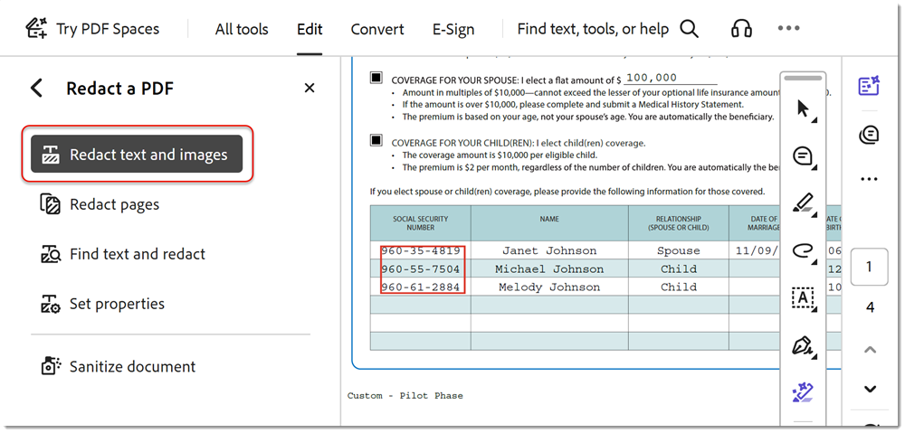

# Redigera bort och sanera

Lär dig använda bortredigeringsverktyget för att permanent ta bort privat eller känslig information från PDF. Använd verktyget Sanera för att ta bort information som inte visas i filen, till exempel kommentarer, metadata eller dolda lager.

>[!NOTE]
>
>Finns endast i Acrobat Pro.

## Redigera bort text och bilder

1. Välj **[!UICONTROL Redigera bort]** från [!UICONTROL Verktyg] mitten eller den högra rutan.

   

1. Välj **[!UICONTROL Redigera bort text och bilder]** **>** **[!UICONTROL Egenskaper]** om du vill anpassa utseendet på dina bortredigeringar, inklusive färgen på bortredigeringsrutor eller textövertäckning.

   

   Redigera bort information genom att först markera objekten som ska tas bort och sedan använda bortredigeringarna. Du kan redigera bort hela sidor eller markerat innehåll.

1. Välj **[!UICONTROL Redigera bort sidor]** väljer du sedan den sida eller det sidintervall som ska redigeras bort och markerar **[!UICONTROL OK]**.

   

   Du kan också använda markören för att markera innehållet som ska redigeras bort. Du kan se en förhandsgranskning av bortredigeringen genom att hålla pekaren över det markerade innehållet.

   

1. Välj **[!UICONTROL Redigera bort text och bilder]** **>** **[!UICONTROL Sök efter text och redigera bort]** för att hitta specifikt innehåll att redigera bort.

   Använd sökrutan för att söka efter ett specifikt ord eller en fras.

1. Välj **[!UICONTROL Mönster]** för att hitta viss information, markera sedan rutorna och välj **[!UICONTROL Söka efter och ta bort text]**.

   

1. Välj **[!UICONTROL Använd]** i [!UICONTROL Redigera bort] huvudmenyn för att tillämpa de markerade bortredigeringarna och spara den bortredigerade filen.

   

## Sanera dokument

1. Välj **[!UICONTROL Sanera dokument]** i [!UICONTROL Redigera bort] översta menyn.

1. Välj **[!UICONTROL OK]** för att bekräfta borttagningen av dold information. Eller välj **[!UICONTROL Klicka här]** för att selektivt ta bort dold information.

   

>[!TIP]
>
>Om du vill snabba på bortredigeringsprocessen kan du läsa [Action Wizard](../advanced-tasks/action.md).

>[!TIP]
>
>Den här videon är en del av kursen [Arbeta smartare med Acrobat DC och Microsoft 365](https://experienceleague.adobe.com/?recommended=Acrobat-U-1-2021.microsoft365) som är tillgänglig gratis på Experience League!
