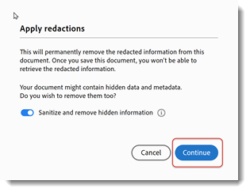

# Ta bort känslig information

Lär dig använda bortredigeringsverktyget för att permanent ta bort privat eller känslig information från en PDF och sanera sedan dokumentet för att ta bort information som inte syns i filen, t.ex. kommentarer, metadata eller dolda lager. Det är viktigt att du tar bort känsligt innehåll och dolda uppgifter permanent så att uppgifterna inte överförs när du publicerar PDF. Den här självstudiekursen använder [den nya Acrobat-upplevelsen](../getting-started/new-workspace.md).

>[!NOTE]
>
>Endast tillgängligt i Acrobat Pro.

[!BADGE ORGANISATORISK EFFEKT]
Kunddataskydd, riskhantering

## Redigera information i Acrobat för datorer

1. Öppna en fil och välj **[!UICONTROL Alla verktyg]** i verktygsfältet. Välj sedan **[!UICONTROL Redigera bort en PDF]**.
   

1. Välj **[!UICONTROL Ange egenskaper]** för att anpassa utseendet på dina bortredigeringar, inklusive färgen på bortredigeringsrutor eller textövertäckning.

   

   Redigera informationen genom att först markera objekten som ska tas bort och sedan tillämpa bortredigeringarna. Du kan redigera hela sidor eller markerat innehåll.

1. Välj **[!UICONTROL Redigera bort text och bilder]** och använd markören för att markera innehållet som ska redigeras bort.

   

   Du kan se en förhandsgranskning av redigeringen genom att hålla muspekaren över det valda innehållet.

1. Välj **[!UICONTROL Sök efter text och redigera bort]** om du vill söka efter ett visst ord eller en viss fras, eller sök efter ett mönster om du vill hitta vissa typer av information. Ange din sökning och välj Sök efter och ta bort text.

1. I dialogrutan med sökresultat markerar du rutorna bredvid objekten och väljer **[!UICONTROL Markera markerade resultat för bortredigering]**.

   

1. Välj **[!UICONTROL Redigera bort sidor]** för att markera hela sidor för bortredigering.

   

1. Markera sidorna och välj **[!UICONTROL OK]**.

   

1. Välj **[!UICONTROL Tillämpa]** på panelen Redigera bort i en PDF om du vill tillämpa de markerade redigeringarna.

   

1. Välj **[!UICONTROL Fortsätt]** för att sanera och ta bort dold information.

   

När du har bekräftat tas bortredigeringarna och den dolda informationen bort permanent och sparas i en ny fil.

>[!TIP]
>
>Se [Actionen Wizard](../advanced-tasks/action.md) för att snabba på bortredigeringsprocessen.
