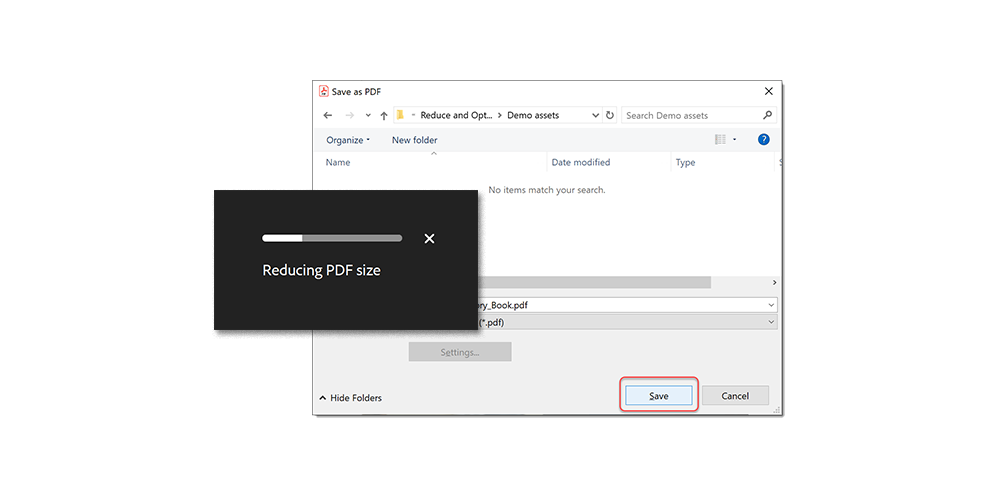

# Minska filstorleken och optimera

Minska antalet filer och optimera PDF utan att kompromissa med kvaliteten vid delning, publicering eller arkivering.

>[!NOTE]
>
>Finns endast i Acrobat Pro DC.

1. Välj **[!UICONTROL Optimize PDF]** från [!UICONTROL Verktyg] i mitten eller på den högra panelen.

   

1. Välj **[!UICONTROL Minska filstorleken]** och välja om du vill reducera en eller flera filer.

   Filen minskas till minsta möjliga storlek samtidigt som dokumentets kvalitet behålls.

   

1. Välj **[!UICONTROL Avancerad optimering]** väljer du sedan bland alternativen i PDF-optimering.

   

1. Välj **[!UICONTROL Standard]** från **[!UICONTROL Inställningar]** om du vill använda standardinställningarna.

   Om du ändrar några inställningar i dialogrutan **[!UICONTROL PDF-optimering]** växlar menyn **Inställningar** automatiskt till **Anpassad**.

1. Välj **[!UICONTROL Behåll befintlig]** från **[!UICONTROL Gör kompatibel med]** om du vill behålla den aktuella versionen av PDF eller välja en specifik version av Acrobat.

1. Markera kryssrutan bredvid en panel (till exempel Bilder, Teckensnitt, Genomskinlighet) och välj sedan alternativ på den panelen.

   

   Om du vill förhindra att alla alternativ på en panel körs under optimeringen avmarkerar du kryssrutan för den panelen.

1. **(Valfritt)** Välj **[!UICONTROL Spara]** och namnge den aktuella inställningen för att skapa en anpassad markering. Om du vill ta bort en sparad inställning väljer du den i dialogrutan **Inställningar** meny och välj **Ta bort**.

   

>[!TIP]
>
>Om du vill optimera flera PDF-filer kan du använda [Action Wizard](../advanced-tasks/action.md).

Klicka på ikonen PDF för att ladda ned *Minska filstorleken och optimera* självstudiekurs.

.
