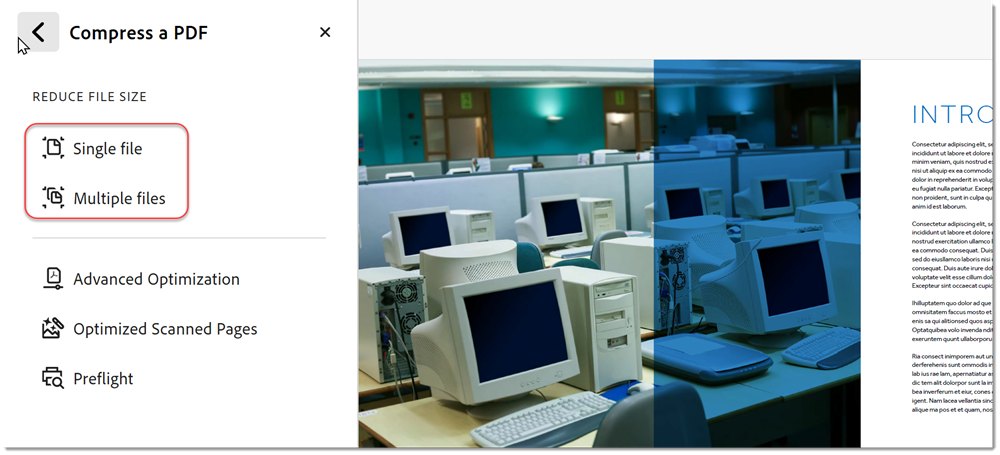

# Minska filstorleken och optimera

Minska antalet stora filer och optimera PDF:erna utan att kompromissa med kvaliteten vid utbyte, publicering eller arkivering.

>[!NOTE]
>
>Finns endast i Acrobat Pro DC.

1. I Acrobat Pro DC väljer du **[!UICONTROL Optimize PDF]** från [!UICONTROL Verktyg] i mitten eller rutan.

   

1. Välj **[!UICONTROL Minska filstorlek]** och välj om du vill minska en eller flera filer.

   Filen minskas till minsta möjliga storlek samtidigt som dokumentkvaliteten bibehålls.

   

1. Om du vill optimera filen väljer du **[!UICONTROL Avancerad optimering]**. Välj sedan bland alternativen i PDF-optimering.

   

1. Om du vill använda standardinställningarna väljer du **[!UICONTROL Standard]** på menyn **[!UICONTROL Inställningar]**.

Om du ändrar några inställningar i dialogrutan **[!UICONTROL PDF-optimering]** växlar menyn **Inställningar** automatiskt till **Egen**.

1. Välj **Behåll befintlig** i listrutan **Gör kompatibel med** om du vill behålla den aktuella PDF-versionen av filen eller välj en Acrobat-version. Markera kryssrutan bredvid en panel (t.ex. Bilder, Teckensnitt, Genomskinlighet), och ange sedan alternativ på panelen. Om du vill förhindra att alla alternativ på en panel körs under optimeringen avmarkerar du kryssrutan för den panelen.

   

1. **(Valfritt)** Om du vill spara dina anpassade inställningar klickar du på  **** Spara och ger inställningarna ett namn. Du tar bort en sparad inställning genom att välja den på menyn **Inställningar** och klicka på **Ta bort**.

   

>[!TIP]
>
>Om du vill optimera flera PDF-filer kan du prova att använda Actionen Wizard [a1/>.](../advanced-tasks/action.md)

Klicka för att ladda ned en PDF-fil av *Minska filstorleken och optimera* självstudiekursen.

.
