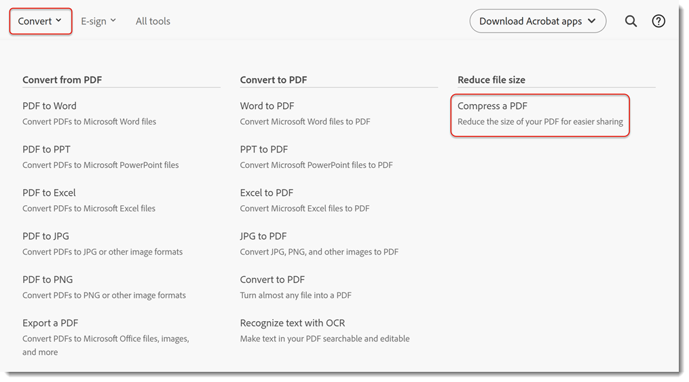

# Komprimera och optimera en PDF

Lär dig hur du komprimerar och optimerar storleken på en PDF-fil. Att komprimera en PDF gör det enklare att dela via e-post eller ladda upp till webbplatser med filstorleksbegränsningar. Du kan också förbättra visningsupplevelsen och spara på lagringskostnader genom att optimera PDF.

## Så här komprimerar du en PDF i Acrobat på datorn

1. Öppna en fil och välj **[!UICONTROL Alla verktyg]** i verktygsfältet. Välj sedan **[!UICONTROL Komprimera en PDF]**.

   

1. Markera **[!UICONTROL Enskilda filer]** eller **[!UICONTROL Flera filer]** på panelen **[!UICONTROL Komprimera en PDF]**.

   

1. Välj **[!UICONTROL Spara]**.

   

   Filen minskas till minsta möjliga storlek men dokumentets kvalitet behålls.

## Så här komprimerar du en PDF i Acrobat på webben

1. Logga in på [acrobat.adobe.com](https://acrobat.adobe.com/se/sv) i en webbläsare.

1. Välj **[!UICONTROL Konvertera > Komprimera en PDF]** på den övre menyn.

   

1. Välj **[!UICONTROL Välj filer]**, markera dina filer och välj **[!UICONTROL Öppna]**.

   

1. Välj en komprimeringsnivå och välj **[!UICONTROL Komprimera]**.

   

## Så här optimerar du en PDF i Acrobat på datorn

>[!NOTE]
>
>Optimering av en PDF är endast tillgängligt i Acrobat Pro för datorer.

1. Öppna en fil och välj **[!UICONTROL Alla verktyg]** i verktygsfältet. Välj sedan **[!UICONTROL Komprimera en PDF]**.

   

1. Markera **[!UICONTROL Avancerad optimering]** på panelen **[!UICONTROL Komprimera en PDF]**.

   

   Som standard är **Standard** valt på menyn **Inställningar**. Om du ändrar några inställningar i dialogrutan PDF-optimering växlar menyn **Inställningar** automatiskt till **Anpassad**.

1. I listrutan **Gör kompatibel med** väljer du **Behåll befintlig** om du vill behålla den nuvarande PDF-versionen eller väljer en Acrobat-version. Markera kryssrutan bredvid en panel (t.ex. Bilder, Teckensnitt, Genomskinlighet) och välj alternativ på panelen. Välj sedan **[!UICONTROL OK]** och spara filen.

   

   Om du vill förhindra att alla alternativ på en panel körs under optimeringen, avmarkerar du kryssrutan för den panelen.

1. (Valfritt) Om du vill spara de anpassade inställningarna väljer du **[!UICONTROL Spara]** och ger inställningarna ett namn. Om du vill ta bort en sparad inställning väljer du den i menyn **Inställningar** och väljer **[!UICONTROL Ta bort]**.

   

>[!TIP]
>
>Om du vill optimera flera PDF-filer kan du prova att använda Actionen Wizard [&#128279;](../advanced-tasks/action.md).

<table style="table-layout:fixed">
  <td>
    
    

    <a href="reduce.md"><strong>Komprimera och optimera en PDF</strong></a>
    

    <em>Minska antalet stora filer och optimera PDF utan att kompromissa med kvaliteten för delning, publicering eller arkivering</em>
     
  </td>
  <td>
        
        

         
      </td>
    <td>
        
        

         
    </td>
    <td>
        
        

         
    </td>
</tr>
</table>