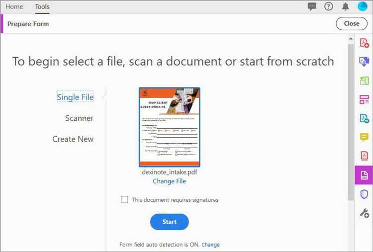

# Skapa ifyllbara formulär

Omvandla ett skannat pappersformulär eller dokument som har skapats i InDesign, Microsoft Word, Excel eller andra program till ett ifyllbart PDF-formulär i Acrobat DC.

1. Välj **[!UICONTROL Prepare Form]** från [!UICONTROL Verktyg]-centret.

   

1. Markera ett befintligt dokument som du vill använda som formulär (t.ex. en Word-, Excel-, InDesign- eller PDF-fil).

   Om [!UICONTROL Automatisk identifiering av formulärfält] är PÅ, identifierar Acrobat automatiskt formulärfält i PDF-filen.

1. Skapa formuläret genom att klicka på **[!UICONTROL Starta]**.

   

   Redigera formuläret med alternativen som visas. Dra och släpp fält från den övre menyraden och redigera formulärfältsinformation i den högra rutan.

1. Klicka på **[!UICONTROL Förhandsgranska]** om du vill visa formuläret efter att fält har lagts till.

   

   Återgå enkelt till **[!UICONTROL Redigera]** för att fortsätta arbeta.

   

1. Klicka på **[!UICONTROL Arkiv > Spara som]** för att spara PDF-formuläret.

Klicka för att ladda ned en PDF-fil av *Skapa ifyllbara formulär* självstudiekursen.

