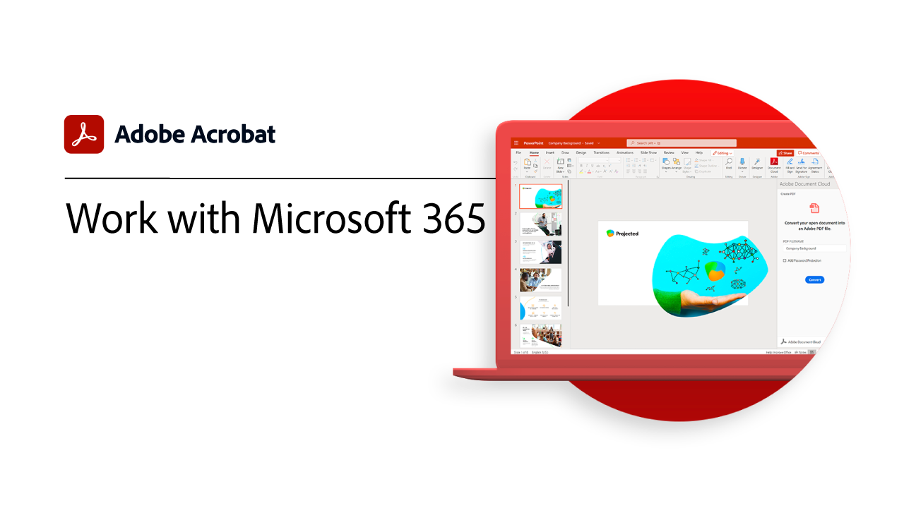
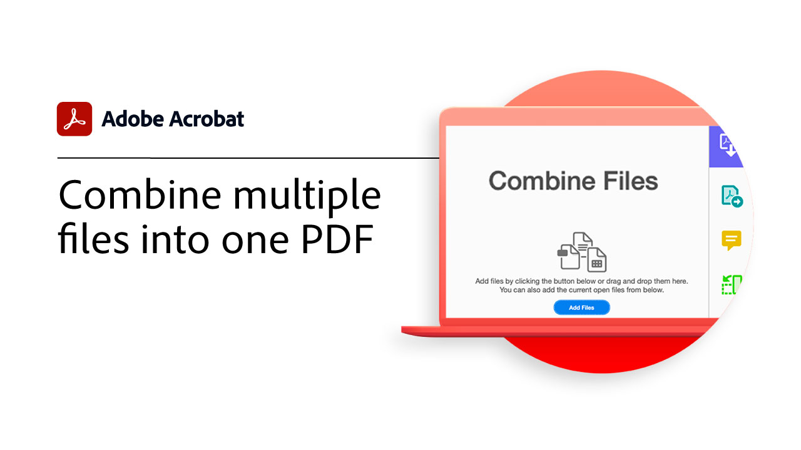
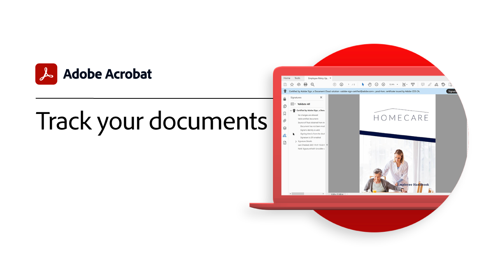

# Översikt över Komma igång

Lär dig börja använda Adobe Acrobat via de här korta stegvisa självstudiekurserna. Från att skapa ett dokument till att skydda eller [redigera dina PDF-filer](https://www.adobe.com/se/acrobat/online/pdf-editor.html){target="_blank"}, detta innehåll är utformat för att underlätta för dig att komma in i arbetsflöden i PDF.

## Nyheter

* [Upptäck PDF-insikter med AI Assistant](ai-assistant.md)
Lär dig hur du får insikter från dina PDF-filer med hjälp av AI-assistenten

* [Konvertera PDF till olika filformat](export-pdf.md)
Lär dig hur du konverterar dina PDF-filer till olika filformat - som Microsoft Word, Excel eller PowerPoint

* [Redigera text i en PDF](edit-pdf.md)
Lär dig hur du redigerar ord, fraser eller till och med hela sidor på en PDF

* [Skapa en PDF](create-pdf.md)
Lär dig hur du skapar PDF från alla typer av dokument

## Självstudiekurser för att komma igång

<table style="table-layout:fixed">
<tr>
  <td>
    
    

    <a href="get-to-know-the-acrobat-dc-interface.md"><strong>Allmänt om arbetsytan</strong></a>
    

    <em>Se hur Acrobat-arbetsytan gör det enkelt att komma åt filer och verktyg på datorer, webben och mobiler</em>
     
  </td>
  <td>
    
    

    <a href="new-workspace.md"><strong>Ny arbetsyta</strong></a>
    

    <em>Läs mer om den nya arbetsytan som du kan aktivera i Acrobat</em>
     
  </td>
  <td>
    
    

    <a href="ai-assistant.md"><strong>Upptäck PDF-insikter med AI Assistant</strong></a>
    

    <em>Lär dig hur du får insikter från dina PDF-filer med hjälp av AI-assistenten</em>
     
  </td>
  <td>
    
    

    <a href="acrobatweb.md"><strong>Arbeta överallt med Acrobat web</strong></a>
    

    <em>Lär dig hantera affärsdokumentförfrågningar från var som helst med Acrobat-webbverktygen i din webbläsare</em>
     
  </td>
</tr>
<tr>
  <td>
    
    

     <a href="productivity.md"><strong>Produktivitet i farten</strong></a>
    

    <em>Gör mer direkt från din surfplatta eller mobiltelefon med Acrobat Reader-mobilappen</em>
     
  </td>
    <td>
      
      

      <a href="../integrate/integrate-overview.md#microsoft"><strong>Arbeta med Microsoft 365</strong></a>
      

      <em>Öka produktiviteten och arbetsflödena för affärsdokument med Acrobat och [!DNL Microsoft 365]</em>
       
    </td>
    <td>
      
      

      <a href="where-do-pdfs-come-from.md"><strong>Var kommer PDF ifrån?</strong></a>
      

      <em>Förstå varifrån PDF kommer och hur det används</em>
       
    </td>
    <td>
    
      

       
    </td>
  </tr>
  </table>

## Skapa, kombinera och ordna självstudiekurser

<table style="table-layout:fixed">
  <tr>
    <td>
      
      

      <a href="create-pdf.md"><strong>Skapa en PDF</strong></a>
      

      <em>Skapa PDF från alla typer av dokument</em>
       
    </td>
    <td>
      
      

      <a href="combine-to-pdf.md"><strong>Kombinera filer till PDF</strong></a>
      

      <em>Kombinera många olika filtyper i en enda PDF</em>
       
    </td>
    <td>
      
      

      <a href="organize.md"><strong>Ordna sidor</strong></a>
      

      <em>Lägg till, ersätt, extrahera, rotera, ta bort och ordna om sidor i din PDF</em>
       
    </td>
    <td>
      
      

      <a href="add-custom-page.md"><strong>Lägg till anpassad sida</strong></a>
      

      <em>Lär dig hur du lägger till anpassade Adobe Expresser i PDF med hjälp av den integrerade sidappen</em>
       
    </td>
  </tr>
  </table>

## Självstudiekurser för redigering och export

<table style="table-layout:fixed">
  <tr>
    <td>
      
      

      <a href="edit-pdf.md"><strong>Redigera text i en PDF</strong></a>
      

      <em>Lär dig hur du redigerar text i en PDF</em>
       
    </td>
    <td>
      
      

      <a href="stylize-this-PDF.md"><strong>Stilisera denna PDF</strong></a>
      

      <em>Läs mer om det nya redigeringsläget för automatisk justering av innehåll</em>
       
    </td>
   <td>
      
      

      <a href="auto-adjust-layout.md"><strong>Automatisk justering av layout</strong></a>
      

      <em>Läs mer om det nya redigeringsläget för automatisk justering av innehåll</em>
       
    </td>
    <td>
      
      

      <a href="export-pdf.md"><strong>Konvertera PDF till olika filformat</strong></a>
      

      <em>Lär dig hur du konverterar dina PDF-filer till olika filformat - som Microsoft Word, Excel eller PowerPoint</em>
       
    </td>
  </tr>
  </table>

## Självstudiekurser om samarbete

<table style="table-layout:fixed">
  <tr>
    <td>
      
      

      <a href="collaborate.md"><strong>Samarbeta i realtid</strong></a>
      

      <em>Utveckla dina projekt genom att samla kommentarer, samarbeta om svar och spåra framsteg i dina dokument i realtid, var som helst</em>
       
    </td>
    <td>
      
      

      <a href="comment-on-pdf-files.md"><strong>Kommentera en PDF</strong></a>
      

      <em>Lägg till kommentarer i en PDF-fil och dela den sedan med andra</em>
       
    </td>
    <td>
    
      

       
    </td>
    <td>
    
      

       
    </td>
</tr>
</table>

## Ytterligare självstudiekurser

<table style="table-layout:fixed">
<tr>
  <td>
    
    

    <a href="create-fillable-forms.md"><strong>Skapa ifyllningsbara formulär</strong></a>
    

    <em>Omvandla ett dokument som har skapats i ett annat program till ett ifyllbart PDF-formulär</em>
     
  </td>
  <td>
    
    

    <a href="fill-and-sign.md"><strong>Fill &amp; Sign PDF forms</strong></a>
    

    <em>Fyll snabbt i och signera ett PDF-formulär</em>
     
  </td>
  <td>
    
    

    <a href="scan-and-ocr.md"><strong>Skanning &amp; OCR</strong></a>
    

    <em>Minska antalet stora filer och optimera PDF utan att kompromissa med kvaliteten för delning, publicering eller arkivering</em>
     
  </td>
  <td>
    
    

    <a href="password-protect.md"><strong>Protect en PDF-fil med ett lösenord</strong></a>
    

    <em>Lägg till ett lösenord på din PDF för att skydda andra från att öppna eller redigera filen</em>
     
  </td>
</tr>
<tr>
  <td>
    
    

    <a href="signatures.md"><strong>Hämta signaturer</strong></a>
    

    <em>Få fart på verksamheten genom att samla in rättsligt bindande e-signaturer från andra - var som helst</em>
     
  </td>
  <td>
    
    

    <a href="track.md"><strong>Spåra dina dokument</strong></a>
    

    <em>Ta alltid reda på vilka filer som väntar på signaturer och vilka som har signerats</em>
     
  </td>
  <td>
   
    

     
  </td>
  <td>
   
    

     
  </td>
</tr>
</table>
