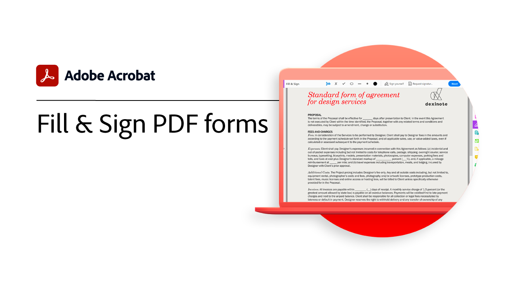

# Komma igång - översikt

Lär dig hur du börjar använda Adobe Acrobat med de här korta stegvisa självstudiekurserna. Allt från att skapa ett dokument till att skydda dina PDF-filer är det här innehållet utformat för att underlätta för dig att komma in i arbetsflödena i PDF.

## Acrobat självstudiekurser

<table style="table-layout:fixed">
<tr>
  <td>
    
    

    <a href="get-to-know-the-acrobat-dc-interface.md"><strong>Allmänt om arbetsytan</strong></a>
    

    <em>Se hur Adobe Acrobat DC-gränssnittet gör det enkelt att komma åt filer och verktyg på datorn, webben och mobila enheter</em>
     
  </td>
  <td>
    
    

    <a href="acrobatweb.md"><strong>Arbeta var som helst med Acrobat webben</strong></a>
    

    <em>Lär dig hur du hanterar förfrågningar från affärsdokument var som helst med Acrobat webbverktyg i webbläsaren</em>
     
  </td>
  <td>
    
    

     <a href="productivity.md"><strong>Produktivitet i farten</strong></a>
    

    <em>Gör mer direkt på surfplattan eller mobiltelefonen med Acrobat Reader mobilapp</em>
     
  </td>
</tr>
<tr>
   <td>
    
    

     <a href="../integrate/integrate-overview.md#microsoft"><strong>Arbeta med Microsoft 365</strong></a>
    

    <em>Öka produktiviteten och arbetsflödena för affärsdokument med Acrobat och [!DNL Microsoft 365]</em>
     
  </td>
  <td>
    
    

     <a href="collaborate.md"><strong>Samarbeta i realtid</strong></a>
    

    <em>Flytta dina projekt framåt genom att samla in kommentarer, samarbeta om svar och följa upp förloppet för dina dokument i realtid, var du än är</em>
     
  </td>
  <td>
    
    

     <a href="combine-to-pdf.md"><strong>Kombinera filer till PDF</strong></a>
    

    <em>Kombinera många olika typer av filer till en enda PDF</em>
     
  </td>
</tr>
<tr>
  <td>
    
    

    <a href="create-pdf.md"><strong>Skapa en PDF</strong></a>
    

    <em>Skapa PDF från alla slags dokument</em>
     
  </td>
 <td>
    
    

    <a href="comment-on-pdf-files.md"><strong>Kommentera på en PDF</strong></a>
    

    <em>Lägga till kommentarer i en PDF-fil och dela den sedan med andra</em>
     
  </td>
  <td>
    
    

    <a href="edit-pdf.md"><strong>Redigera en PDF-fil</strong></a>
    

    <em>Redigera text och bilder i PDF-filer</em>
     
  </td>
</tr>
<tr>
  <td>
    
    

    <a href="export-pdf.md"><strong>Exportera ett PDF till redigerbara format</strong></a>
    

    <em>Lär dig hur du exporterar dina PDF-filer till redigerbara format</em>
     
  </td>
  <td>
    
    

    <a href="create-fillable-forms.md"><strong>Skapa ifyllbara formulär</strong></a>
    

    <em>Gör om ett dokument som har skapats i ett annat program till ett ifyllbart PDF-formulär</em>
     
  </td>
  <td>
    
    

    <a href="scan-and-ocr.md"><strong>Skanna och OCR</strong></a>
    

    <em>Minska antalet stora filer och optimera PDF utan att kompromissa med kvaliteten på delning, publicering eller arkivering</em>
     
  </td>
</tr>
<tr>
 <td>
    
    

    <a href="organize.md"><strong>Ordna sidor</strong></a>
    

    <em>Lägga till, ersätta, extrahera, rotera, ta bort och flytta sidor i PDF</em>
     
  </td>
  <td>
    
    

    <a href="password-protect.md"><strong>Protect en PDF-fil med ett lösenord</strong></a>
    

    <em>Lägg till ett lösenord till PDF för att skydda andra från att öppna eller redigera filen</em>
     
  </td>
  <td>
    
    

    <a href="fill-and-sign.md"><strong>Fill &amp; Sign PDF forms</strong></a>
    

    <em>Fyll i och signera ett PDF-formulär snabbt</em>
     
  </td>
</tr>
<tr>
  <td>
    
    

    <a href="where-do-pdfs-come-from.md"><strong>Varifrån kommer PDF?</strong></a>
    

    <em>Förstå varifrån PDF kommer och deras användningsområden</em>
     
  </td>
  <td>
   
    

     
  </td>
  <td>
   
    

     
  </td>
</tr>
</table>
