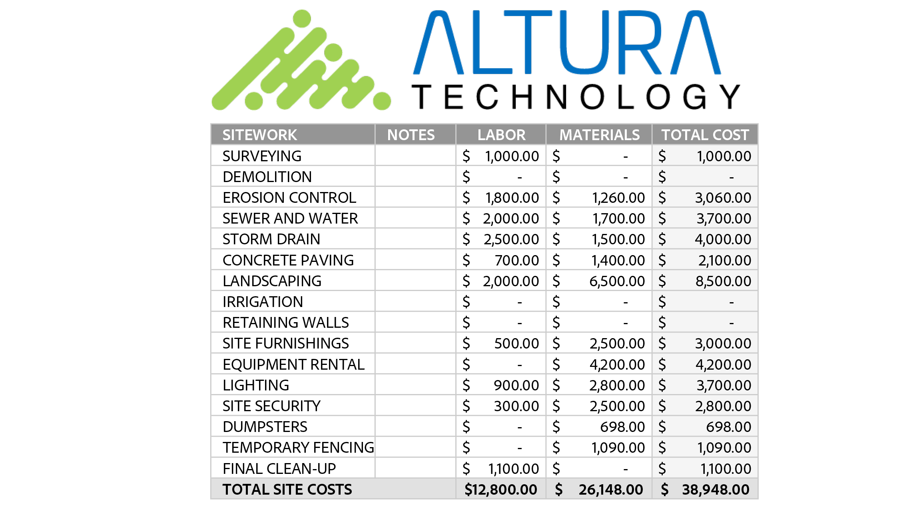

# Översikt över Komma igång

Lär dig börja använda Adobe Acrobat via de här korta stegvisa självstudiekurserna. Från att skapa ett dokument till att skydda eller [redigera dina PDF-filer](https://www.adobe.com/se/acrobat/online/pdf-editor.html){target="_blank"}, är detta innehåll utformat för att underlätta för dig att komma in i PDF-arbetsflöden.

## Nyheter

* [Redigera grafik i en PDF](edit-graphics.md)
Lär dig skapa, redigera och förbättra grafik i din PDF
* [Ny arbetsyta](new-workspace.md)
Lär dig mer om den nya arbetsytan i Acrobat som hjälper dig att snabbt hitta verktyg och slutföra dina arbetsuppgifter i PDF effektivt
* [Upptäck PDF-insikter med AI-assistenten](ai-assistant.md)
Lär dig hur du får insikter från dina PDF-filer med hjälp av AI-assistenten

## Självstudiekurser för att komma igång

<table style="table-layout:fixed">
<tr>
  <td>
    
    

    <a href="new-workspace.md"><strong>Ny arbetsyta</strong></a>
    

    Läs mer om den nya arbetsytan i Acrobat
     
  </td>
  <td>
    
    

    <a href="get-to-know-the-acrobat-dc-interface.md"><strong>Grundläggande om arbetsytan</strong></a>
    

    Lär dig grunderna i Acrobat-arbetsytan
     
  </td>
  <td>
    
    

    <a href="ai-assistant.md"><strong>Upptäck PDF-insikter med AI-assistenten</strong></a>
    

    Få insikter från dina PDF-filer med hjälp av AI-assistenten
     
  </td>
  <td>
    
    

    <a href="acrobatweb.md"><strong>Arbeta överallt med Acrobat på webben</strong></a>
    

    Lär dig arbeta var du än är
     
  </td>
</tr>
<tr>
  <td>
    
    

    <a href="productivity.md"><strong>Produktivitet var du än är</strong></a>
    

    Läs om hur du kan göra mer med din surfplatta eller mobiltelefon
     
  </td>
    <td>
      
      

      <a href="../integrate/integrate-overview.md#microsoft"><strong>Arbeta med Microsoft 365</strong></a>
      

      Arbeta smidigt med PDF-filer direkt i Microsoft 365
        
    </td>
    <td>
      
      

      <a href="where-do-pdfs-come-from.md"><strong>Var kommer PDF ifrån?</strong></a>
      

      Lär dig var PDF kommer ifrån och hur du kan använda dem
       
    </td>
    <td>
    
      

       
    </td>
  </tr>
  </table>

## Skapa, kombinera och ordna självstudiekurser

<table style="table-layout:fixed">
  <tr>
    <td>
      
      

      <a href="create-pdf.md"><strong>Skapa PDF-filer</strong></a>
      

      Skapa PDF från alla typer av dokument
       
    </td>
    <td>
      
      

      <a href="combine-to-pdf.md"><strong>Kombinera filer till en PDF</strong></a>
      

      Kombinera smidigt många olika filtyper i en och samma PDF
       
    </td>
    <td>
      
      

      <a href="organize.md"><strong>Ordna sidor</strong></a>
      

      Lär dig hur du ordnar om sidor precis som du vill
       
    </td>
    <td>
      
      

      <a href="add-custom-page.md"><strong>Designa en ny sida</strong></a>
      

     Lär dig skapa en ny sida med professionellt utseende i PDF
       
    </td>
  </tr>
  </table>

## Självstudiekurser för redigering och export

<table style="table-layout:fixed">
  <tr>
    <td>
      
      

      <a href="edit-pdf.md"><strong>Redigera text i en PDF</strong></a>
      

      Redigera ord, fraser eller till och med hela sidor på din PDF
       
    </td>
    <td>
      
      

      <a href="edit-graphics.md"><strong>Redigera grafik i en PDF</strong></a>
      

      Lär dig skapa, redigera och förbättra grafik i din PDF
       
    </td>
    <td>
      
      

      <a href="stylize-this-PDF.md"><strong>Stilisera den här PDF</strong></a>
      

      Lär dig skapa PDF med professionellt utseende
       
    </td>
   <td>
      
      

      <a href="auto-adjust-layout.md"><strong>Automatisk justering av layout</strong></a>
      

      Läs mer om det nya redigeringsläget för innehållsflödesomformning
       
    </td>
  </tr>
    <td>
      
      

      <a href="export-pdf.md"><strong>Konvertera PDF till olika filformat</strong></a>
      

      Konvertera dina PDF-filer till olika filformat
       
    </td>
    <td>
   
    

     
  </td>
  <td>
   
    

     
  </td>
   <td>
   
    

     
  </td>
</tr>
</table>

## Självstudiekurser om samarbete

<table style="table-layout:fixed">
  <tr>
    <td>
      
      

      <a href="collaborate.md"><strong>Samarbeta i realtid</strong></a>
      

      Utveckla dina projekt genom att samarbeta i realtid
    </td>
    <td>
      
      

      <a href="comment-on-pdf-files.md"><strong>Kommentera en PDF</strong></a>
      

      Lägg till kommentarer och dela sedan din PDF med andra
       
    </td>
    <td>
    
      

       
    </td>
    <td>
    
      

       
    </td>
</tr>
</table>

## Ytterligare självstudiekurser

<table style="table-layout:fixed">
<tr>
  <td>
    
    

      <a href="create-fillable-forms.md"><strong>Skapa ifyllningsbara formulär</strong></a>
      

      Omvandla ett skannat papper till ett ifyllbart formulär
       
  </td>
  <td>
    
    

    <a href="fill-and-sign.md"><strong>Fill &amp; Sign ett PDF-formulär</strong></a>
    

    Läs om hur du snabbt och enkelt fyller i och signerar ett PDF-formulär
     
  </td>
  <td>
    
    

    <a href="scan-and-ocr.md"><strong>Skanning och OCR</strong></a>
    

    Konvertera skanningar eller bilder till sökbara, redigerbara PDF-filer
     
  </td>
  <td>
    
    

    <a href="password-protect.md"><strong>Protect en PDF-fil med ett lösenord</strong></a>
    

    Lär dig hur du lägger till ett lösenord till din PDF
     
  </td>
</tr>
<tr>
  <td>
    
    

    <a href="signatures.md"><strong>Hämta signaturer</strong></a>
    

    Lär dig samla in rättsligt bindande e-signaturer
     
  </td>
  <td>
    
    

    <a href="track.md"><strong>Spåra dina dokument</strong></a>
    

    Spåra och hantera dina dokument för e-signaturer
     
  </td>
  <td>
   
    

     
  </td>
  <td>
   
    

     
  </td>
</tr>
</table>
