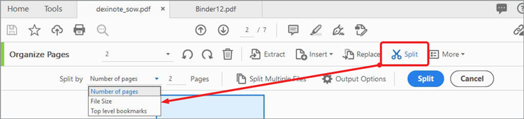

# Ordna sidor

Använd **[!UICONTROL Ordna sidor]** i Acrobat DC för att lägga till, ersätta, extrahera, rotera, ta bort och flytta sidor i PDF-filen.

1. Välj **[!UICONTROL Ordna sidor]** i [!UICONTROL Verktyg] mitten.

   

1. Håll markören över en sida om du vill rotera sidan medsols eller motsols, eller ta bort sidan.

   Om du vill flytta en sida klickar du och drar sidan till den nya platsen.

   

1. Klicka på **[!UICONTROL Extrahera]** i verktygsfältet om du vill skapa en ny PDF-fil från en eller flera sidor.

1. Markera sidan eller sidorna och klicka sedan på knappen **[!UICONTROL Extrahera]**.

   Du kan också **[!UICONTROL Infoga]** eller **[!UICONTROL Ersätt]** sidor och visa andra alternativ genom att klicka på **[!UICONTROL Mer]**.

   

1. Välj **[!UICONTROL Dela]** om du vill dela upp en eller flera PDF-filer i flera mindre PDF-filer.

   När du delar upp en PDF-fil kan du dela upp efter antal sidor, filstorlek eller bokmärken på högsta nivån.

   

Klicka för att hämta en PDF-fil med *Organizer pages*-självstudiekursen.

