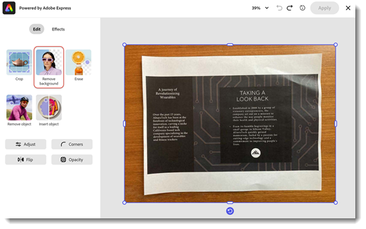
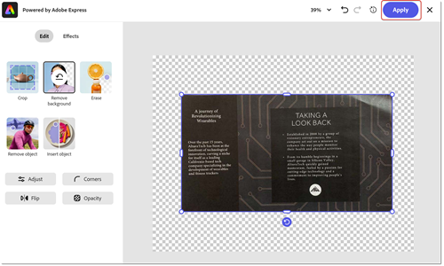

# Papper till PDF

Lär dig hur du skannar (eller tar en bild) av ett pappersdokument och förvandlar det till en sökbar och [redigerbar PDF-fil](https://www.adobe.com/se/acrobat/online/pdf-editor.html){target="_blank"}. Genom att konvertera papper till PDF kan du snabbt hitta information och göra den tillgänglig för personer med funktionsnedsättning. I den här självstudiekursen visas [den nya Acrobat-upplevelsen](new-workspace.md).

## Så här gör du om papper till en PDF i Acrobat på en dator

1. Öppna ett foto eller en skannad bild av ett dokument. Eller skapa en ny fil med en ansluten skanner eller använd den kostnadsfria [Adobe Scan-mobilappen](https://adobescan.app.link/GpBqG8Bkoeb).

1. Välj **[!UICONTROL Alla verktyg]** i verktygsfältet och välj **[!UICONTROL Skanning och OCR]** i den vänstra rutan.

   

1. Välj **[!UICONTROL Förbättra skannade bilder]** eller **[!UICONTROL Förbättra kamerabilden]** beroende på filtyp.

   

1. Justera sidgränserna genom att dra i handtagen och välj **[!UICONTROL Förbättra]**.

   

   Acrobat rengör och rätar upp fotot automatiskt.

1. Välj **[!UICONTROL I den här filen]** och välj **[!UICONTROL Identifiera text]** för att göra texten sökbar och redigerbar.

   

Filen är nu en sökbar, redigerbar PDF-fil.

## Hur man förvandlar papper till en PDF i Acrobat web

1. Logga in på [acrobat.adobe.com](https://acrobat.adobe.com/se/sv) i en webbläsare.

1. Välj **[!UICONTROL Konvertera > Identifiera text med OCR]** på den övre menyn.

   

1. Välj **[!UICONTROL Välj filer]**, välj din fil och välj **[!UICONTROL Öppna]**.

   

1. Välj **[!UICONTROL Identifiera text]**.

   

   Texten i filen är nu sökbar och redigerbar.

1. Om du vill ta bort bakgrunden markerar du bilden och väljer **[!UICONTROL Redigera bild]**.

   

1. Markera **[!UICONTROL Ta bort bakgrunden]** i redigeraren för Adobe Express.

   

1. Justera sidgränserna genom att dra i handtagen och välj **[!UICONTROL Använd]**.

   

>[!TIP]
>
>Om du vill använda OCR på flera PDF-filer kan du prova att använda Actionen Wizard [&#128279;](../advanced-tasks/action.md) i Acrobat Pro på datorn.