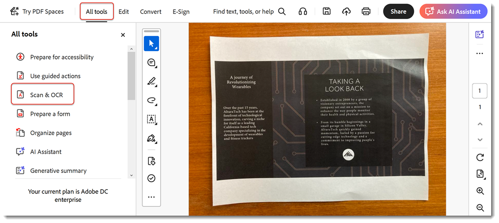

# Skanning och OCR

Utveckla verksamheten genom att konvertera skanningar eller bilder av dokument till sökbara [redigerbara PDF-filer](https://www.adobe.com/se/acrobat/online/pdf-editor.html){target="_blank"}.

>[!TIP]
>
>Om du vill använda OCR på flera PDF-filer kan du prova att använda [Action Wizard](../advanced-tasks/action.md).

1. Välj **[!UICONTROL Skanning och OCR]** från [!UICONTROL Verktyg] mitten eller den högra rutan.

   

1. Välj en fil.

   Den här filen kan vara ett foto av ett dokument eller en fil som redan har skannats och skapats med en skanner eller mobilappen Adobe Scan. Du kan också skanna ett dokument för att skapa en ny fil med en ansluten skanner.

   

1. Välj **[!UICONTROL Skannade dokument]** eller **[!UICONTROL Kamerabild]** för att förbättra dokumentet.

1. Välj **[!UICONTROL Förbättra]** för att rensa bilden.

   

   Acrobat identifierar automatiskt inskannad text.

1. Välj **[!UICONTROL Identifiera text]** för att manuellt tolka text i bildfiler.

   

Filen är nu en sökbar, redigerbar PDF-fil.

>[!TIP]
>
>Den här videon är en del av kursen [Arbeta smartare med Acrobat DC och Microsoft 365](https://experienceleague.adobe.com/?recommended=Acrobat-U-1-2021.microsoft365) som är tillgänglig gratis på Experience League!
