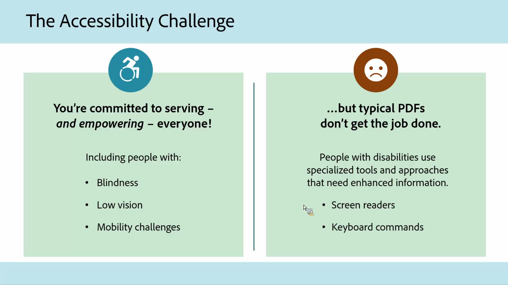

# Acrobat för myndigheter

Utforska våra Acrobat-självstudiekurser som är särskilt utformade för statliga och lokala myndigheter.

## Fem tips för att arbeta var som helst med Acrobat

<table style="table-layout:fixed">
<tr>
  <td>
    
    

    <a href="5-tips-for-working-anywhere-with-acrobat-dc-for-government.md"><strong>Fem tips för att arbeta var som helst med Acrobat (komplett 15:12)</strong></a>
    

    <em>Lär dig hur du får och använder verktygen i Acrobat och dess tillhörande mobilappar för att arbeta var som helst</em>
     
  </td>
  <td>
    
    

    <a href="get-your-tools.md"><strong>Tips 1: Skaffa dina verktyg</strong></a>
    

    <em>Det första steget för att börja arbeta var du än är att skaffa dina Acrobat-verktyg och tillhörande mobilappar</em>
     
  </td>  
  <td>
    
    

    <a href="collaborate-on-documents.md"><strong>Tips 2: Samarbeta i dokument</strong></a>
    

    <em>Skapa enkla och smidiga arbetsflöden för samarbete i dokument</em>
     
  </td>
  <td>
    
    

    <a href="protect-digital-documents.md"><strong>Tips 3: Protect digitala dokument</strong></a>
    

    <em>Lägg till ett lösenord till din PDF för att förhindra kopiering, redigering eller utskrift</em>
     
  </td>
</tr>
  <td>
    
    

    <a href="work-with-forms-and-signatures.md"><strong>Tips 4: Arbeta med formulär och signaturer</strong></a>
    

    <em>Lär dig hur du håller dig digital när du fyller i formulär</em>
     
  </td>
  <td>
    
    

    <a href="scan-and-edit-on-mobile.md"><strong>Tips 5: Skanna och redigera på mobilen</strong></a>
    

    <em>Lär dig arbeta med Adobe Scan- och Acrobat Reader-mobilappar för att få jobbet gjort var som helst</em>
     
  </td>
  <td>
   
    

     
  </td>
  <td>
   
    

     
  </td>
</tr>
</table>

## Tillgänglighet

<table>
<tr>
  <td>
    
    

    <a href="making-pdfs-accessible.md"><strong>Göra PDF tillgängligt (fullständig 14:11)</strong></a>
    

    <em>Läs mer om det bästa arbetsflödet för att skapa hjälpmedelsanpassade PDF-filer</em>
     
  </td>
  <td>
    
    

    <a href="understanding-accessibility.md"><strong>Göra PDF tillgänglig: Förstå hjälpmedel</strong></a>
    

    <em>Läs mer om vad det innebär att göra en PDF tillgänglig för funktionshindrade</em>
     
  </td>  
  <td>
    
    

    <a href="collaborate-on-documents.md"><strong>Göra PDF tillgänglig: Skapa i Word</strong></a>
    

    <em>Lär dig bästa sättet att skapa PDF-filer som är skapade i [!DNL Microsoft Word]</em>
     
  </td>
   <td>
    
    

    <a href="finishing-in-acrobat.md"><strong>Göra PDF tillgängligt: Slutföra i Acrobat</strong></a>
    

    <em>Läs om hur du slutför tillgängliggörandet av din PDF-fil med verktygen i Acrobat Pro</em>
     
  </td>
</tr>
<tr>
  <td>
    
    

    <a href="making-pdf-ballots-accessible.md"><strong>Göra röstsedlar i PDF mer tillgängliga</strong></a>
    

    <em>Detta webbseminarium tar upp de viktigaste tillgänglighetsområdena för PDF som behövs för att användare av hjälpmedelstekniker, t.ex. skärmläsare, ska kunna läsa och slutföra sina omröstningar</em>
     
  </td>  
  <td>
   
    

     
  </td>
  <td>
   
    

     
  </td>
  <td>
   
    

     
  </td>
</tr>
</table>
