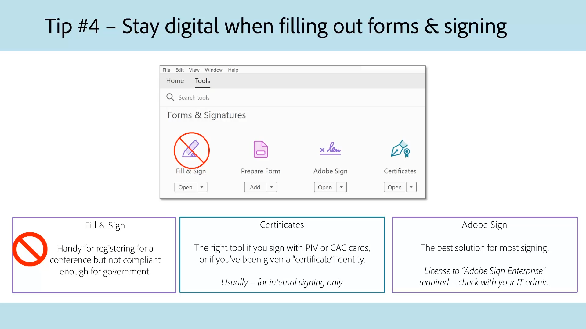

# Acrobat för myndigheter

Utforska våra självstudiekurser för Acrobat som är särskilt utformade för myndigheter på federal, delstatlig och lokal nivå.

## 5 tips för att arbeta var som helst med Acrobat

<table style="table-layout:fixed">
<tr>
  <td>
    
    

    <a href="5-tips-for-working-anywhere-with-acrobat-dc-for-government.md"><strong>5 tips för att arbeta var som helst med Acrobat (komplett 15:12)</strong></a>
    

    <em>Lär dig hur du skaffar och använder verktygen i Acrobat och dess tillhörande mobilappar för att arbeta var som helst</em>
     
  </td>
  <td>
    
    

    <a href="get-your-tools.md"><strong>Tips 1: Skaffa dina verktyg</strong></a>
    

    <em>Det första steget för att börja arbeta var som helst är att skaffa Acrobat-verktyg och tillhörande mobilappar</em>
     
  </td>  
  <td>
    
    

    <a href="collaborate-on-documents.md"><strong>Tips 2: Samarbeta om dokument</strong></a>
    

    <em>Skapa enkla och smidiga arbetsflöden för dokumentsamarbete</em>
     
  </td>  
</tr>
<tr>
  <td>
    
    

    <a href="protect-digital-documents.md"><strong>Tips 3: Protect digitala dokument</strong></a>
    

    <em>Lägg till ett lösenord i PDF för att förhindra kopiering, redigering eller utskrift</em>
     
  </td>
  <td>
    
    

    <a href="work-with-forms-and-signatures.md"><strong>Tips 4: Arbeta med formulär och signaturer</strong></a>
    

    <em>Lär dig hur man håller sig digital när man fyller i formulär</em>
     
  </td>
  <td>
    
    

    <a href="scan-and-edit-on-mobile.md"><strong>Tips 5: Skanna och redigera på mobilen</strong></a>
    

    <em>Lär dig hur du arbetar med mobilapparna Adobe Scan och Acrobat Reader för att få jobbet gjort oavsett var du är</em>
     
  </td>
</tr>
</table>

## Tillgänglighet

<table>
<tr>
  <td>
    
    

    <a href="making-pdfs-accessible.md"><strong>Göra PDF tillgängligt (komplett 14:11)</strong></a>
    

    <em>Läs om det optimala arbetsflödet för att skapa tillgängliga PDF-filer</em>
     
  </td>
  <td>
    
    

    <a href="understanding-accessibility.md"><strong>Göra PDF tillgängligt: Tillgänglighet</strong></a>
    

    <em>Se vad det innebär att göra en PDF tillgänglig för funktionshindrade</em>
     
  </td>  
  <td>
    
    

    <a href="collaborate-on-documents.md"><strong>Göra PDF tillgängligt: Redigering i Word</strong></a>
    

    <em>Lär dig de bästa sätten att skapa PDF-filer som skapas i [!DNL Microsoft Word]</em>
     
  </td>  
</tr>
<tr>
  <td>
    
    

    <a href="finishing-in-acrobat.md"><strong>Göra PDF tillgängligt: Slutbehandling i Acrobat</strong></a>
    

    <em>Läs om hur du gör klart PDF-filen med verktygen i Acrobat Pro</em>
     
  </td>
  <td>
    
    

    <a href="making-pdf-ballots-accessible.md"><strong>Göra valsedlar i PDF mer tillgängliga</strong></a>
    

    <em>Detta webbinarium tar upp de viktigaste tillgänglighetsområdena i PDF som behövs för att användare av hjälpmedelsteknik, t.ex. skärmläsare, ska kunna läsa och fylla i sina röstsedlar</em>
     
  </td>  
  <td>
   
    

     
  </td>
</tr>
</table>
