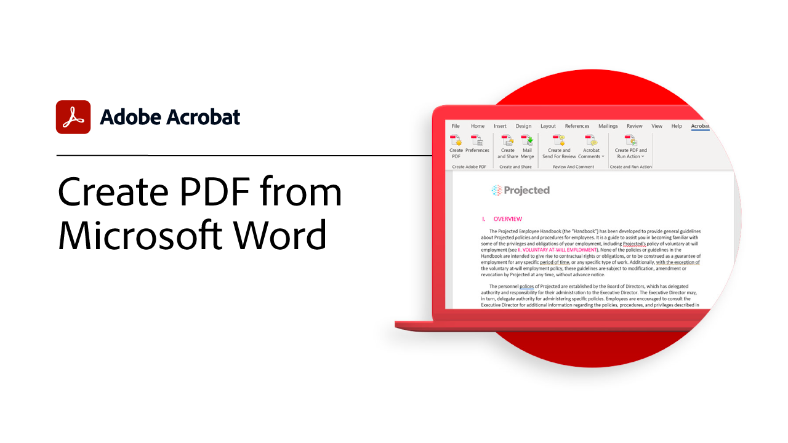

# Översikt över integreringar

Integrera Acrobat med [!DNL Box], [!DNL Dropbox], [!DNL Google Drive], [!DNL OneDrive]och [!DNL Microsoft] program.

## Microsoft

Se hur alla i teamet kan arbeta smidigt med PDF-filer direkt i [Microsoft 365](https://www.adobe.com/documentcloud/integrations/microsoft-office-365.html).

<table style="table-layout:fixed">
<tr>
  <td>
    
    

    <a href="createfromword.md"><strong>Skapa PDF-filer från [!DNL Microsoft Word]</strong></a>
    

    <em>Skapa funktionsrika PDF-filer med hyperlänkade innehållsförteckningar och korsreferenser, bokmärken och till och med bilagor direkt från [!DNL Microsoft Word]</em>
     
  </td>
  <td>
    
    

    <a href="createofficeweb.md"><strong>Skapa PDF i [!DNL Office] för webben</strong></a>
    

    <em>Lär dig hur du skapar PDF-filer utan att behöva lämna [!DNL Microsoft Office] för webbappar</em>
     
  </td>  
  <td>
    
    

    <a href="acrobatandsp.md"><strong>Arbeta med [!DNL SharePoint] filer</strong></a>
    

    <em>Effektivisera dokumentarbetsflöden med [!DNL SharePoint] och Acrobat</em>
     
  </td>  
</tr>
<tr>
  <td>
    
    

    <a href="acrobatandteams.md"><strong>PDF i [!DNL Microsoft Teams]</strong></a>
    

    <em>Samarbeta och samarbeta med kollegor genom att visa, kommentera och granska PDF utan att behöva lämna det [!DNL Microsoft Teams]</em>
     
  </td>
  <td>
    
    

    <a href="outlook.md"><strong>Konvertera e-postmeddelanden och bilagor till PDF i [!DNL Outlook]</strong></a>
    

    <em>Läs om hur man levererar information på ett mer professionellt och säkert sätt i [!DNL Outlook]</em>
     
  </td>
  <td>
    
    

    <a href="edge.md"><strong>Skapa PDF-innehåll när du bläddrar med [!DNL Microsoft Edge]</strong></a>
    

    <em>Läs om hur du arkiverar webbsidor till PDF i farten med Adobe Acrobat-tillägget för [!DNL Microsoft Edge]</em>
     
  </td>
</tr>
</table>

## Google Drive

Läs om hur du får mer gjort på kortare tid med de verktyg för PDF och e-signaturer som behövs [!DNL Google Drive].

<table style="table-layout:fixed">
<tr>
  <td>
    
    

    <a href="acrobatandgoogle.md"><strong>Adobe Acrobat för [!DNL Google Drive]</strong></a>
    

    <em>Få tillgång till tidsbesparande verktyg för PDF och e-signaturarbetsflöden direkt i [!DNL Google Drive] app</em>
     
  </td>
  <td>
   
    

     
  </td>
  <td>
   
    

     
  </td>
</tr>
</table>

## Box

Läs om hur Acrobat och [Box](https://www.adobe.com/documentcloud/integrations/box.html){target=&quot;_blank&quot;} gör det enklare för alla i organisationen att hålla igång verksamheten.

## Dropbox

Se hur enkelt det är att komma åt och arbeta med PDF som lagras i [Dropbox](https://www.adobe.com/documentcloud/integrations/dropbox.html){target=&quot;_blank&quot;}.
