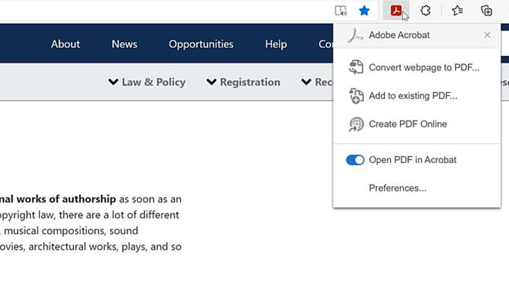

# Översikt över integreringar

Integrera Acrobat med [!DNL Box], [!DNL Dropbox], [!DNL Google Drive], [!DNL OneDrive] och [!DNL Microsoft] program.

## Microsoft

Se hur alla i ditt team kan arbeta smidigt med PDF-filer direkt i [Microsoft 365](https://www.adobe.com/documentcloud/integrations/microsoft-office-365.html). Ta en titt på den här expertkurerade [spellistan](https://experienceleague.adobe.com/en/playlists/acrobat-integrate-microsoft-365) för integreringar av Acrobat och Microsoft 365.

<table style="table-layout:fixed">
<tr>
  <td>
    
    

    <a href="createfromword.md"><strong>Skapa PDF-filer från Microsoft Word</strong></a>
    

    Lär dig hur du skapar innehållsrika, robusta PDF-filer direkt från Microsoft Word
     
  </td>
  <td>
    
    

    <a href="createofficeweb.md"><strong>Skapa PDF i [!DNL Office] för webben</strong></a>
    

    Lär dig hur du skapar innehållsrika, robusta PDF-filer direkt från Microsoft Word
     
  </td> 
  <td>
    
    

    <a href="acrobatandsp.md"><strong>Arbeta med dina [!DNL SharePoint] filer</strong></a>
    

    Effektivisera dokumentarbetsflöden med [!DNL SharePoint] och Acrobat
     
  </td>
  <td>
    
    

    <a href="acrobatandteams.md"><strong>PDF-samarbete i [!DNL Microsoft Teams]</strong></a>
    

    Samarbeta och arbeta med kollegor genom att visa, kommentera och granska PDF utan att någonsin lämna [!DNL Microsoft Teams]
     
  </td>
</tr>
<tr>
  <td>
    
    

    <a href="outlook.md"><strong>Konvertera e-postmeddelanden och bilagor till PDF i Outlook</strong></a>
    

    Lär dig leverera information på ett mer professionellt och säkert sätt i [!DNL Outlook]
     
  </td>
  <td>
    
    

    <a href="edge.md"><strong>Skapa PDF-innehåll när du surfar med [!DNL Microsoft Edge]</strong></a>
    

    Lär dig hur du förvandlar webbsidor till PDF i farten med Adobe Acrobat-tillägget för [!DNL Microsoft Edge]
     
  </td>
  <td>
    
    

    <a href="microsoftsensitivitylabels.md"><strong>Protect PDF med [!DNL Microsoft Purview Information] känslighetsetiketter</strong></a>
    

    Lär dig skydda PDF genom att lägga till, redigera, anpassa och ta bort känslighetsetiketter för Microsoft Purview Information direkt i Acrobat
     
  </td>
  <td>
   
    

     
  </td>
</tr>
</table>

## Google Drive

Lär dig hur du får mer gjort på kortare tid med viktiga PDF- och e-signaturverktyg i [!DNL Google Drive].

<table style="table-layout:fixed">
<tr>
  <td>
    
    

    <a href="acrobatandgoogle.md"><strong>Adobe Acrobat för Google Drive</strong></a>
    

    Lär dig hur du får tillgång till tidsbesparande PDF-verktyg och arbetsflöden för e-signaturer direkt i [!DNL Google Drive]-programmet
     
  </td>
  <td>
   
    

     
  </td>
  <td>
   
    

     
  </td>
  <td>
   
    

     
  </td>
</tr>
</table>

## Dropbox

Se hur enkelt det är att komma åt och arbeta med filer som lagras i [!DNL Dropbox].

<table style="table-layout:fixed">
<tr>
  <td>
    
    

    <a href="acrobat-dropbox.md"><strong>Arbeta med filer från [!DNL Dropbox]</strong></a>
    

    Läs om hur du öppnar, skapar, redigerar, signerar och sparar ändringar i dina [!DNL Dropbox]-filer inifrån Acrobat
     
  </td>
  <td>
   
    

     
  </td>
  <td>
   
    

     
  </td>
  <td>
   
    

     
  </td>
</tr>
</table>

## Box

Se hur Acrobat och [Box](https://www.adobe.com/documentcloud/integrations/box.html){target="_blank"} gör det enklare för alla i organisationen att hålla verksamheten igång.
