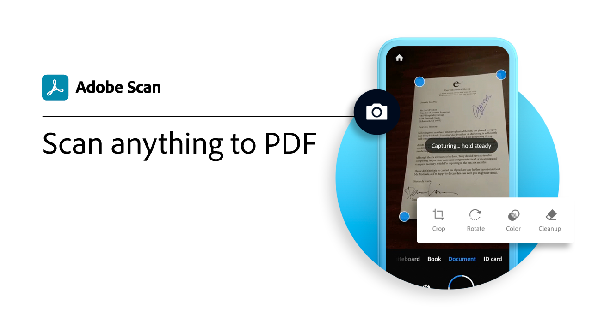

# Översikt över mobilen

Skapa, fyll i och signera PDF på din mobila enhet.

## Självstudiekurser för Acrobat Reader-mobilappar

<table style="table-layout:fixed">
<tr>
  <td>
    
    

     <a href="../getting-started/productivity.md"><strong>Produktivitet i farten</strong></a>
    

    <em>Gör mer direkt från din surfplatta eller mobiltelefon med mobilappen Acrobat Reader</em>
     
  </td>
  <td>
   
    

     
  </td>
  <td>
   
    

     
  </td>
</tr>
</table>

## Självstudiekurser för Adobe Scan-mobilappar

<table style="table-layout:fixed">
<tr>
  <td>
    
    

     <a href="scan-mobile-app.md"><strong>Skanna vad som helst till PDF</strong></a>
    

    <em>Läs om hur du förvandlar pappersdokument till PDF med den kostnadsfria mobilappen Adobe Scan</em>
     
  </td>
  <td>
   
    

     
  </td>
  <td>
   
    

     
  </td>
</tr>
</table>

Hämta [Adobe Acrobat Reader-mobilapp](https://www.adobe.com/acrobat/mobile/acrobat-reader.html){target=&quot;_blank&quot;} är den kostnadsfria världsstandarden för att visa, kommentera och signera PDF.

[Användarhandbok för Acrobat Reader för iOS](https://www.adobe.com/devnet-docs/acrobat/ios/en/){target=&quot;_blank&quot;}
[Användarhandbok för mobiler till Acrobat Reader för Android](https://www.adobe.com/devnet-docs/acrobat/android/en/){target=&quot;_blank&quot;}

Hämta [Adobe Scan-mobilapp](https://www.adobe.com/acrobat/mobile/scanner-app.html){target=&quot;_blank&quot;} om du vill hämta ett pappersdokument och omvandla det till ett högkvalitativt PDF med sökbar text.

[Användarhandbok för Adobe Scan för iOS](https://www.adobe.com/devnet-docs/adobescan/ios/en/){target=&quot;_blank&quot;}
[Användarhandbok för mobiler till Adobe Scan för Android](https://www.adobe.com/devnet-docs/adobescan/android/en/){target=&quot;_blank&quot;}

Hämta [Adobe Fill &amp; Sign-mobilapp](https://www.adobe.com/acrobat/mobile/fill-sign-pdfs.html){target=&quot;_blank&quot;} om du vill fylla i, signera och skicka formulär var du än är, på vilken enhet som helst, med bara fingret eller en penna.
