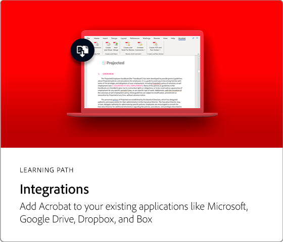

# Självstudiekurser om Acrobat

Adobe Acrobat är en Adobe Document Cloud-lösning som hjälper företag att hålla verksamheten i rörelse genom att konvertera, redigera, dela och signera PDF. Här hittar du ett brett utbud av utbildningsupplevelser som är utformade för att snabbt få både nybörjare och avancerade användare att komma igång med Adobe Acrobat.

## Aktuella utbildningsvägar

<table style="table-layout:fixed">
<tr>
  <td>
    
  </td>
  <td>
    
  </td>
  <td>
    
  </td>
  <td>
    
  </td>
</tr>
</table>
