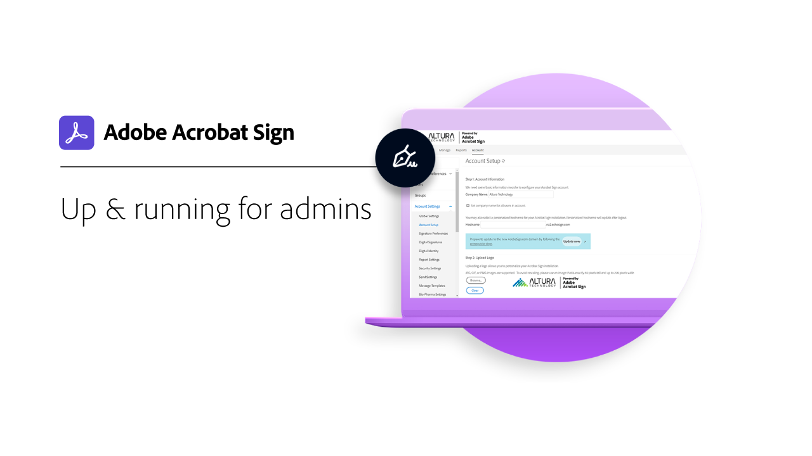
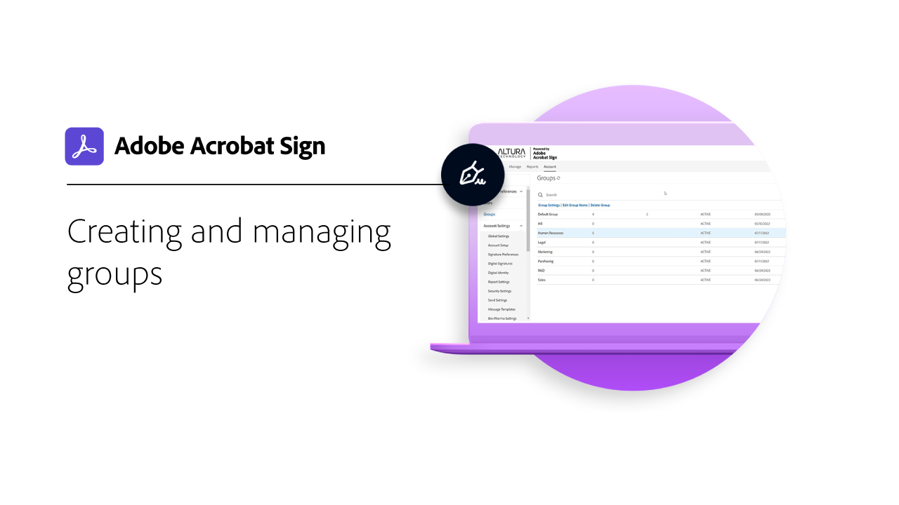
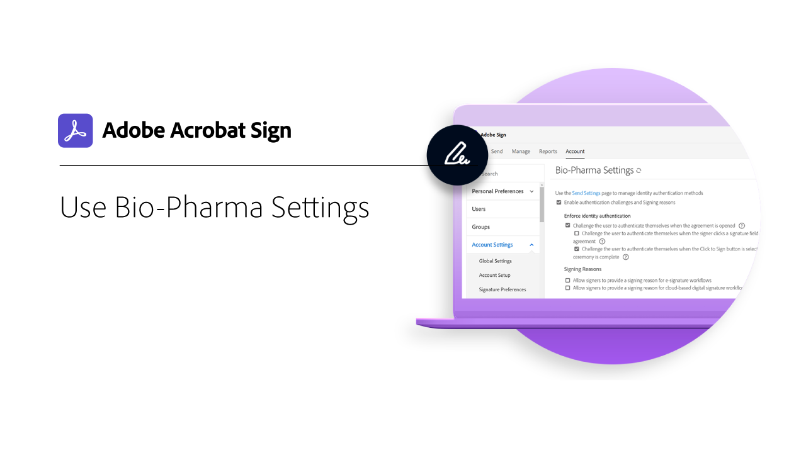

# Översikt över administratörer

Lär dig hur du lägger till användare i ditt konto, konfigurerar grupper, delar åtkomst och konfigurerar ett arbetsflöde, ett externt arkiv och delade händelser och varningar. Dessa självstudiekurser är utformade för administratörer som har passerat installationsfasen och är redo att börja administrera Acrobat Sign. De avancerade uppgifterna omfattar ämnen som sträcker sig bortom administratörskonfigurationen och rör sig mot att definiera globala inställningar, kontoåtkomst och delning samt texttaggning.

## Komma igång

<table style="table-layout:fixed">
<tr>
  <td>
    
    

    <a href="get-started-admin.md"><strong>Komma igång för nya administratörer</strong></a>
    

    <em>I den här omfattande videoguiden får du lära dig mer om alla verktyg som behövs för att få igång verksamheten med Acrobat Sign</em>
     
  </td>
  <td>
    
    

    <a href="up-and-running-admin.md"><strong>Komma igång för administratörer</strong></a>
    

    <em>Översikt över 7 nyckelområden där administratörer snabbt kan komma igång i Acrobat Sign</em>
     
  </td>
  <td>
    
    

    <a href="set-up-shared-events-and-alert.md"><strong>Konfigurera meddelanden för händelser och varningar</strong></a>
    

    <em>Konfigurera aviseringar för händelser och aviseringar för ditt konto</em>
     
  </td>
  <td>
    
    

    <a href="add-users-to-your-account.md"><strong>Lägga till användare</strong></a>
    

    <em>Lägg till användare enskilt eller i grupp i ditt Acrobat Sign-konto</em>
     
  </td>
</tr>
<tr>
 <td>
    
    

    <a href="create-and-manage-groups.md"><strong>Skapa och hantera grupper</strong></a>
    

    <em>Skapa grupper, lägg till användare i grupper och redigera gruppinställningar</em>
     
  </td>
  <td>
    
    

    <a href="set-up-your-external-archive.md"><strong>Konfigurera ett externt arkiv</strong></a>
    

    <em>Skapa ett externt arkiv för säkerhetskopior av avtal som har signerats</em>
     
  </td>
  <td>
    
    

    <a href="../sign-advanced-users/create-a-template.md"><strong>Skapa en dokumentmall</strong></a>
    

    <em>Skapa en återanvändbar dokumentmall för snabbhet och enhetlighet</em>
     
  </td>
  <td>
    
    

    <a href="create-a-report.md"><strong>Skapa ett rapportdiagram</strong></a>
    

    <em>Lär dig skapa, spara och hantera egna anpassade rapporter och dataexporter</em>
     
  </td>
</tr>
<tr>
  <td>
    
    

    <a href="../sign-advanced-users/webform.md"><strong>Skapa ett webbformulär</strong></a>
    

    <em>Skapa ett dokument som kan signeras elektroniskt direkt på webbplatsen</em>
     
  </td>
  <td>
    
    

    <a href="../sign-advanced-users/modify-webform.md"><strong>Ändra ett befintligt webbformulär</strong></a>
    

    <em>Lär dig hur du inaktiverar, redigerar och återaktiverar ett befintligt webbformulär</em>
     
  </td>
  <td>
    
    

    <a href="../sign-advanced-users/megasign.md"><strong>Skicka och samla in flera signaturer samtidigt</strong></a>
    

    <em>Samla hundratals signaturer samtidigt för alla dokument</em>
     
  </td>
   <td>
    
    

    <a href="building-a-custom-workflow.md"><strong>Konfigurera ett arbetsflöde</strong></a>
    

    <em>Automatisera dokumentarbetsflöden för att snabbt få elektroniska signaturer och data</em>
     
  </td>
</tr>
</table>

## Avancerade uppgifter

<table style="table-layout:fixed">
<tr>
  <td>
    
    

    <a href="learn-about-global-settings.md"><strong>Globala inställningar</strong></a>
    

    <em>Redigera produktinställningar globalt för hela organisationen eller för specifika grupper</em>
     
  </td>
  <td>
      
    

    <a href="share-account-access.md"><strong>Delning av kontoåtkomst</strong></a>
    

    <em>Ställ in skrivskyddad åtkomst till transaktioner på en annan användares konto</em>
     
  </td>
  <td>
    
    

    <a href="advanced-account-sharing.md"><strong>Avancerad kontodelning</strong></a>
    

    <em>Konfigurera kontodelning så att administratörer och användare kan delegera behörigheter för att skicka, ändra och visa</em>
     
  </td>
  <td>
    
    

    <a href="use-bio-pharma-settings.md"><strong>Använda bioläkemedelsinställningar</strong></a>
    

    <em>Ställ in bioläkemedelsinställningar som gör att du kan uppfylla kraven för FDA 21 CFR del 11</em>
     
  </td> 
</tr>
<tr>
   <td>
     
    

    <a href="../sign-advanced-users/adobe-sign-text-tagging.md"><strong>Acrobat Sign-texttaggar</strong></a>
    

    <em>Skapa Acrobat Sign-formulärfält genom att tagga text med Adobe Acrobat</em>
     
  </td>
  <td>
    
    

     
  </td>
  <td>
    
    

     
  </td>
  <td>
    
    

     
  </td>
</tr>
</table>
