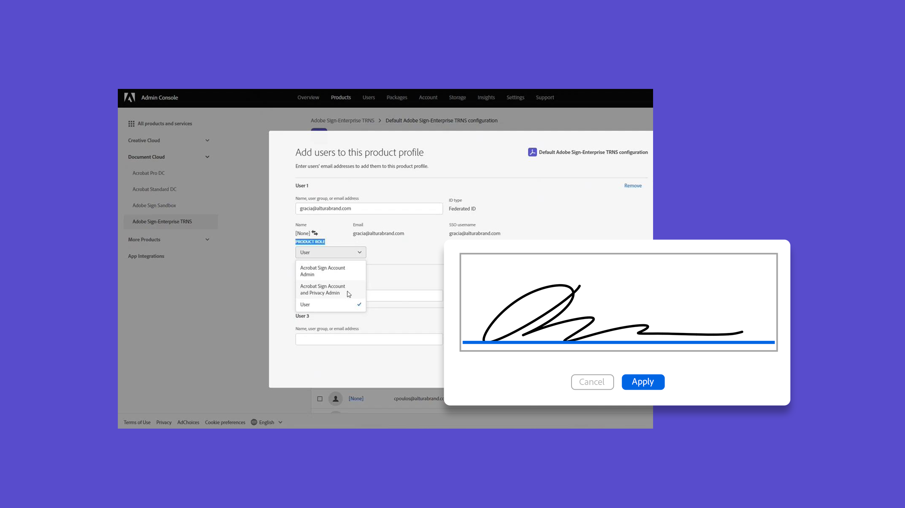
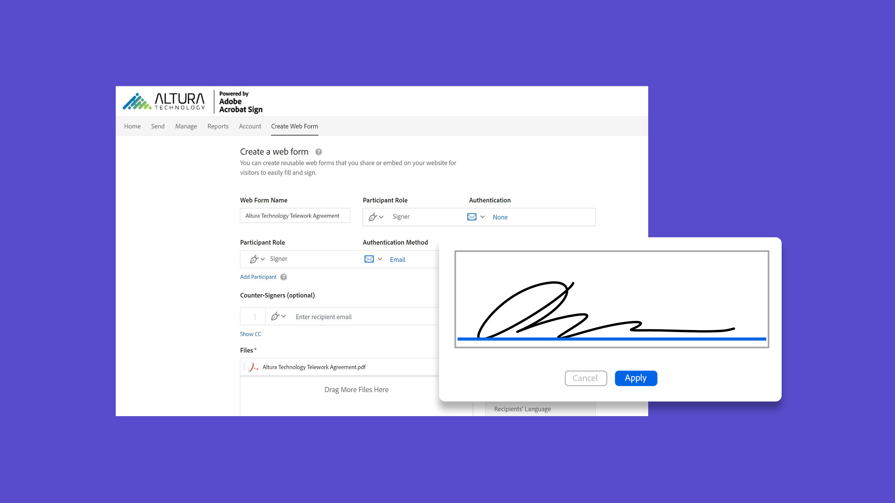

# Översikt över administratörer

Läs mer om hur du lägger till användare i ditt konto, konfigurerar grupper, delar åtkomst och konfigurerar ett arbetsflöde, ett externt arkiv och delade händelser och varningar. De här självstudiekurserna är avsedda för administratörer som har kommit förbi installationsfasen och kan börja administrera Acrobat Sign. De avancerade uppgifterna omfattar ämnen som expanderar efter administratörskonfigurationen och går vidare till att definiera globala inställningar, kontoåtkomst och delning samt texttaggning.

## Nyheter

>[!BEGINTABS]

>[!TAB Skapa ett anpassat arbetsflöde]

Lär dig hur du skapar och använder [anpassade arbetsflöden](building-a-custom-workflow.md) för att påskynda processen med att skapa och skicka ett avtal.

>[!TAB Skapa en mall som kan återanvändas]

Lär dig skapa en [återanvändbar dokumentmall](../sign-advanced-users/create-a-template.md).

>[!TAB Aktivera regler för automatisk användartilldelning]

Lär dig hur du konfigurerar [regler för automatisk tilldelning](automatic-assignment-rules.md) så att användare får åtkomst till Acrobat Sign i Admin Console.

>[!TAB Migrera dokumentmallar]

Lär dig hur du smidigt [migrerar dokumentmallar](docusign-templates.md) och arbetsflöden i tre enkla steg.

>[!ENDTABS]

## Komma igång

<table style="table-layout:fixed">
<tr>
  <td>
    
    

    <a href="get-started-admin.md"><strong>Komma igång för nya administratörer</strong></a>
    

    <em>I den här omfattande videoguiden får du lära dig mer om alla verktyg du behöver för att komma igång med Acrobat Sign</em>
     
  </td>
  <td>
    
    

    <a href="up-and-running-admin.md"><strong>Start och körning för administratörer</strong></a>
    

    <em>Översikt över sju nyckelområden där administratörer kan komma igång snabbt i Acrobat Sign</em>
     
  </td>
  <td>
    
    

    <a href="docusign-templates.md"><strong>Migrera dokumentmallar</strong></a>
    

    <em>Lär dig hur du migrerar dokumentmallar och arbetsflöden smidigt</em>
     
  </td>
  <td>
    
    

    <a href="add-users-to-your-account.md"><strong>Lägg till en ny användare</strong></a>
    

    <em>Lär dig lägga till nya användare i Acrobat Sign</em>
     
  </td>
</tr>
<tr>
  <td>
    
    

    <a href="automatic-assignment-rules.md"><strong>Aktivera regler för automatisk användartilldelning</strong></a>
    

    <em>Lär dig ställa in regler för automatisk tilldelning som ger användare åtkomst till Acrobat Sign i Admin Console</em>
     
  </td>
  <td>
    
    

    <a href="add-admin.md"><strong>Lägg till en ny kontoadministratör</strong></a>
    

    <em>Lär dig hur du skapar en ny användare eller befordrar en befintlig användare till Acrobat Sign-administratörsrollen</em>
     
  </td>
    <td>
      
      

      <a href="promote-admin.md"><strong>Tilldela administratörsroller för produkter och support</strong></a>
      

      <em>Lär dig tilldela en Acrobat Sign-användarroll som produktadministratör och supportadministratör i Admin Console</em>
       
    </td>
    <td>
      
      

      <a href="create-and-manage-groups.md"><strong>Skapa och hantera grupper</strong></a>
      

      <em>Skapa grupper, lägg till användare i grupper och redigera gruppinställningar</em>
       
    </td>
</tr>
<tr>
 <td>
      
      

      <a href="set-up-your-external-archive.md"><strong>Skapa ett externt arkiv</strong></a>
      

      <em>Skapa ett externt arkiv för säkerhetskopior av avtal som har signerats</em>
       
    </td>
  <td>
    
    

    <a href="../sign-advanced-users/create-a-template.md"><strong>Skapa en mall som kan återanvändas</strong></a>
    

    <em>Skapa en återanvändbar dokumentmall för snabbhet och konsekvens</em>
     
  </td>
  <td>
    
    

    <a href="../sign-advanced-users/creating-a-report.md"><strong>Rapporterings- och transaktionsanvändning</strong></a>
    

    <em>Lär dig hur du skapar rapporter och spårar transaktionsanvändning</em>
     
  </td>
  <td>
    
    

    <a href="report-options.md"><strong>Rapportalternativ för användare</strong></a>
    

    <em>Lär dig ställa in rapportalternativ för användare</em>
     
  </td>
</tr>  
<tr>
   <td>
    
    

    <a href="../sign-advanced-users/webform.md"><strong>Skapa ett webbformulär</strong></a>
    

    <em>Skapa ett dokument som kan signeras elektroniskt direkt på din webbplats</em>
     
  </td>
  <td>
    
    

    <a href="../sign-advanced-users/modify-webform.md"><strong>Ändra ett befintligt webbformulär</strong></a>
    

    <em>Lär dig hur du inaktiverar, redigerar och återaktiverar ett befintligt webbformulär</em>
     
  </td>
  <td>
    
    

    <a href="../sign-advanced-users/megasign.md"><strong>Massutskick</strong></a>
    

    <em>Samla in tusentals signaturer samtidigt för alla dokument</em>
     
  </td>
  <td>
    
    

    <a href="building-a-custom-workflow.md"><strong>Skapa ett anpassat arbetsflöde</strong></a>
    

    <em>Lär dig hur du skapar och använder anpassade arbetsflöden för att påskynda processen med att skapa och skicka ett avtal</em>
     
  </td>
</tr>
<tr>
     <td>
    
    

    <a href="audit-reports.md"><strong>Granskningsrapporter</strong></a>
    

    <em>Lär dig hur du får tillgång till, använder och konfigurerar granskningsrapporter</em>
     
    </td>
    <td>
      
      

      <a href="set-up-shared-events-and-alert.md"><strong>Konfigurera meddelanden för händelser och varningar</strong></a>
      

      <em>Konfigurera aviseringar för händelser och aviseringar för ditt konto</em>
       
    </td>
    <td>
      
      

       
    </td>
    <td>
      
      

       
    </td>
</tr>    
</table>

## Avancerade uppgifter

<table style="table-layout:fixed">
<tr>
  <td>
    
    

    <a href="learn-about-global-settings.md"><strong>Globala inställningar</strong></a>
    

    <em>Redigera produktinställningar globalt för hela organisationen eller för specifika grupper</em>
     
  </td>
  <td>
      
    

    <a href="share-account-access.md"><strong>Delar kontoåtkomst</strong></a>
    

    <em>Ställ in skrivskyddad åtkomst till transaktioner på en annan användares konto</em>
     
  </td>
  <td>
    
    

    <a href="advanced-account-sharing.md"><strong>Avancerad kontodelning</strong></a>
    

    <em>Konfigurera kontodelning så att administratörer och användare kan delegera behörighet att skicka, ändra och visa</em>
     
  </td>
  <td>
    
    

    <a href="bulk-download-tool.md"><strong>Verktyget Hämta i grupp</strong></a>
    

    <em>Lär dig använda verktyget Hämta i grupp för att snabbt hämta alla dina signerade avtal</em>
     
  </td> 
</tr>
<tr>
   <td>
     
    

    <a href="../sign-advanced-users/adobe-sign-text-tagging.md"><strong>Acrobat Sign-texttaggning</strong></a>
    

    <em>Skapa Acrobat Sign-formulärfält genom texttaggning med Adobe Acrobat</em>
     
  </td>
  <td>
    
    

    <a href="use-bio-pharma-settings.md"><strong>Använda bioläkemedelsinställningar</strong></a>
    

    <em>Ställ in bioläkemedelsinställningar så att du kan uppfylla kraven i FDA 21 CFR Part 11</em>
     
  </td>
  <td>
    
    

    <a href="privacy.md"><strong>Så här konfigurerar du sekretessadministratörer</strong></a>
    

    <em>Lär dig hur du konfigurerar och använder sekretessadministratörer</em>
     
  </td>
  <td>
    
    

     
  </td>
</tr>
</table>
