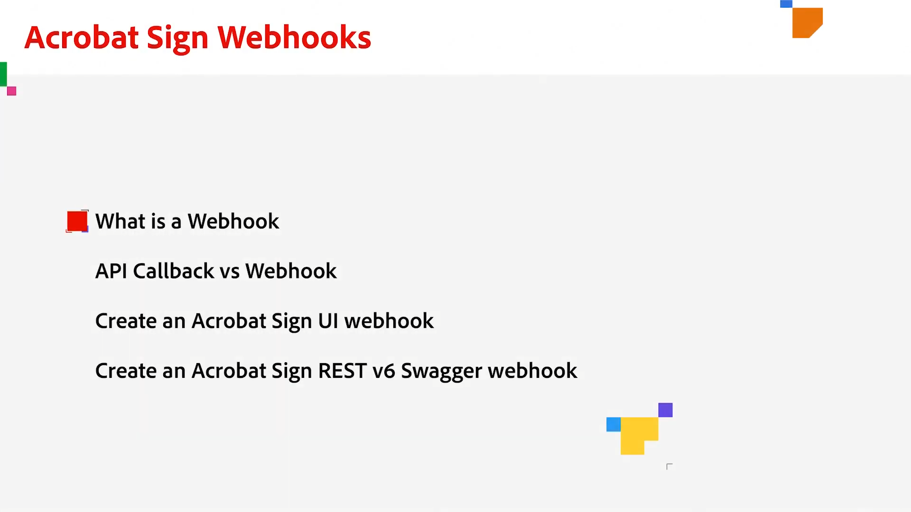

# Översikt över Framkalla

40 % av avtalen i Acrobat Sign skapas med API:er. Använd API:er för att skapa anpassade program för dina team, partner och kunder.

## Nyheter

* [Så här konfigurerar du webhooks](webhooks.md)
Lär dig hur du skapar en webhook för att automatisera processer som normalt skulle kräva manuell åtgärd

<table style="table-layout:fixed">
<tr>
  <td>
    
    

    <a href="https://www.adobe.io/apis/documentcloud/sign.html" target="_blank"><strong>Skapa ett utvecklarkonto</strong></a>
    

    <em>Lär dig komma igång med ett utvecklarkonto</em>
     
  </td>
  <td>
    
    

    <a href="https://www.adobe.io/apis/documentcloud/sign/docs.html" target="_blank"><strong>Se vad du kan göra</strong></a>
    

    <em>Lär dig använda funktionerna i Acrobat Sign i externa program</em>
     
  </td>  
  <td>
    
    

    <a href="gigasign.md"><strong>Samla in stora dokument med GigaSign</strong></a>
    

    <em>Skicka, samla in och spåra dokument för signering till tusentals personer samtidigt</em>
     
  </td>
   <td>
    
    

    <a href="embeddedesignature.md"><strong>Skapa inbäddade e-signaturer och dokumentupplevelser</strong></a>
    

    <em>Lär dig hur du använder API:er i Acrobat Sign för att bädda in e-signatur- och dokumentupplevelser i dina webbplattformar och system för hantering av innehåll och dokument</em>
     
  </td>
</tr>
<tr>
  <td>
    
    

    <a href="webhooks.md"><strong>Så här konfigurerar du webhooks</strong></a>
    

    <em>Lär dig hur du skapar en webhook för att automatisera processer som normalt kräver manuell åtgärd</em>
     
  </td>
  <td>
    
    

     
  </td>
  <td>
    
    

     
  </td>
  <td>
    
    

     
  </td>
</tr>
</table>
