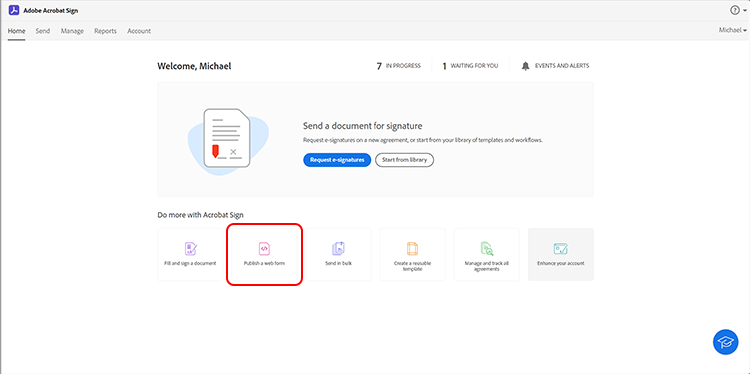
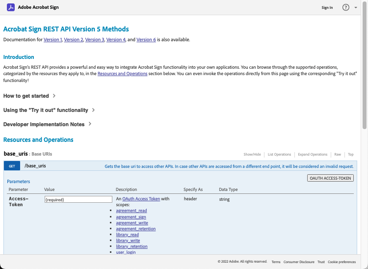

# Skapa inbäddade e-signaturer och dokumentupplevelser

Lär dig hur du använder Acrobat Sign API:er för att bädda in e-signaturer och dokumentupplevelser på webbplattformar och i system för innehållshantering och dokumenthantering. Den här praktiska självstudiekursen består av fyra delar som beskrivs i länkarna nedan:

<table style="table-layout:fixed">
<tr>
  <td>
    
    

    <a href="embeddedesignature.md#part1"><strong>Del 1: Vad du behöver</strong></a>
    

  </td>
  <td>
    
    

    <a href="embeddedesignature.md#part2"><strong>Del 2: Låg/ingen kod - kraftfulla webbformulär</strong></a>
    

  </td>
  <td>
   
    

    <a href="embeddedesignature.md#part3"><strong>Del 3: Skicka avtal med ett formulär och sammanfoga data</strong></a>
    

  </td>
  <td>
   
    

    <a href="embeddedesignature.md#part4"><strong>Del 4: Bädda in signeringsfunktioner, omdirigeringar med mera</strong></a>
    

  </td>
</tr>
</table>

## Del 1: Vad du behöver {#part1}

I del 1 får du lära dig hur du kommer igång med allt du behöver för delarna 2-4. Vi börjar med att hämta API-uppgifter.

* [Utvecklarkonto för Acrobat Sign](https://acrobat.adobe.com/se/sv/sign/developer-form.html)
* [Startkod](https://github.com/benvanderberg/adobe-sign-api-tutorial)
* [VS-kod (eller valfri redigerare)](https://code.visualstudio.com)
* Python 3.x
   * Mac - Homebrew
   * Linux - Inbyggt installationsprogram
   * Windows - Chocolatey
   * Alla - https://www.python.org/downloads/

## Del 2: Låg/ingen kod - kraftfulla webbformulär {#part2}

I del 2 ska du utforska alternativet low/no-code när du använder webbformulär. Det är alltid en bra idé att se om du kan undvika att skriva kod i början.

1. Gå till Acrobat Sign med ditt utvecklarkonto.
1. Klicka **Publicera ett webbformulär** på startsidan.

   

1. Skapa ditt avtal.

   

1. Lägg in ditt avtal på en platt HTML-sida.
1. Experimentera med dynamisk tillägg av frågeparametrar.

   

## Del 3: Skicka avtal med ett formulär och sammanfoga data {#part3}

I del 3 skapar du avtal dynamiskt.

Först måste du upprätta åtkomst. Med Acrobat Sign finns det två sätt att ansluta via API. OAuth-token och integreringsnycklar. Om du inte har ett särskilt skäl till att använda OAuth med ditt program, du kommer att vilja utforska Integration Keys först.

1. Välj **Integreringsnyckel** om **API-information** menyn under **Konto** i Acrobat Sign.

   

Nu när du har åtkomst till och kan interagera med API:et kan du se vad du kan göra med API:et.

1. Gå till [Acrobat Sign REST API Version 6-metoder](http://adobesign.com/public/docs/restapi/v6).

   

1. Använd token som ett &quot;bearer&quot;-värde.

   

För att skicka ditt första avtal är det bäst att förstå hur du använder API:et.

1. Skapa ett övergående dokument och skicka det.

>[!NOTE]
>
>JSON-baserade anrop har alternativen &quot;Model&quot; och &quot;Minimal Model Schema&quot;. Detta ger specifikationer och en minsta nyttolast uppsättning.

När du har skickat ett avtal för första gången kan du lägga till logiken. Det är alltid en bra idé att etablera vissa hjälpfunktioner för att minimera upprepningar. Här är några exempel:

**Validering**

**Rubriker/autentisering**

**Bas-URI**

Var medveten om var övergående dokument hamnar i det stora schemat i Sign-ekosystemet.
Övergående -> Övergående avtal -> Mall -> Övergående avtal -> Widget -> Avtal

I det här exemplet används en mall som dokumentkälla. Detta är oftast det bästa sättet, såvida du inte har en solid anledning att dynamiskt generera dokument för signering (t.ex. äldre kod eller dokumentgenerering).

Koden är relativt enkel. det använder ett biblioteksdokument (mall) som dokumentkälla. Den första och andra signeraren tilldelas dynamiskt. Den `IN_PROCESS` tillstånd innebär att dokumentet skickas omedelbart. Dessutom `mergeFieldInfo` används för att fylla i fält dynamiskt.

## Del 4: Bädda in signeringsfunktioner, omdirigeringar med mera {#part4}

I många scenarier kanske du vill tillåta att den utlösande deltagaren omedelbart signerar ett avtal. Detta är användbart för kundcentrerade applikationer och kioskdatorer.

Om du inte vill att det första e-postmeddelandet ska utlösas är det ett enkelt sätt att hantera beteendet med en ändring av API-anropet.

Så här styr du omdirigeringen efter signering:

När du har uppdaterat processen för att skapa avtal genereras signerings-URL:en i det sista steget. Det här anropet är också ganska enkelt och genererar en URL som en signerare kan använda för att komma åt sin del av signeringsprocessen.

>[!NOTE]
>
>Observera att anropet för att skapa avtal är tekniskt asynkront. Det innebär att ett anrop till ett &quot;POST&quot;-avtal kan göras, men avtalet är inte klart än. Det bästa sättet är att skapa en loop av nytt försök. Använd ett nytt försök eller något annat som passar din miljö bäst.

När allt är sammanställt är lösningen ganska enkel. Du skapar ett avtal och sedan en signerings-URL som signeraren kan klicka på och påbörja signeringsritualen.

### Ytterligare ämnen

* [JS Events](https://www.adobe.io/apis/documentcloud/sign/docs.html#!adobedocs/adobe-sign/master/events.md)
* Webhook-händelser
   * [REST API](https://sign-acs.na1.echosign.com/public/docs/restapi/v6#!/webhooks/createWebhook)
   * [Webhooks i Acrobat Sign v6](https://www.adobe.io/apis/documentcloud/sign/docs.html#!adobedocs/adobe-sign/master/webhooks.md)
* [Återaktivera e-postförfrågningar (med händelser)](https://sign-acs.na1.echosign.com/public/docs/restapi/v6#!/agreements/updateAgreement)
* [Ersätt timeout med ett nytt försök](https://stackoverflow.com/questions/23267409/how-to-implement-retry-mechanism-into-python-requests-library)

     
* Anpassade påminnelser
   * Med det första skapandet

      

   * Eller lägg till en [under flygning](https://sign-acs.na1.echosign.com/public/docs/restapi/v6#!/agreements/createReminderOnParticipant)

## Ytterligare resurser

http://bit.ly/Summit21-T126

Omfattar:
* Utvecklarkonto för Acrobat Sign
* Acrobat Sign API-dokument
* Exempelkod
* Visual Studio Code
* Python
