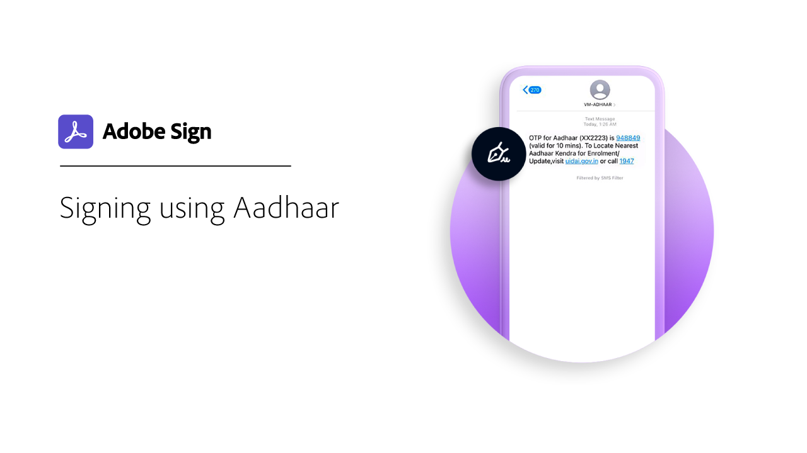

# Översikt över digitalt ID

På samma sätt som ett pass i elektronisk form gör ett digitalt ID att du på ett säkert sätt kan bevisa att du är den du säger att du är. Och när du e-signerar i Acrobat Sign kan du använda ett elektroniskt ID för att vara säker på att du har godkänt e-signaturen för just det dokumentet. I följande självstudiekurser visas hur du använder elektroniska ID:n från hela världen med Acrobat Sign.

>[!NOTE]
>
>Innan du kan använda ett elektroniskt ID med en molnsignatur bör du kontakta organisationens administratör och bekräfta att leverantörens lösning har aktiverats i Acrobat Sign.

## [!DNL Aadhaar]

<table style="table-layout:fixed">
<tr>
 <td>
    
    

    <a href="aadhaar-sign.md"><strong>Signera med [!DNL Aadhaar]</strong></a>
    

    <em>Lär dig använda din [!DNL Aadhaar] elektroniskt ID med Acrobat Sign</em>
     
  </td>
  <td>
    
    

     
  </td>
  <td>
    
    

     
  </td>
</tr>
</table>

## [!DNL Digidentity]

<table style="table-layout:fixed">
<tr>
 <td>
    
    

    <a href="digidentity-reg.md"><strong>Hämta ett digitalt ID från [!DNL Digidentity]</strong></a>
    

    <em>Lär dig hur du får ett certifikat för digital signering från [!DNL Digidentity]</em>
     
  </td>
  <td>
    
    

    <a href="digidentity-sign.md"><strong>Signera med [!DNL Digidentity]</strong></a>
    

    <em>Lär dig använda din [!DNL Digidentity] elektroniskt ID med Acrobat Sign</em>
     
  </td>
  <td>
    
    

     
  </td>
</tr>
</table>

## [!DNL D-Trust]

<table style="table-layout:fixed">
<tr>
  <td>
    
    

    <a href="d-trust.md"><strong>Registrera och signera med D-Trust</strong></a>
    

    <em>Lär dig hur du registrerar din identitet med [!DNL D-Trust]och sedan använda [!DNL D-Trust] elektronisk underskrift på ett dokument i Acrobat Sign</em>
     
  </td>
  <td>
    
    

     
  </td>
  <td>
    
    

     
  </td>
  </tr>
  </table>

## [!DNL Intesi Group]

<table style="table-layout:fixed">
<tr>
  <td>
    
    

    <a href="intesi-advanced.md"><strong>Hämta ett digitalt ID från [!DNL Intesi Group] (Avancerat)</strong></a>
    

    <em>Lär dig hur du får ett avancerat digitalt signeringscertifikat från [!DNL Intesi Group]</em>
     
  </td>
  <td>
    
    

    <a href="intesi-qualified.md"><strong>Hämta ett digitalt ID från [!DNL Intesi Group] (Kvalificerad)</strong></a>
    

    <em>Lär dig hur du får ett kvalificerat certifikat för digital signering från [!DNL Intesi Group]</em>
     
  </td>
  <td>
    
    

    <a href="intesi-sign.md"><strong>Signera med [!DNL Intesi Group]</strong></a>
    

    <em>Lär dig använda din [!DNL Intesi Group] elektroniskt ID med Acrobat Sign</em>
     
  </td>
</tr>
</table>
