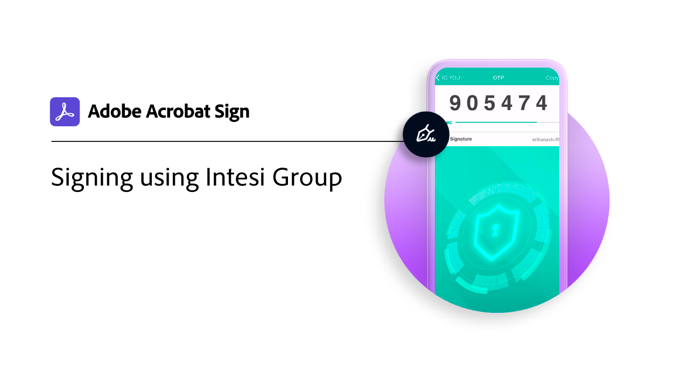

# Översikt över digitalt ID

På samma sätt som ett pass i elektronisk form kan du med ett digitalt ID på ett säkert sätt bevisa att du är den du säger att du är. Och när du e-signerar i Adobe Sign kan du lita på att du har auktoriserat din e-signatur på det specifika dokumentet med ett digitalt ID. I följande självstudier visas hur du använder digitala ID:n från hela världen med Adobe Sign.

>[!NOTE]
>
>Innan du kan använda ett digitalt ID med en molnsignatur bör du kontakta organisationens administratör för att bekräfta att leverantörens lösning är aktiverad i Adobe Sign.

## [!DNL Aadhaar]

<table style="table-layout:fixed">
<tr>
 <td>
    
    

    <a href="aadhaar-sign.md"><strong>Signera med [!DNL Aadhaar]</strong></a>
    

    <em>Lär dig hur du använder [!DNL Aadhaar] elektroniskt ID med Adobe Sign</em>
     
  </td>
  <td>
    
    

     
  </td>
  <td>
    
    

     
  </td>
</tr>
</table>

## [!DNL Digidentity]

<table style="table-layout:fixed">
<tr>
 <td>
    
    

    <a href="digidentity-reg.md"><strong>Hämta ett digitalt ID från [!DNL Digidentity]</strong></a>
    

    <em>Lär dig hur du får ett certifikat för digital signering från [!DNL Digidentity]</em>
     
  </td>
  <td>
    
    

    <a href="digidentity-sign.md"><strong>Signera med [!DNL Digidentity]</strong></a>
    

    <em>Lär dig hur du använder [!DNL Digidentity] elektroniskt ID med Adobe Sign</em>
     
  </td>
  <td>
    
    

     
  </td>
</tr>
</table>

## [!DNL Intesi Group]

<table style="table-layout:fixed">
<tr>
  <td>
    
    

    <a href="intesi-advanced.md"><strong>Hämta ett digitalt ID från [!DNL Intesi Group] (Avancerat)</strong></a>
    

    <em>Lär dig hur du får ett avancerat certifikat för digital signering från [!DNL Intesi Group]</em>
     
  </td>
  <td>
    
    

    <a href="intesi-qualified.md"><strong>Hämta ett digitalt ID från [!DNL Intesi Group] (Kvalificerad)</strong></a>
    

    <em>Lär dig hur du får ett kvalificerat digitalt signeringscertifikat från [!DNL Intesi Group]</em>
     
  </td>
  <td>
    
    

    <a href="intesi-sign.md"><strong>Signera med [!DNL Intesi Group]</strong></a>
    

    <em>Lär dig hur du använder [!DNL Intesi Group] elektroniskt ID med Adobe Sign</em>
     
  </td>
</tr>
</table>
