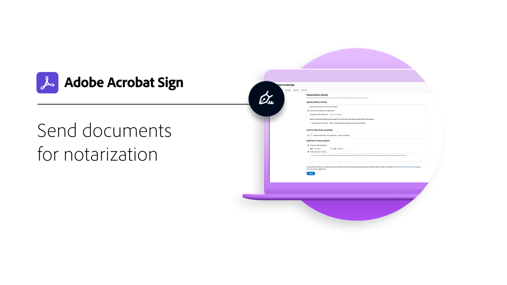
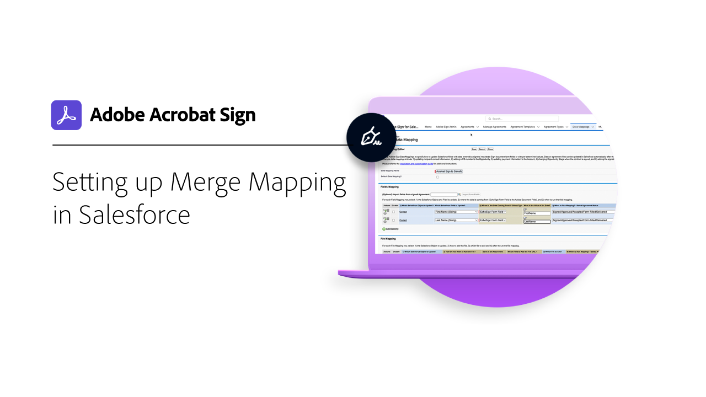

# Översikt över integreringar

Du kan använda Acrobat Sign i andra program som ditt företag redan använder, till exempel Microsoft, Salesforce, Workday och Marketo, för att nämna några. Läs om hur du kan förenkla arbetsflödena för e-signaturer i dessa integreringsguider och självstudiekurser.

>[!NOTE]
> Om du har problem med att komma åt någon av dessa funktioner kan du fråga organisationens administratör och kontrollera att integreringen är aktiverad.

## Nyheter

* [Integrera ett webbformulär med [!DNL SharePoint] Online](integrate-web-form-sharepoint-online.md)
Lär dig mappa data som samlats in från ett webbformulär till ett [!DNL SharePoint] lista
* [Introduktion till nyanställda på Acrobat Sign + Workday](acrobat-sign-workday-onboarding.md)
Lär dig hur du effektiviserar arbetsflöden för onboarding med Acrobat Sign + Workday

## Självstudiekurser för Microsoft-integreringar

<table style="table-layout:fixed">
<tr>
  <td>
    
    

    <a href="fill-and-sign-doc-microsoft-outlook.md"><strong>Fylla i och signera i Microsoft Outlook</strong></a>
    

    <em>Fyll i och signera ett formulär direkt i Microsoft Outlook</em>
     
  </td>
  <td>
    
    

    <a href="send-for-signature-with-outlook.md"><strong>Skicka för signering i Outlook</strong></a>
    

    <em>Skicka ett dokument för signering direkt i Microsoft Outlook</em>
     
  </td>
  <td>
    
    

    <a href="send-for-signature-with-sharepoint-online.md"><strong>Skicka för signering i SharePoint Online</strong></a>
    

    <em>Skicka ett dokument för signering direkt i SharePoint Online</em>
     
  </td>
   <td>
    
    

    <a href="track-an-agreement-with-sharepoint-online.md"><strong>Spårning i SharePoint Online</strong></a>
    

    <em>Spåra avtalsförloppet direkt i Microsoft SharePoint</em>
     
  </td>
</tr>
<tr>
  <td>
    
    

    <a href="integrate-web-form-sharepoint-online.md"><strong>Integrera ett webbformulär med [!DNL SharePoint Online]</strong></a>
    

    <em>Lär dig mappa data som samlats in från ett webbformulär till ett [!DNL SharePoint] lista</em>
     
  </td>
  <td>
    
    

    <a href="auto-archive-sharepoint-power-automate.md"><strong>Arkivera filer automatiskt i [!DNL SharePoint] med [!DNL Power Automate]</strong></a>
    

    <em>Lär dig hur du automatiskt arkiverar signerade dokument på en [!DNL SharePoint] bibliotek använda [!DNL Power Automate]</em>
     
  </td>
  <td>
    
    

    <a href="documentautomation.md"><strong>Automatisera dokument med [!DNL Acrobat Sign for Microsoft Power Platform]</strong></a>
    

    <em>Lär dig hur du aktiverar och använder [!DNL Acrobat Sign] och [!DNL Adobe PDF Tools] anslutningsdon för [!DNL Microsoft Power] appar</em>
     
  </td>
   <td>
    
    

    <a href="adobe-sign-teams-mortgage.md"><strong>Skicka för signering i [!DNL Microsoft Teams]</strong></a>
    

    <em>Skicka dokument för signering direkt inom [!DNL Microsoft Teams]</em>
     
  </td>
</tr>
</table>

## [!DNL Notarize] självstudiekurser för integration

<table style="table-layout:fixed">
<tr>
  <td>
    
    

    <a href="send-document-notarize.md"><strong>Skicka dokument för vidimering</strong></a>
    

    <em>Lär dig hur du skickar ett dokument för vidimering</em>
     
  </td>
  <td>
    
    

     
  </td>
  <td>
    
    

     
  </td>
  <td>
    
    

     
  </td>
</tr>
</table>

## Självstudiekurser för Salesforce-integreringar

<table style="table-layout:fixed">
<tr>
  <td>
    
    

    <a href="create-an-agreement-template.md"><strong>Document Builder för [!DNL Salesforce]</strong></a>
    

    <em>Lär dig hur du skapar en återanvändbar dokumentmall med hjälp av Document Builder för [!DNL Salesforce]</em>
     
  </td>
  <td>
    
    

    <a href="set-up-data-mapping.md"><strong>Ställa in datamappning</strong></a>
    

    <em>Hämta tillbaka data till Salesforce efter att ett avtal har signerats</em>
     
  </td>
  <td>
    
    

    <a href="set-up-merging-map.md"><strong>Konfigurera kopplingsmappning i Salesforce</strong></a>
    

    <em>Lär dig hur du sammanfogar data från Salesforce direkt i ett Acrobat Sign-dokument</em>
     
  </td>
  <td>
    
    

    <a href="create-a-custom-button.md"><strong>Skapa en anpassad knapp</strong></a>
    

    <em>Skapa en anpassad knapp som startar sändningsprocessen och automatiskt fyller i ett avtal i Salesforce</em>
     
  </td>
</tr>
</table>

## Självstudiekurser för Workday-integrering

<table style="table-layout:fixed">
<tr>
 <td>
    
    

    <a href="acrobat-sign-workday-onboarding.md"><strong>Introduktion till nyanställda på Acrobat Sign + Workday</strong></a>
    

    <em>Lär dig hur du effektiviserar arbetsflöden för onboarding med Acrobat Sign + Workday</em>
     
  </td>
 <td>
    
    

     
  </td>
  <td>
    
    

     
  </td>
  <td>
    
    

     
  </td>
</tr>
</table>

## Självstudiekurser och konfigurationsguider för Marketo

<table style="table-layout:fixed">
<tr>
  <td>
    
    

    <a href="marketo-salesforce-sms.md"><strong>Skicka aviseringar med Acrobat Sign för Salesforce och Marketo</strong></a>
    

    <em>Lär dig hur du skickar ett textmeddelande, ett e-postmeddelande eller ett push-meddelande för att informera signeraren om att ett avtal är på väg</em>
     
  </td>
  <td>
    
    

    <a href="marketo-salesforce-reminder.md"><strong>Skicka påminnelser med videosjälvstudiekursen Adobe Sign för Salesforce och Marketo</strong></a>
    

    <em>Lär dig hur du skickar en e-postpåminnelse från Marketo när ett avtal förblir osignerat efter en viss tidsperiod</em>
     
  </td>
  <td>
    
    

    <a href="marketo-salesforce-reminder.md"><strong>Skicka påminnelser med konfigurationshandboken för Acrobat Sign för Salesforce och Marketo</strong></a>
    

    <em>Läs om hur du skickar en e-postpåminnelse från Marketo när ett avtal förblir osignerat efter en viss tidsperiod</em>
     
  </td>
   <td>
    
    

    <a href="marketo-dynamics-reminder.md"><strong>Skicka påminnelser med Acrobat Sign för Microsoft Dynamics och Marketo</strong></a>
    

    <em>Lär dig hur du skickar en e-postpåminnelse när ett avtal förblir osignerat efter en viss tid</em>
     
  </td>
</tr>
<tr>
  <td>
    
    

    <a href="marketo-dynamics-sms.md"><strong>Skicka aviseringar med Acrobat Sign för Microsoft Dynamics och Marketo</strong></a>
    

    <em>Lär dig hur du skickar ett textmeddelande, ett e-postmeddelande eller ett push-meddelande för att informera signeraren om att ett avtal är på väg</em>
     
  </td>
  <td>
    
    

     
  </td>
  <td>
    
    

     
  </td>
  <td>
    
    

     
  </td>
</tr>
</table>
