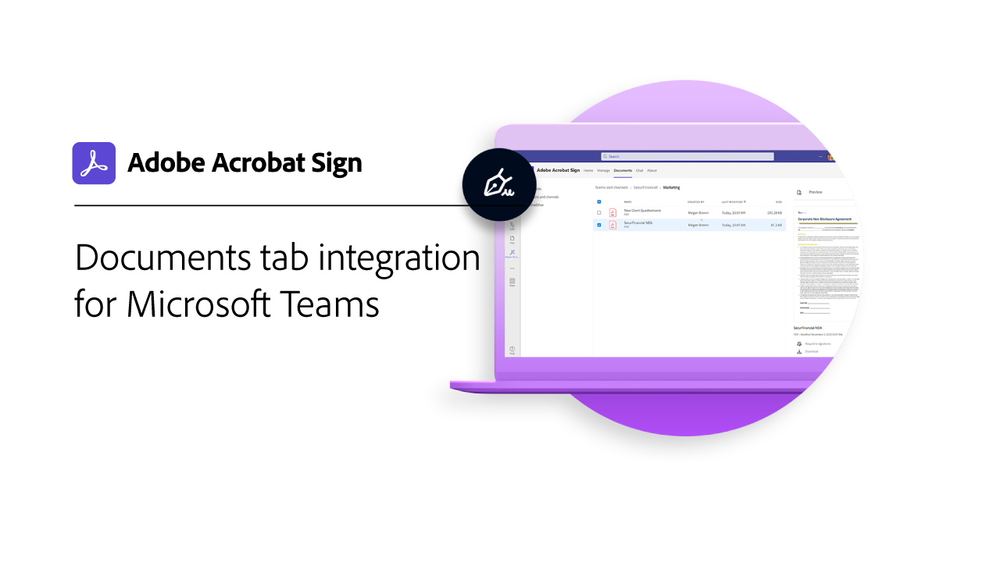

# Översikt över integreringar

Du kan använda Acrobat Sign i andra program som ditt företag redan använder, t.ex. Microsoft, Salesforce, Workday och Marketo, för att nämna några. Lär dig förenkla arbetsflödena för e-signaturer i dessa integreringsguider och självstudiekurser.

>[!NOTE]
> Om du har problem med att komma åt någon av dessa funktioner kontaktar du organisationens administratör för att säkerställa att integreringen är aktiverad.

## Nyheter

* [Konfigurera stora filer och push-mappningar](salesforce-large-files.md)
Lär dig hur du konfigurerar stora dokument och push-avtalstjänster i Salesforce
* [Konfigurera automatiska uppdateringar](salesforce-automatic-updates.md)
Lär dig hur du enkelt länkar ditt konto till Salesforce för att få automatiska uppdateringar
* [Integrering av fliken Dokument för [!DNL Microsoft Teams]](acrobat-sign-teams-documents-tab.md)
Läs om hur du skickar dokument för signering direkt från fliken Dokument i [!DNL Microsoft Teams]

## Självstudiekurser om Microsoft-integreringar

<table style="table-layout:fixed">
<tr>
  <td>
    
    

    <a href="fill-and-sign-doc-microsoft-outlook.md"><strong>Fylla i och signera i Microsoft Outlook</strong></a>
    

    <em>Fyll i och signera ett formulär direkt i Microsoft Outlook</em>
     
  </td>
  <td>
    
    

    <a href="send-for-signature-with-outlook.md"><strong>Skicka för signering i Outlook</strong></a>
    

    <em>Skicka ett dokument för signering direkt i Microsoft Outlook</em>
     
  </td>
  <td>
    
    

    <a href="send-for-signature-with-sharepoint-online.md"><strong>Skicka för signering i SharePoint Online</strong></a>
    

    <em>Skicka ett dokument för signering direkt inom SharePoint Online</em>
     
  </td>
   <td>
    
    

    <a href="track-an-agreement-with-sharepoint-online.md"><strong>Spårning i SharePoint Online</strong></a>
    

    <em>Spåra förloppet för ett avtal direkt i Microsoft SharePoint</em>
     
  </td>
</tr>
<tr>
  <td>
    
    

    <a href="integrate-web-form-sharepoint-online.md"><strong>Integrera ett webbformulär med [!DNL SharePoint Online]</strong></a>
    

    <em>Lär dig mappa data som samlats in från ett webbformulär till en [!DNL SharePoint]-lista</em>
     
  </td>
  <td>
    
    

    <a href="auto-archive-sharepoint-power-automate.md"><strong>Arkivera filer automatiskt i [!DNL SharePoint] med [!DNL Power Automate]</strong></a>
    

    <em>Lär dig arkivera signerade dokument automatiskt i ett [!DNL SharePoint]-bibliotek med [!DNL Power Automate]</em>
     
  </td>
  <td>
    
    

    <a href="documentautomation.md"><strong>Dokumentautomatisering med [!DNL Acrobat Sign for Microsoft Power Platform]</strong></a>
    

    <em>Lär dig hur du aktiverar och använder [!DNL Acrobat Sign]- och [!DNL Adobe PDF Tools]-kopplingar för [!DNL Microsoft Power]-program</em>
     
  </td>
   <td>
    
    

    <a href="adobe-sign-teams-mortgage.md"><strong>Skicka för signering om [!DNL Microsoft Teams]</strong></a>
    

    <em>Skicka dokument för signering direkt inom [!DNL Microsoft Teams]</em>
     
  </td>
</tr>
<tr>
  <td>
    
    

    <a href="live-sign-microsoft-teams.md"><strong>Live Sign i Adobe Acrobat Sign för [!DNL Microsoft Teams]</strong></a>
    

    <em>Lär dig hur du skapar en signeringsupplevelse online som liknar personlig signering under ett [!DNL Microsoft Teams]-möte</em>
     
  </td>
   <td>
    
    

    <a href="acrobat-sign-teams-documents-tab.md"><strong>Integrering av fliken Dokument för [!DNL Microsoft Teams]</strong></a>
    

    <em>Lär dig hur du skickar dokument för signering direkt från fliken Dokument i [!DNL Microsoft Teams]</em>
     
  </td>
 <td>
    
    

    <a href="simple-workflow-power-automate.md"><strong>Skapa ett enkelt arbetsflöde med [!DNL Power Automate]</strong></a>
    

    <em>Lär dig skapa ett enkelt arbetsflöde med hjälp av [!DNL Power Automate] anslutningar</em>
     
  </td>
  <td>
    
    

    <a href="advanced-workflow-power-automate.md"><strong>Skapa ett avancerat arbetsflöde med Power Automate</strong></a>
    

    <em>Lär dig skapa ett avancerat arbetsflöde med hjälp av [!DNL Power Automate] anslutningar</em>
     
  </td>
<tr>
  <td>
    
    

    <a href="dynamics-customer-service.md"><strong>Microsoft Dynamics 365 för kundtjänst</strong></a>
    

    <em>Läs om hur Acrobat Sign och [!DNL Microsoft Dynamics 365] för kundtjänst används för att förbättra kundnöjdheten på en självbetjänad kundwebbportal</em>
     
  </td>
  <td>
    
    

    <a href="dynamics-field-service.md"><strong>Microsoft Dynamics 365 för fälttjänsten</strong></a>
    

    <em>Lär dig hur Acrobat Sign, [!DNL Power Automate] och [!DNL Microsoft Dynamics 365] för fälttjänsten används för att effektivisera kundengagemang på plats</em>
     
  </td>
  <td>
    
    

    <a href="dynamics-sales.md"><strong>Microsoft Dynamics 365 for Sales</strong></a>
    

    <em>Lär dig hur Acrobat Sign och [!DNL Microsoft Dynamics 365] för försäljning används för att automatisera signeringsprocessen för försäljningsofferter</em>
     
  </td>
  <td>
    
    

     
  </td>
</tr>
</table>

## Självstudiekurser om [!DNL Notarize]-integrering

<table style="table-layout:fixed">
<tr>
  <td>
    
    

    <a href="send-document-notarize.md"><strong>Skicka dokument för bestyrkande</strong></a>
    

    <em>Lär dig hur du skickar ett dokument för attestering</em>
     
  </td>
  <td>
    
    

     
  </td>
  <td>
    
    

     
  </td>
  <td>
    
    

     
  </td>
</tr>
</table>

## Självstudiekurser om Salesforce-integreringar

<table style="table-layout:fixed">
<tr>
  <td>
    
    

    <a href="create-an-agreement-template.md"><strong>Document Builder för [!DNL Salesforce]</strong></a>
    

    <em>Lär dig skapa en återanvändbar dokumentmall med Document Builder för [!DNL Salesforce]</em>
     
  </td>
  <td>
    
    

    <a href="set-up-data-mapping.md"><strong>Konfigurerar datamappning</strong></a>
    

    <em>Hämta tillbaka data till Salesforce efter att ett avtal har signerats</em>
     
  </td>
  <td>
    
    

    <a href="set-up-merging-map.md"><strong>Konfigurerar kopplingsmappning i Salesforce</strong></a>
    

    <em>Lär dig hur du sammanfogar data från Salesforce direkt i ett Acrobat Sign-dokument</em>
     
  </td>
  <td>
    
    

    <a href="create-a-custom-button.md"><strong>Skapa en anpassad knapp</strong></a>
    

    <em>Skapa en anpassad knapp som startar sändningsprocessen och automatiskt fyller i ett avtal i Salesforce</em>
     
  </td>
</tr>
<tr>
  <td>
    
    

    <a href="salesforce-automatic-updates.md"><strong>Konfigurera automatiska uppdateringar</strong></a>
    

    <em>Lär dig hur du enkelt länkar ditt konto till Salesforce för att få automatiska uppdateringar</em>
     
  </td>
 <td>
    
    

    <a href="salesforce-large-files.md"><strong>Konfigurera stora filer och push-mappningar</strong></a>
    

    <em>Lär dig konfigurera stora dokument och push-avtalstjänster i Salesforce</em>
     
  </td>
  <td>
      
      

       
  </td>
  <td>
      
      

       
  </td>
</tr>
</table>

## Självstudiekurser om Workday-integrering

<table style="table-layout:fixed">
<tr>
 <td>
    
    

    <a href="acrobat-sign-workday-onboarding.md"><strong>Introduktion till Acrobat Sign + Workday för nyanställningar</strong></a>
    

    <em>Lär dig effektivisera introduktionsarbetsflöden med Acrobat Sign + Workday</em>
     
  </td>
 <td>
    
    

     
  </td>
  <td>
    
    

     
  </td>
  <td>
    
    

     
  </td>
</tr>
</table>

## Självstudiekurser och konfigurationsguider för Marketo-integrering

<table style="table-layout:fixed">
<tr>
  <td>
    
    

    <a href="marketo-salesforce-sms.md"><strong>Skicka meddelanden med Acrobat Sign för Salesforce och Marketo</strong></a>
    

    <em>Lär dig hur du skickar ett textmeddelande, e-postmeddelande eller push-meddelande för att informera undertecknaren om att ett avtal är på väg</em>
     
  </td>
  <td>
    
    

    <a href="marketo-salesforce-reminder.md"><strong>Skicka påminnelser med videosjälvstudiekurserna Adobe Sign för Salesforce och Marketo</strong></a>
    

    <em>Lär dig hur du skickar en e-postpåminnelse från Marketo när ett avtal fortfarande är osignerat efter en tidsperiod</em>
     
  </td>
  <td>
    
    

    <a href="marketo-salesforce-reminder.md"><strong>Skicka påminnelser med konfigurationsguiden för Acrobat Sign för Salesforce och Marketo</strong></a>
    

    <em>Läs om hur du skickar en e-postpåminnelse från Marketo när ett avtal fortfarande är osignerat efter en tidsperiod</em>
     
  </td>
   <td>
    
    

    <a href="marketo-dynamics-reminder.md"><strong>Skicka påminnelser med Acrobat Sign för Microsoft Dynamics och Marketo</strong></a>
    

    <em>Lär dig hur du skickar en e-postpåminnelse när ett avtal förblir osignerat efter en tidsperiod</em>
     
  </td>
</tr>
<tr>
  <td>
    
    

    <a href="marketo-dynamics-sms.md"><strong>Skicka aviseringar med Acrobat Sign för Microsoft Dynamics och Marketo</strong></a>
    

    <em>Lär dig hur du skickar ett textmeddelande, e-postmeddelande eller push-meddelande för att informera undertecknaren om att ett avtal är på väg</em>
     
  </td>
  <td>
    
    

     
  </td>
  <td>
    
    

     
  </td>
  <td>
    
    

     
  </td>
</tr>
</table>
