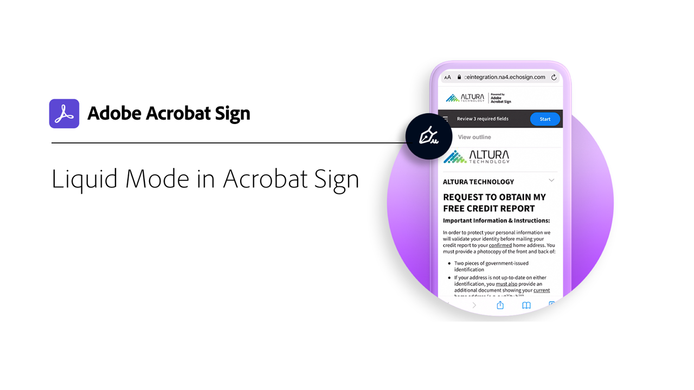

# Översikt över Mobile

Skicka dokument för signering, följ e-signeringsprocessen och få uppdateringar i realtid på din mobila enhet.

<table style="table-layout:fixed">
<tr>
  <td>
    
    

    <a href="liquidmode.md"><strong>Liquid Mode i Acrobat Sign</strong></a>
    

    <em>Läs om hur Liquid Mode förbättrar den mobila signeringsupplevelsen</em>
     
  </td>
  <td>
    
    

    <a href="https://itunes.apple.com/us/app/adobe-sign/id481082197?mt=8" target="_blank"><strong>Hämta appen Acrobat Sign Mobile för iOS</strong></a>
     
  </td>
  <td>
    
    

    <a href="https://play.google.com/store/apps/details?id=com.adobe.echosign&amp;hl=en" target="_blank"><strong>Hämta Acrobat Sign Mobile-appen för Android</strong></a>
     
  </td>
</tr>
</table>
