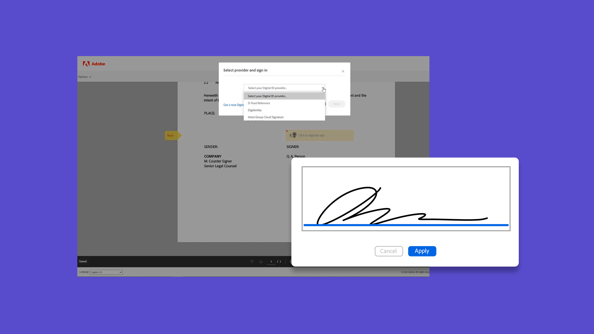

# Självstudiekurser om Acrobat Sign

Acrobat Sign är en Adobe Document Cloud-lösning som kan skalas för att uppfylla ditt företags behov med integreringar, API:er, avancerad autentisering, ytterligare administratörsfunktioner och mycket mer. Här hittar du ett brett utbud av utbildningsupplevelser som är utformade för att snabbt hålla både nybörjare och administratörer uppdaterade om Acrobat Sign.

## Utbildningsvägar

<table style="table-layout:fixed">
<tr>
  <td>
    
    

      <a href="sign-beginner-tutorials/beginner-users-overview.md"><strong>Komma i gång</strong></a>
      

      <em>Kom igång snabbt med att skicka, signera och spåra dokument</em>
       
  </td>
  <td>
    
    

      <a href="sign-advanced-users/advanced-users-overview.md"><strong>Avancerade uppgifter</strong></a>
      

      <em>Gå längre än grunderna med specifika uppgifter och automatisering</em>
       
  </td>  
  <td>
    
    

      <a href="admin/intro-admin-overview.md"><strong>Administrera</strong></a>
      

      <em>Grundläggande till avancerade konfigurationstips för organisationen</em>
       
  </td>
  <td>
    
     

      <a href="digitalid/digitalid-overview.md"><strong>Digitalt ID</strong></a>
      

      <em>Lär dig använda elektroniska ID:n från hela världen i Acrobat Sign</em>
       
  </td>
</tr>
<tr>
  <td>
    
    

      <a href="integrations/integrations-overview.md"><strong>Integreringar</strong></a>
      

      <em>Lägg till Acrobat Sign direkt i andra program som organisationen redan använder</em>
       
  </td>
  <td>
    
    

      <a href="sign-usecase/expand-inspire-overview.md"><strong>Branscher och avdelningar</strong></a>
      

      <em>Utforska verkliga användningsfall inom industri och avdelning</em>
       
  </td>
  <td>
    
    

      <a href="develop/develop-overview.md"><strong>Framkalla</strong></a>
      

      <em>Skaffa utvecklingsresurser för Acrobat Sign I/O</em>
       
  </td>
   <td>
    
    

      <a href="deploy-overview.md"><strong>Distribuera</strong></a>
      

      <em>Insikter och bästa metoder för att driftsätta Acrobat Sign i organisationen</em>
       
  </td>
</tr>
<tr>
  <td>
    
    

      <a href="mobile/mobile-overview.md"><strong>Mobilt</strong></a>
      

      <em>Skicka, signera och få uppdateringar i realtid på din mobila enhet</em>
       
  </td>  
</tr>
</table>
