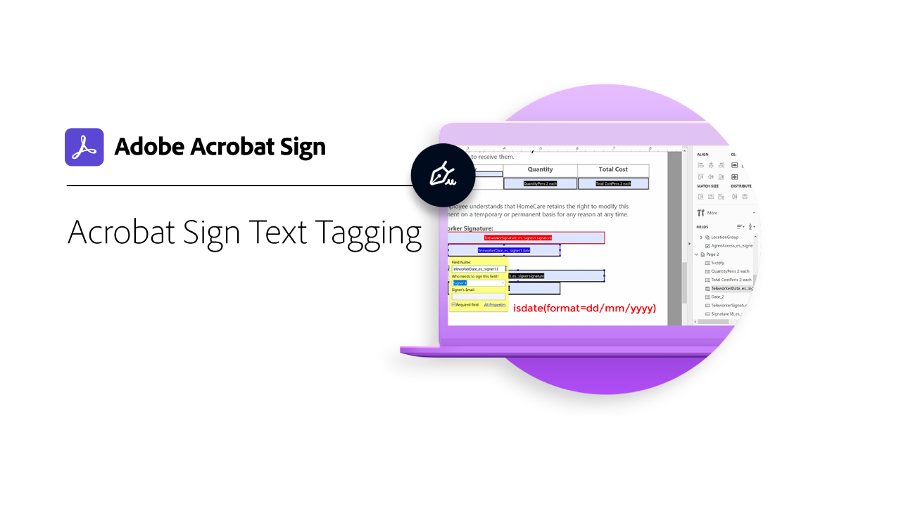

# Acrobat Sign-texttaggar

I det här inspelade webbseminariet (ingen registrering behövs) lär du dig hur du skapar Acrobat Sign-formulärfält med texttaggning med Adobe Acrobat. Texttaggar minskar avsevärt tiden det tar att skapa och granska dokument med många formulärfält. Avsändare behöver inte placera ut enskilda fält i varje dokument - ännu en viktig tidsbesparare. Andra fördelar är validering av formulärfält (korrekt och felfri datainsamling) och enhetlig utformning av formulär. Skicka gärna dina frågor till oss under webbinariet med hjälp av vår Frågor &amp; Svar-podd. Klicka på bilden nedan för att börja titta på inspelningen.

[Titta på inspelat webbseminarium med Acrobat Sign-texttaggar](https://event.on24.com/wcc/r/2338276/415BE4603F60A61A546C0A91528B444F)

>[!TIP]
>
>Den här videon är en del av [Avancerade uppgifter för användare](https://experienceleague.adobe.com/?recommended=Sign-U-1-2020.3) och [Avancerade uppgifter för administratörer](https://experienceleague.adobe.com/?recommended=Sign-A-1-2020.1) kurser som är tillgängliga gratis på Experience League!
