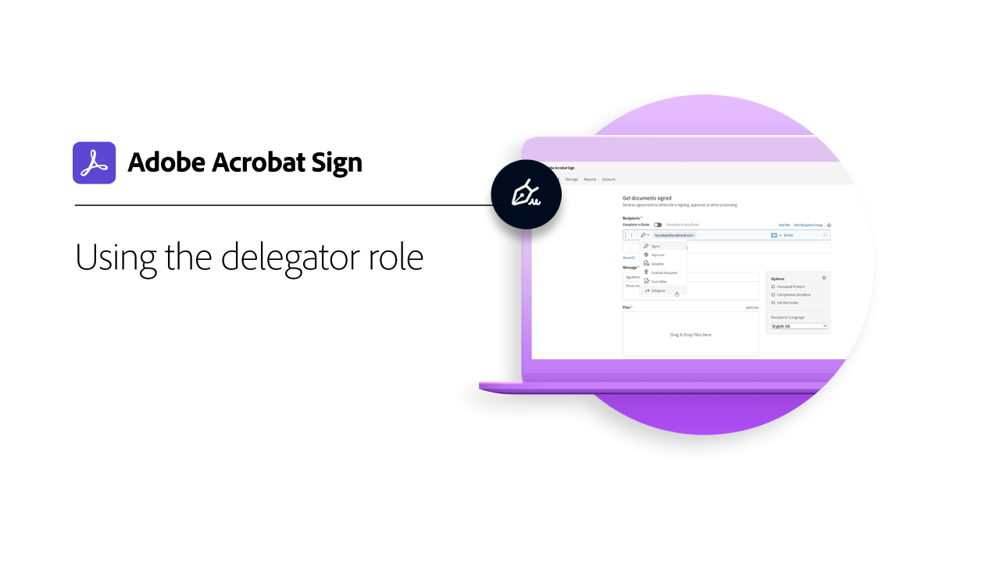

# Översikt över avancerade uppgifter

Lär dig hur du skickar ett dokument för signering till 100-tals mottagare samtidigt, skapar ett signaturfärdigt dokument för webbplatsen, hanterar signaturtransaktioner och skapar och hanterar dokumentmallar. Dessa självstudiekurser är till för alla som redan känner till grunderna för att skicka och begära signaturer och vill veta mer om hur Acrobat Sign kan hjälpa dem.

## Skicka

<table style="table-layout:fixed">
<tr>
  <td>
    
    

    <a href="setting-up-routing.md"><strong>Setting up signing order</strong></a>
    

    <em>Ställ in signeringsordning för flera signerare</em>
     
  </td>
  <td>
      
    

    <a href="delegate-signature.md"><strong>Använda delegerarerollen</strong></a>
    

    <em>Använd rollen delegerande för att skicka ett dokument till en mellanhand som sedan kan vidarebefordra dokumentet för signering</em>
     
  </td>
  <td>
    
    

    <a href="add-an-approver.md"><strong>Använda godkännarrollen</strong></a>
    

    <em>Lägg till en godkännarroll i kontraktsgodkännandeprocessen</em>
     
  </td>
</tr>
<tr>
  <td>
    
    

    <a href="set-up-online-payments.md"><strong>Ställ in onlinebetalningar</strong></a>
    

    <em>Lär dig hur du ställer in och accepterar onlinebetalningar i dina dokument</em>
     
  </td>
  <td>
    
    

    <a href="megasign.md"><strong>Skicka och samla in flera signaturer samtidigt</strong></a>
    

    <em>Samla in hundratals signaturer samtidigt för alla dokument i några få korta steg</em>
     
  </td>
  <td>
    
    

    <a href="webform.md"><strong>Skapa ett webbformulär</strong></a>
    

    <em>Skapa ett dokument som kan signeras elektroniskt direkt på webbplatsen</em>
     
  </td>
</tr>
<tr>
   <td>
    
    

    <a href="adobe-sign-text-tagging.md"><strong>Acrobat Sign-texttaggar</strong></a>
    

    <em>Skapa Acrobat Sign-formulärfält genom att tagga text med Adobe Acrobat</em>
     
  </td>
  <td>
    
    

     
  </td>
  <td>
    
    

     
  </td>
</tr>
</table>

## Hantera

<table style="table-layout:fixed">
<tr>
  <td>
    
    

    <a href="edit-a-template.md"><strong>Hantera dokumentmallar</strong></a>
    

    <em>Redigera eller ta bort en mall från biblioteket</em>
     
  </td>  
  <td>
    
    

     
  </td>
  <td>
    
    

     
  </td>
</tr>
</table>
