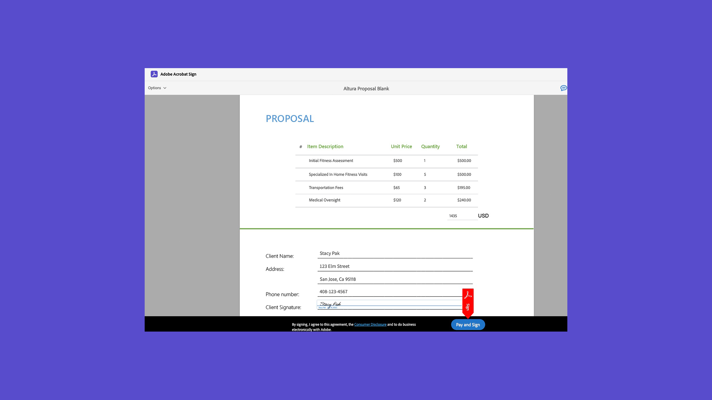

# Översikt över avancerade uppgifter

Lär dig hur du skickar ut ett dokument för signering till 100-tals mottagare samtidigt, skapar ett signaturfärdigt dokument för din webbplats, hanterar signaturtransaktioner samt skapar och hanterar dokumentmallar. De här självstudiekurserna är till för alla som redan känner till grunderna för att skicka och begära signaturer och vill lära sig fler sätt som Acrobat Sign kan arbeta för dem.

## Nyheter

>[!BEGINTABS]

>[!TAB Massutskick]

Lär dig att [samla in tusentals](megasign.md) signaturer samtidigt för alla dokument i bara några korta steg.

>[!TAB Autentiseringsmetoder i Acrobat Sign]

Läs mer om de olika metoder som finns i Acrobat Sign för att [autentisera](authentication-methods.md) identiteten för någon som signerar ett dokument.

>[!ENDTABS]

## Skicka

<table style="table-layout:fixed">
<tr>
  <td>
    
    

    <a href="setting-up-routing.md"><strong>Konfigurerar signeringsordning</strong></a>
    

    <em>Ställ in signeringsordning för flera signerare</em>
     
  </td>
  <td>
      
    

    <a href="delegate-signature.md"><strong>Använda delegeringsrollen</strong></a>
    

    <em>Använd delegeringsrollen för att skicka ett dokument till en mellanhand som sedan kan vidarebefordra dokumentet för signering</em>
     
  </td>
  <td>
    
    

    <a href="add-an-approver.md"><strong>Använder godkännarrollen</strong></a>
    

    <em>Lägg till en godkännarroll i godkännandeprocessen för ditt avtal</em>
     
  </td>
  <td>
    
    

    <a href="authentication-methods.md"><strong>Autentiseringsmetoder i Acrobat Sign</strong></a>
    

    <em>Läs mer om de olika metoderna för identitetsautentisering som är tillgängliga i Acrobat Sign</em>
     
  </td>
</tr>
<tr>
  <td>
      
      

      <a href="manage-form-data.md"><strong>Hantera formulärdata</strong></a>
      

      <em>Lär dig konsolidera formulärdata från dina dokument</em>
       
    </td>
  <td>
    
    

    <a href="set-up-online-payments.md"><strong>Ställ in onlinebetalningar</strong></a>
    

    <em>Lär dig ställa in och acceptera onlinebetalningar i dina dokument</em>
     
  </td>
  <td>
      
      

      <a href="megasign.md"><strong>Massutskick</strong></a>
      

      <em>Samla hundratals signaturer samtidigt för alla dokument i några få korta steg</em>
       
  </td>
 <td>
      
      

      <a href="webform.md"><strong>Skapa ett webbformulär</strong></a>
      

      <em>Lär dig skapa ett dokument som kan signeras elektroniskt direkt på din webbplats</em>
       
  </td>
</tr>
<tr>
  <td>
      
      

      <a href="adobe-sign-text-tagging.md"><strong>Acrobat Sign-texttaggning</strong></a>
      

      <em>Skapa Acrobat Sign-formulärfält genom texttaggning med Adobe Acrobat</em>
       
    </td>
  <td>
    
    

    <a href="text-tagging-word.md"><strong>Använda texttaggar i [!DNL Microsoft Word]</strong></a>
    

    <em>Lär dig skapa en återanvändbar dokumentmall genom att lägga till Acrobat Sign-texttaggar i [!DNL Microsoft Word]</em>
     
  </td>
  <td>
    
    

     
  </td>
  <td>
    
    

     
  </td>
</tr>
</table>

## Hantera

<table style="table-layout:fixed">
<tr>
<td>
    
    

    <a href="creating-a-report.md"><strong>Rapporterings- och transaktionsanvändning</strong></a>
    

    <em>Lär dig hur du skapar rapporter och spårar transaktionsanvändning</em>
     
  </td>
  <td>
    
    

    <a href="edit-a-template.md"><strong>Hantera dokumentmallar</strong></a>
    

    <em>Redigera eller ta bort en mall från ditt bibliotek</em>
     
  </td>
  <td>
    
    

    <a href="modify-webform.md"><strong>Ändra ett befintligt webbformulär</strong></a>
    

    <em>Lär dig hur du inaktiverar, redigerar och återaktiverar ett befintligt webbformulär</em>
     
  </td>  
  <td>
    
    

    <a href="manage-webform-data.md"><strong>Hantera webbformulärdata</strong></a>
    

    <em>Lär dig spåra, hantera och exportera data från ett webbformulär</em>
     
  </td>  
</tr>
</table>