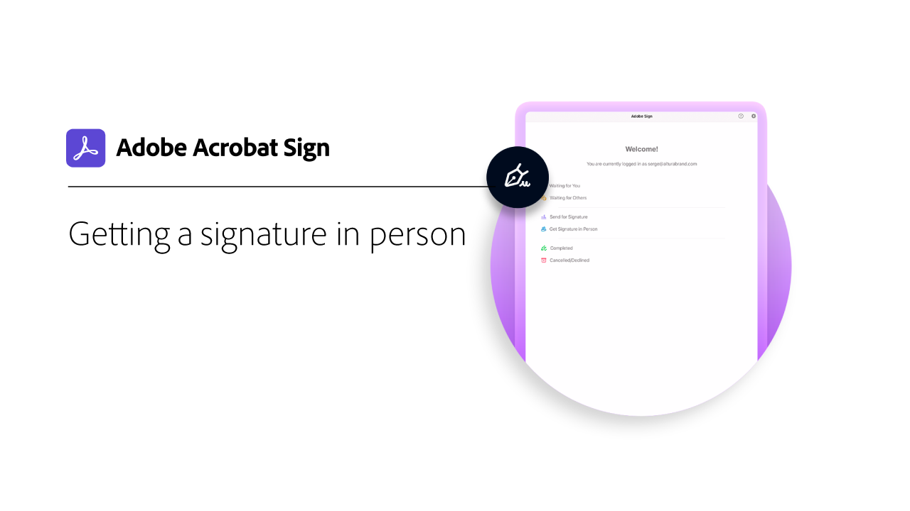

# Komma igång - översikt

Få information om hur du skickar, signerar och spårar dokument med dessa korta steg-för-steg-självstudiekurser. Få en snabbgenomgång av Acrobat Sign och börja sedan skicka ett dokument till en eller flera personer. Det här innehållet är utformat för att underlätta för dig att komma in i e-signaturarbetsflöden.

## Nyheter

* [Komma igång med Acrobat Sign](new-sender.md)
Har du inte använt Acrobat Sign förut? Den här självstudiekursen är en bra utgångspunkt.
* [Ange tidsgränser och påminnelser](set-deadlines-reminders.md)
Lär dig hur du skickar regelbundna e-postpåminnelser och deadlines för att få dina dokument signerade snabbt

## Skickar

<table style="table-layout:fixed">
<tr>
 <td>
    
    

    <a href="quick-tour.md"><strong>Allmänt om arbetsytan</strong></a>
    

    <em>Ta en snabbtitt på arbetsytan i Acrobat Sign för att komma igång</em>
     
  </td>
  <td>
    
    

    <a href="new-sender.md"><strong>Komma igång med Acrobat Sign</strong></a>
    

    <em>Den här omfattande självstudiekursen är en bra utgångspunkt för nya avsändare i Acrobat Sign</em>
     
  </td>
  <td>
    
    

    <a href="send-to-single-recipient.md"><strong>Skicka till en enda mottagare</strong></a>
    

    <em>Hoppa in och lär dig hur enkelt det är att skicka ett dokument för signering</em>
     
  </td>
  <td>
    
    

    <a href="send-to-multiple-recipients.md"><strong>Skicka till flera mottagare</strong></a>
    

    <em>Skicka ett dokument för e-signering till mer än en person i exakt den ordning du vill</em>
     
  </td>
</tr>
<tr>
  <td>
    
    

    <a href="sending-options.md"><strong>Konfigurera sändningsalternativ</strong></a>
    

    <em>Lär dig konfigurera olika alternativ när du skickar ett dokument för signering</em>
     
  </td>
  <td>
    
    

    <a href="adding-fields.md"><strong>Lägga till fält i dina dokument</strong></a>
    

    <em>Lär dig hur du lägger till olika typer av fält i dina dokument</em>
     
  </td>
  <td>
    
    

    <a href="modify-in-flight.md"><strong>Ändra ett dokument efter sändning</strong></a>
    

    <em>Ändra ett dokument som redan bearbetas</em>
     
  </td>
  <td>
    
    

    <a href="replace-signer.md"><strong>Ersätta en signerare</strong></a>
    

    <em>Lär dig hur du ändrar signeraren för ett dokument som redan pågår</em>
      
  </td>
</tr>
<tr>
  <td>
      
      

      <a href="set-deadlines-reminders.md"><strong>Ange tidsgränser och påminnelser</strong></a>
      

      <em>Lär dig hur du skickar regelbundna e-postpåminnelser och deadlines för att få dina dokument signerade snabbt</em>
       
    </td> 
  <td>
      
      

       
    </td>
    <td>
      
      

       
    </td>
    <td>
      
      

       
    </td>
</tr>
</table>

## Signera

<table style="table-layout:fixed">
<tr>
  <td>
    
    

    <a href="electronically-sign-a-document.md"><strong>Signera ett dokument elektroniskt</strong></a>
    

    <em>Lär dig hur enkelt det är att signera ett dokument som skickas till dig med Acrobat Sign</em>
     
  </td>
  <td>
    
    

    <a href="fill-and-sign.md"><strong>Fylla i och signera ett dokument</strong></a>
    

    <em>Fyll i formulär och lägg till din elektroniska signatur i dokument</em>
     
  </td>
  <td>
    
    

    <a href="sign-in-person.md"><strong>Hämta en signatur personligen</strong></a>
    

    <em>Få någon annans namnteckning personligen med mobilappen Acrobat Sign</em>
     
  </td>
  <td>
    
    

    <a href="delegate-signing.md"><strong>Delegera signering till någon annan</strong></a>
    

    <em>Lär dig hur du delegerar signeringen av ett dokument till någon annan</em>
     
  </td>
</tr>
<tr>
  <td>
    
    

    <a href="sign-with-a-digital-signature.md"><strong>Vad är en digital signatur?</strong></a>
    

    <em>Läs mer om certifikatbaserade digitala signaturer</em>
     
  </td>
  <td>
    
    

    <a href="sign-with-a-stamp.md"><strong>Signera med en stämpel</strong></a>
    

    <em>Använda stämplar för att markera ett godkänt eller ifyllt dokument</em>
      
  </td> 
 <td>
    
    

     
  </td>
  <td>
    
    

     
  </td>
</tr>  
</table>

## Hantera

<table style="table-layout:fixed">
<tr>
  <td>
    
    

    <a href="manage-and-track.md"><strong>Hantera och spåra avtal</strong></a>
    

    <em>Lär dig hantera och spåra avtal som skickats för signering</em>
     
  </td>
  <td>
    
    

    <a href="../sign-advanced-users/create-a-template.md"><strong>Skapa en dokumentmall</strong></a>
    

    <em>Skapa en återanvändbar dokumentmall för att snabba upp och göra organisationen enhetlig</em>
     
  </td>
  <td>
    
    

     
  </td>
  <td>
    
    

     
  </td>
</tr>
</table>
