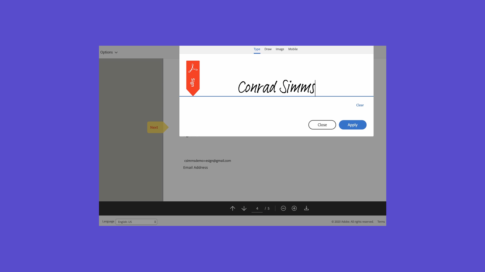

# Översikt över Komma igång

Kom igång med att skicka, signera och spåra dokument med hjälp av dessa korta självstudiekurser. Få en snabb genomgång av Acrobat Sign och börja sedan skicka ett dokument till en eller flera personer. Innehållet är utformat för att underlätta för dig att komma in i arbetsflöden för e-signaturer.

## Nyheter

>[!BEGINTABS]

>[!TAB Signera ett dokument elektroniskt]

Se hur enkelt det är att [signera](../sign-beginner-tutorials/electronically-sign-a-document.md) ett dokument som skickas till dig med Acrobat Sign.

>[!TAB Skapa en mall som kan återanvändas]

Lär dig skapa en [återanvändbar dokumentmall](../sign-advanced-users/create-a-template.md).

>[!TAB Konfigurera sändningsalternativ]

Lär dig att [konfigurera olika alternativ](sending-options.md) när du skickar ett dokument för signering.

>[!TAB Skicka till flera signerare]

Lär dig hur du skickar ett dokument för e-signering till [fler än en person](send-to-multiple-recipients.md) i exakt den ordning du vill.

>[!ENDTABS]

## Skicka

<table style="table-layout:fixed">
<tr>
  <td>
    
    

    <a href="new-sender.md"><strong>Kom igång med Acrobat Sign</strong></a>
    

    Den här självstudiekursen är en utmärkt utgångspunkt för nya användare i Acrobat Sign
     
  </td>
 <td>
    
    

    <a href="quick-tour.md"><strong>Grundläggande om arbetsytan</strong></a>
    

    Ta en rundtur på arbetsytan i Acrobat Sign för att komma igång
     
  </td>
  <td>
    
    

    <a href="send-to-single-recipient.md"><strong>Skicka ett dokument till en signerare</strong></a>
    

    Sätt igång och lär dig hur enkelt det är att skicka ett dokument för signering
     
  </td>
  <td>
    
    

    <a href="send-to-multiple-recipients.md"><strong>Skicka till flera signerare</strong></a>
    

    Skicka ett dokument för e-signering till mer än en person i exakt den ordning du vill
     
  </td>
</tr>
<tr>
  <td>
    
    

    <a href="sending-options.md"><strong>Konfigurera sändningsalternativ</strong></a>
    

    Lär dig konfigurera olika alternativ när du skickar ett dokument för signering
     
  </td>
  <td>
    
    

    <a href="adding-fields.md"><strong>Lägga till fält i dokument</strong></a>
    

    Lär dig hur du lägger till olika typer av fält i dokument
     
  </td>
  <td>
    
    

    <a href="modify-in-flight.md"><strong>Ändra ett dokument efter sändning</strong></a>
    

    Ändra ett dokument som redan pågår
     
  </td>
  <td>
    
    

    <a href="replace-signer.md"><strong>Ersätta en signerare</strong></a>
    

    Lär dig ändra signerare av ett dokument som redan pågår
      
  </td>
</tr>
<tr>
  <td>
      
      

      <a href="set-deadlines-reminders.md"><strong>Ange tidsgränser och påminnelser</strong></a>
      

      Lär dig hur du skickar vanliga e-postpåminnelser och tidsgränser för att få dokument signerade snabbt
       
    </td> 
  <td>
    
    

    <a href="../sign-advanced-users/create-a-template.md"><strong>Skapa en mall som kan återanvändas</strong></a>
    

    Skapa en återanvändbar dokumentmall för att göra organisationen snabbare och mer konsekvent
     
  </td>
    <td>
      
      

       
    </td>
    <td>
      
      

       
    </td>
</tr>
</table>

## Signera

<table style="table-layout:fixed">
<tr>
  <td>
    
    

    <a href="electronically-sign-a-document.md"><strong>Signera ett dokument elektroniskt</strong></a>
    

    Lär dig hur enkelt det är att signera ett dokument som skickas till dig med Acrobat Sign
     
  </td>
  <td>
    
    

    <a href="fill-and-sign.md"><strong>Fylla i och signera ett dokument</strong></a>
    

    Fyll i formulär och lägg till din elektroniska signatur i dokument
     
  </td>
  <td>
    
    

    <a href="sign-in-person.md"><strong>Hämta en signatur personligen</strong></a>
    

    Hämta någon annans signatur personligen med Acrobat Sign-mobilappen
     
  </td>
  <td>
    
    

    <a href="delegate-signing.md"><strong>Delegera signering till någon annan</strong></a>
    

    Lär dig delegera signeringen av ett dokument till någon annan
     
  </td>
</tr>
<tr>
  <td>
    
    

    <a href="sign-with-a-digital-signature.md"><strong>Vad är en digital signatur</strong></a>
    

    Läs mer om certifikatbaserade digitala signaturer
     
  </td>
  <td>
    
    

    <a href="sign-with-a-stamp.md"><strong>Signera med en stämpel</strong></a>
    

    Använd stämplar för att markera ett godkänt eller slutfört dokument
      
  </td> 
 <td>
    
    

     
  </td>
  <td>
    
    

     
  </td>
</tr>  
</table>

## Hantera

<table style="table-layout:fixed">
<tr>
  <td>
    
    

    <a href="manage-and-track.md"><strong>Hantera och spåra avtal</strong></a>
    

    Lär dig hantera och spåra avtal som skickats för signering
     
  </td>
  <td>
    
    

     
  </td>
  <td>
    
    

     
  </td>
  <td>
    
    

     
  </td>
</tr>
</table>
