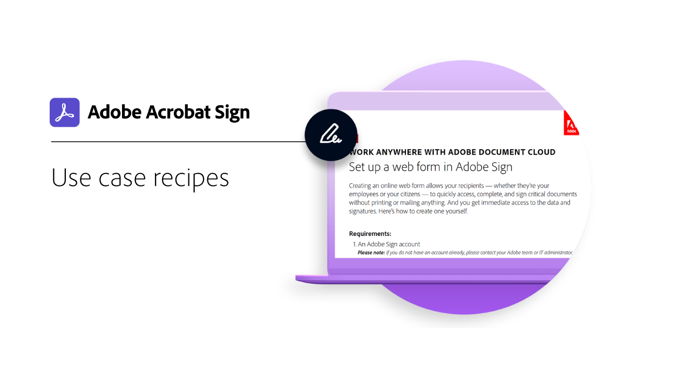

# Översikt över branscher och avdelningar

Lär dig hur du kan förändra organisationens e-signeringsupplevelser genom att utforska de verkliga användningsfallen, recepten och webbinarierna för branschen och avdelningen.

<table style="table-layout:fixed">
<tr>
  <td>
    
    

    <a href="innovation-series.md"><strong>Färdighetsbyggare</strong></a>
    

    <em>Skaffa en 30 minuter lång "Skill Builder" där du lär dig hur du sätter e-signaturer i arbete - utan att behöva lägga till något extra</em>
     
  </td>
  <td>
    
    

    <a href="recipes.md"><strong>Recept för användningsfall</strong></a>
    

    <em>Hämta de resurser du behöver för att snabbt driftsätta olika arbetsflöden för e-signaturavdelningen på egen hand</em>
     
  </td>
  <td>
    
    

    <a href="use-case-showcase.md"><strong>Exempel på användningsfall</strong></a>
    

    <em>Titta på live- eller inspelningssessioner som presenterar dig för nya användningsfall och trender i Acrobat Sign</em>
     
  </td>
  <td>
    
    

     
  </td>
</tr>
</table>
