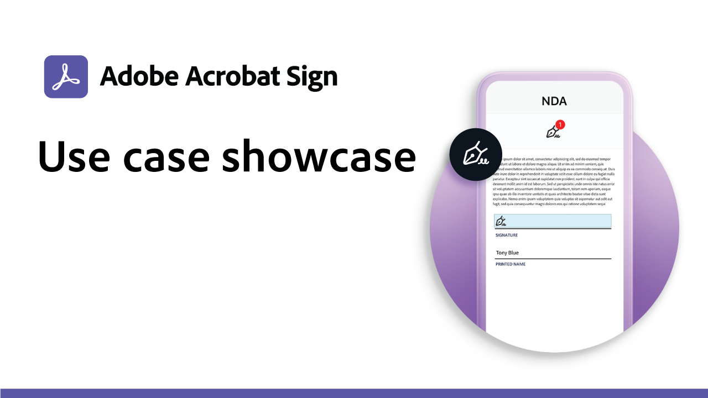

# Branscher och avdelningar - översikt

Lär dig hur du kan omvandla organisationens e-signeringsupplevelser genom att utforska de verkliga användningsområdena inom industri och avdelning, exempel, recept och webbinarier.

<table style="table-layout:fixed">
<tr>
  <td>
    
    

    <a href="innovation-series.md"><strong>Kunskapsbyggaren</strong></a>
    

    <em>Besök oss som en 30-minuters SKompetensbyggare och lär dig hur du kan få dina e-signaturer att fungera - utan att behöva lägga till något extra arbete.</em>
     
  </td>
  <td>
    
    

    <a href="recipes.md"><strong>Använd fallrecept</strong></a>
    

    <em>Ladda ned de resurser du behöver för att snabbt kunna driftsätta olika arbetsflöden för e-signaturavdelningen på egen hand</em>
     
  </td>
  <td>
    
    

    <a href="use-case-showcase.md"><strong>Användningsexempel</strong></a>
    

    <em>Se direktsända eller inspelade sessioner som presenterar nya användningsexempel och trender för Adobe Sign</em>
     
  </td>
</tr>
</table>
