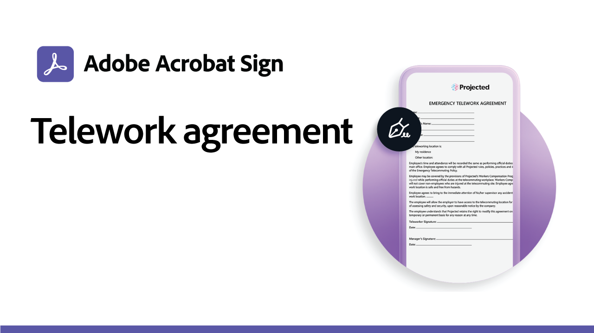
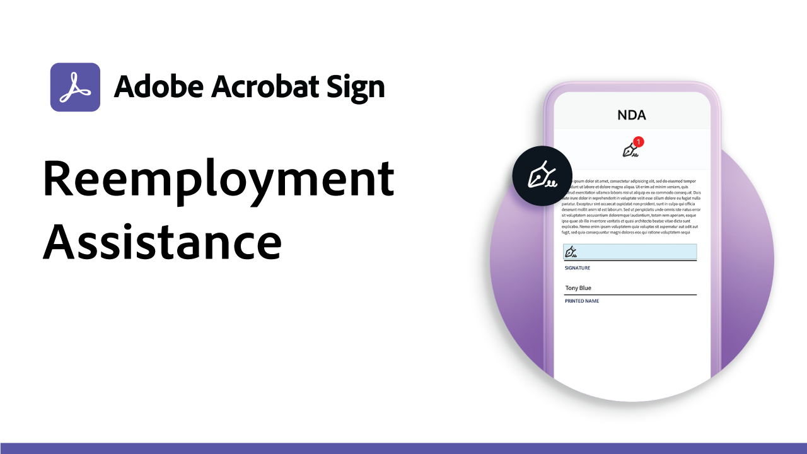
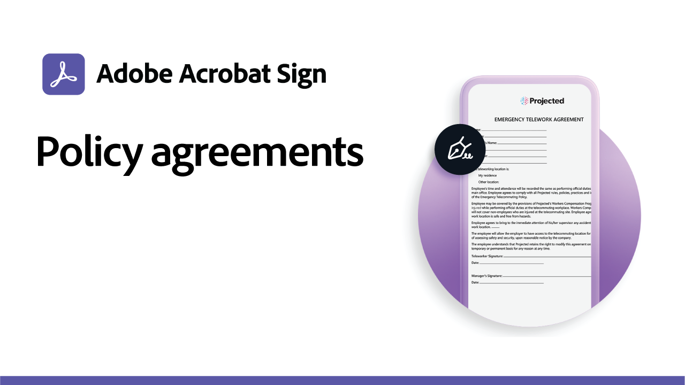

# Recept för användningsfall

Snabba upp organisationens digitala arbetsflöden med dessa exempel på e-signaturer för myndigheter och företag. Klicka här om du vill visa en PDF med resurser och information om hur du konfigurerar de här specifika användningsfallen för e-signaturer.

## Nyheter

* [Praktikprogram för utbildningswebbformulär](usecase-edu-intern.md)
Lär dig hur webbformulär används för att förbättra elevernas åtkomst till de formulär som krävs
* [Skapa ett praktikprogram för utbildningswebbformulär](usecase-edu-intern-create.md)
Lär dig skapa ett webbformulär för praktik
* [Offentlig låneansökan med flera okända signerare](webform-multiple-signers.md)
Lär dig hur ett webbformulär används för ett komplicerat arbetsflöde för låneansökningar som involverar flera okända deltagare

## Användningsfall för myndigheter

<table style="table-layout:fixed">
<tr>
  <td>
    
    

    <a href="webform-multiple-signers.md"><strong>Offentlig låneansökan med flera okända signerare</strong></a>
    

    <em>Lär dig hur ett webbformulär används för ett komplicerat arbetsflöde för låneansökningar som involverar flera okända deltagare</em>
     
  </td> 
  <td>
    
    

    <a href="usecasegovgrants.md"><strong>Bidrag och lån till företag</strong></a>
    

    <em>Ge snabb hjälp till företag genom att ge självbetjäning tillgång till formulär för ansökningar om bidrag, lån och uppskov med skattebetalning</em>
     
  </td> 
  <td>
    
    

    <a href="usecasegovtelework.md"><strong>Distansarbetsavtal</strong></a>
    

    <em>Samla in signaturer från alla medarbetare på distansavtal, policyuppdateringar med mera</em>
     
  </td>
  <td>
    
    

    <a href="usecasegovcontracts.md"><strong>Kontrakt och rekvisitionsblanketter</strong></a>
    

    <em>Ersätt snabbt pappersbearbetning med kompatibla digitala arbetsflöden, med granskningsrapporter</em>
     
  </td>
</tr>
<tr>
 <td>
    
    

    <a href="usecasegovreemployment.md"><strong>Stöd till återanställning</strong></a>
    

    <em>Hjälp medborgarna att få den hjälp de behöver utan att behöva stå i linje med helt digitala ansökningsformulär som kan publiceras på några dagar</em>
     
  </td>
  <td>
    
    

    <a href="usecasegovpaycheck.md"><strong>Betalningsskydd</strong></a>
    

    <em>Se hur du kan använda Acrobat Sign för att konvertera betalningsskyddsprogramformuläret till ett interaktivt onlineformulär</em>
     
  </td>
  <td>
    
    

    <a href="usecasegovremote.md"><strong>Fjärravhjälpsbegäran</strong></a>
    

    <em>Använd e-signaturer och webbkonferenser tillsammans för att minska den tid det tar att begära och säkra tillstånd från domare</em>
     
  </td>
  <td>
    
    

     
  </td>
</tr>
</table>

## Användningsfall för företag

<table style="table-layout:fixed">
<tr>
  <td>
    
    

    <a href="usecasecomcontracts.md"><strong>Kontrakt och rekvisitionsblanketter</strong></a>
    

    <em>Ersätt snabbt pappersbearbetning med kompatibla digitala arbetsflöden, med granskningsrapporter</em>
     
  </td> 
  <td>
    
    

    <a href="usecasecompolicy.md"><strong>Policyavtal</strong></a>
    

    <em>Samla effektivt in signaturer från alla medarbetare om policyavtal och uppdateringar</em>
     
  </td>
  <td>
    
    

    <a href="usecasecomtelework.md"><strong>Distansarbetsavtal</strong></a>
    

    <em>Samla in signaturer från alla medarbetare på distansavtal</em>
     
  </td>
  <td>
    
    

     
  </td>
</tr>
</table>

## Användningsexempel för skolor

<table style="table-layout:fixed">
<tr>
  <td>
    
    

    <a href="usecase-edu-intern.md"><strong>Praktikprogram för utbildningswebbformulär</strong></a>
    

    <em>Lär dig hur webbformulär används för att förbättra elevernas åtkomst till de formulär som krävs</em>
     
  </td> 
  <td>
    
    

    <a href="usecase-edu-intern-create.md"><strong>Skapa ett praktikprogram för utbildningswebbformulär</strong></a>
    

    <em>Lär dig skapa ett webbformulär för praktik</em>
     
  </td> 
  <td>
    
    

     
  </td>
  <td>
    
    

     
  </td>
</tr>
</table>

